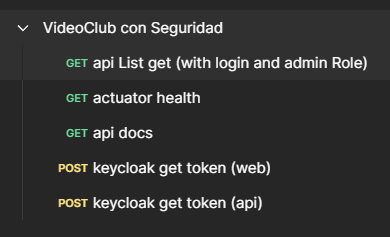
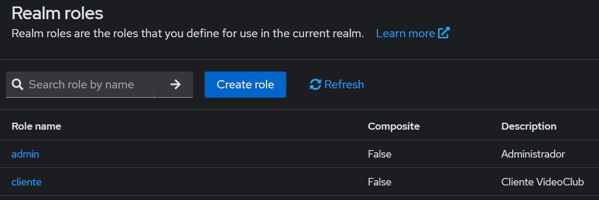
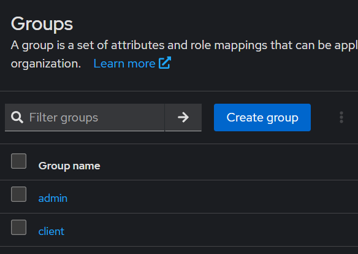
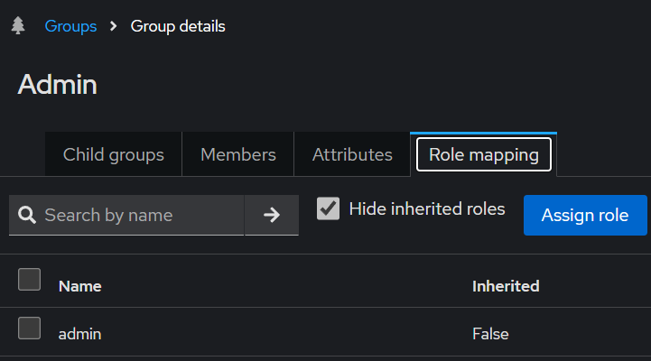
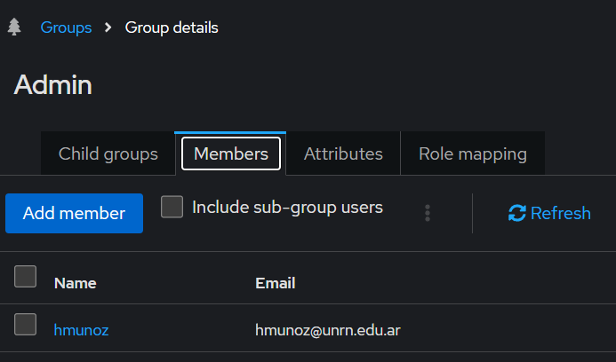

# springboot-sso y keycloak

## OPEN API
- https://springdoc.org/#spring-data-rest-support
- http://localhost:8080/swagger-ui/index.html


# SSO keycloak

## Keycloak client app web
```bash
curl --request POST 'http://localhost:9090/realms/videoclub/protocol/openid-connect/token' --header 'Content-Type: application/x-www-form-urlencoded' --data-urlencode 'client_id=web' --data-urlencode 'username=hmunoz' --data-urlencode 'password=hmunoz' --data-urlencode 'grant_type=password'
```
## Keycloak client app api
```shell
curl --request POST 'http://localhost:9090/realms/videoclub/protocol/openid-connect/token' --header 'Content-Type: application/x-www-form-urlencoded' --data-urlencode 'client_id=web' --data-urlencode 'username=hmunoz' --data-urlencode 'password=hmunoz'  --data-urlencode 'client_secret=78BoOMc7ZM2zbHHE3bU5JNnHInuErQVn' --data-urlencode 'grant_type=password'
```
## Test api
```shell
curl --location 'http://localhost:8080/api/tests' --header 'Authorization: Bearer <TOKEN>'
```

## Postman Callection get Token and Test Api 
- [VideoClub con Seguridad.postman_collection.json](postman%2FVideoClub%20con%20Seguridad.postman_collection.json)
- 

# keycloak Realms, groups and roles, users
## Realms videoclub
- http://localhost:9090/admin/master/console/#/realms/videoclub






## Aauthdebugger Oauth2 and JWT
- https://jwt.io/
- https://oauthdebugger.com/

### Documentation
- https://ravthiru.medium.com/springboot-oauth2-with-keycloak-for-bearer-client-3a31f608a78
- https://www.baeldung.com/spring-boot-keycloak
- https://medium.com/@bcarunmail/securing-rest-api-using-keycloak-and-spring-oauth2-6ddf3a1efcc2
- https://www.baeldung.com/postman-keycloak-endpoints#1-openid-configuration-endpoint

