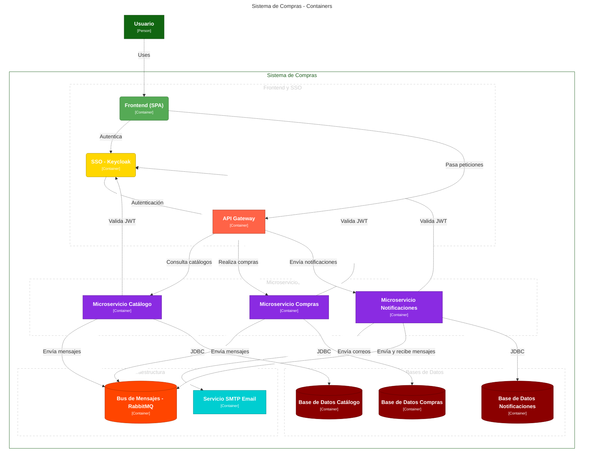

# springboot-sso y keycloak

Dos microservicios Spring Boot 4 (Java 25) como **OAuth 2.0 Resource Servers**, con Keycloak como servidor de identidad y una SPA React 19 como cliente público.

| Proyecto | Puerto | Base de datos | Responsabilidad |
| :--- | :--- | :--- | :--- |
| [`catalog-service/`](catalog-service/) | `8081` | `video_catalog` | Catálogo de películas |
| [`membership-service/`](membership-service/) | `8082` | `video_membership` | Socios, usuarios de Keycloak y notificaciones SSE |

> **Son dos proyectos Maven independientes, no un multi-módulo.** No hay `pom.xml` en la raíz de este repositorio: cada carpeta tiene su propio `pom.xml`, su `mvnw` y su `Dockerfile`, y se abre sola en el IDE — exactamente la forma que genera `start.spring.io`. El razonamiento completo, con lo que se gana y lo que se pierde, está en [`docs/arquitectura-dos-servicios.md`](docs/arquitectura-dos-servicios.md).

> 🧭 **Documentación de Arquitectura Global:** Para la visión integral de la plataforma, topología de servicios, catálogo de ADRs y contratos, consultá [`docs/README.md`](docs/README.md).
> 📘 **Guía didáctica completa de seguridad**: teoría, flujos, diagramas Mermaid y laboratorio paso a paso en [`docs/seguridad-oauth2-openid-connect-keycloak.md`](docs/seguridad-oauth2-openid-connect-keycloak.md).

## Repositorios de la Plataforma

| Componente | Repositorio | Rol |
| :--- | :--- | :--- |
| **Backend Core** | [hmunoz/springboot-sso](https://github.com/hmunoz/springboot-sso) (este repositorio) | Dos Resource Servers OAuth2/OIDC (catálogo y membresía), eventos RabbitMQ, servidores MCP |
| **Frontend SPA** | [hmunoz/react-sso](https://github.com/hmunoz/react-sso) | SPA React 19 + Vite, cliente público con PKCE |
| **API Gateway** | [munozhoracio/apigateway](https://github.com/munozhoracio/apigateway) | Spring Cloud Gateway (GraalVM Native), punto único de entrada |
| **Backend Agente IA** | [munozhoracio/agente-videoclub-sso](https://github.com/munozhoracio/agente-videoclub-sso) | Spring AI, microservicio asistente, cliente MCP con Token Relay |

---

## Quickstart

### 0. Compilar el SPI de eventos (solo la primera vez)

`docker/keycloak.yaml` monta un provider custom que publica los eventos de Keycloak a RabbitMQ. El jar **no está versionado**, así que hay que construirlo antes del primer `up`:

```bash
./mvnw clean package -f docker/keycloak/keycloak-spi/pom.xml
```

> Si se saltea este paso, Docker monta un directorio vacío en lugar del jar. Keycloak arranca igual y **los eventos se pierden en silencio**, sin ningún error visible.

### 1. Levantar la infraestructura

`docker/services.yaml` hace `extends` de todo el stack — PostgreSQL, Keycloak, RabbitMQ, MailHog y el API Gateway. Un solo comando:

```bash
docker compose -f docker/services.yaml --env-file docker/.env up -d
```

El realm `videoclub` se importa automáticamente desde `docker/keycloak/realm-export.json`, con sus clientes, grupos, roles y usuarios de prueba.

### 2. Backends

Son dos procesos, cada uno desde su propia carpeta. Hacen falta las dos terminales:

```bash
cd catalog-service    && ./mvnw spring-boot:run    # :8081
cd membership-service && ./mvnw spring-boot:run    # :8082
```

> A diferencia del monolito anterior, **estos comandos NO levantan la infraestructura**. `spring.docker.compose` viene apagado por defecto en ambos servicios: si estuviera prendido, los dos intentarían levantar el mismo stack al mismo tiempo. Se arranca a mano con el paso 1.

O los dos juntos en contenedores, que es lo que más se parece a producción:

```bash
docker compose up -d --build
```

Para correr los tests, también por proyecto:

```bash
(cd catalog-service    && ./mvnw test)
(cd membership-service && ./mvnw test)
```

### 3. Frontend

```bash
cd ../react-sso
npm install    # solo la primera vez
npm run dev
```

Necesita un `.env` propio en su raíz:

```bash
VITE_AUTHORITY=http://localhost:9090/realms/videoclub
VITE_CLIENT_ID=videoclub-frontend
VITE_API_BASE_URL=http://localhost:9500   # el gateway, que rutea a los dos servicios
```

### Servicios y puertos

| Servicio | URL | Notas |
| --- | --- | --- |
| Frontend (SPA) | http://localhost:5173 | React 19 + Vite |
| catalog-service | http://localhost:8081 | API REST del catálogo (`/movies/**`) |
| membership-service | http://localhost:8082 | API REST de socios, usuarios y notificaciones |
| Swagger UI (catálogo) | http://localhost:8081/swagger-ui/index.html | Con login OAuth2 + PKCE |
| Swagger UI (membresía) | http://localhost:8082/swagger-ui/index.html | Con login OAuth2 + PKCE |
| Keycloak | http://localhost:9090 | Consola: `/admin/master/console/#/realms/videoclub` |
| API Gateway | http://localhost:9500 | `/movies/**` → catalog; `/api/socios/**`, `/api/users/**`, `/api/notifications/**` → membership; `/api/agent/**` → agent |
| RabbitMQ | http://localhost:15672 | Consola del broker |
| MailHog | http://localhost:8025 | Bandeja de correo de desarrollo |
| PostgreSQL | localhost:5432 | Dos bases: `video_catalog` y `video_membership` |

> **El puerto de Keycloak sale de `docker/.env` (`KEYCLOAK_PORT=9090`).** Todos los valores por defecto están alineados a 9090 (`KC_HOSTNAME` y `ports` en `docker/keycloak.yaml`, `issuer-uri` y `jwk-set-uri` en el `application.yml` de cada servicio), así que si el archivo de entorno no se carga el stack sigue siendo coherente. Si cambiás el puerto, cambialo en los dos lugares: un `KC_HOSTNAME` que no coincida con el puerto publicado deja a Keycloak anunciándose donde no escucha, y todo falla con `401` / *issuer mismatch*.

---

## Usuarios de prueba

| Usuario | Contraseña | Grupo (identidad) | Permisos (autorización) |
| --- | --- | --- | --- |
| `usuarioadmin` | `usuarioadmin` | `/videoclub-default/administrador` | CRUD de películas + gestión de usuarios |
| `usuariocliente` | `usuariocliente` | `/videoclub-default/cliente` | solo lectura de películas |

> El modelo separa **quién sos** de **qué podés hacer**: el grupo es el cargo, los client roles son las llaves que ese cargo trae. El realm no define roles propios — no hay `ROLE_ADMIN`, sería un tercer mecanismo diciendo lo que el grupo ya dice. Detalle completo en la [§6 de la guía](docs/seguridad-oauth2-openid-connect-keycloak.md).

Quien se registre por su cuenta desde el formulario de Keycloak entra automáticamente al grupo `cliente` y debe configurar TOTP en el primer login.

---

## Obtener tokens y probar la API

La colección lista para ejecutar está en [`postman/VideoClub con Seguridad.http`](postman/VideoClub%20con%20Seguridad.http) (compatible con el HTTP Client de IntelliJ y con la extensión REST Client de VS Code).

### Token de usuario (Resource Owner Password — solo para debugging)

```bash
curl --request POST 'http://localhost:9090/realms/videoclub/protocol/openid-connect/token' \
  --header 'Content-Type: application/x-www-form-urlencoded' \
  --data-urlencode 'client_id=videoclub-frontend' \
  --data-urlencode 'username=usuarioadmin' \
  --data-urlencode 'password=usuarioadmin' \
  --data-urlencode 'grant_type=password' \
  --data-urlencode 'scope=openid'
```

> ⚠️ El *password grant* está **deprecado** por la especificación OAuth 2.1 y existe acá solo para obtener un token rápido desde la consola. El flujo real de la aplicación es **Authorization Code + PKCE**, y es el que usa la SPA.
>
> Además deja de funcionar en cuanto el usuario tenga TOTP configurado: el flujo `Direct Grant - Conditional OTP` empieza a exigir el parámetro `totp`.

### Token de servicio (Client Credentials, M2M)

Es el que el backend usa internamente para hablar con el Admin API de Keycloak:

```bash
curl --request POST 'http://localhost:9090/realms/videoclub/protocol/openid-connect/token' \
  --header 'Content-Type: application/x-www-form-urlencoded' \
  --data-urlencode 'client_id=videoclub-backend' \
  --data-urlencode 'client_secret=dstNSsANvqlaGfZCJa1mcYzP1EBAYP4N' \
  --data-urlencode 'grant_type=client_credentials'
```

> 🔓 Este secreto está versionado a propósito para que el proyecto arranque sin configuración previa. **En cualquier entorno real va por variable de entorno o gestor de secretos, se rota, y nunca entra en git** — un secreto commiteado queda en el historial aunque después se borre del archivo.

### Consumir la API

Todo pasa por el gateway en `:9500`, que rutea cada ruta al servicio que la implementa. El cliente no necesita saber cuál de los dos responde.

```bash
# Sin token → 401 Unauthorized
curl -i http://localhost:9500/movies

# Con token → 200 OK (lo sirve catalog-service)
curl --location 'http://localhost:9500/movies' \
  --header 'Authorization: Bearer <TOKEN>'

# Con token de usuariocliente → 403 Forbidden (application/problem+json)
# (lo sirve membership-service, que igual deniega por falta de autoridad)
curl --location 'http://localhost:9500/api/users' \
  --header 'Authorization: Bearer <TOKEN_CLIENTE>'
```

Para pegarle a un servicio salteando el gateway, usá su puerto directo: `:8081` para catálogo y `:8082` para membresía.

### Endpoints y permisos

| Método y ruta | Servicio | Autoridad requerida |
| --- | --- | --- |
| `GET /movies`, `GET /movies/{id}` | catalog | `movie-permission-read` |
| `POST /movies` | catalog | `movie-permission-create` |
| `PUT /movies/{id}` | catalog | `movie-permission-update` |
| `DELETE /movies/{id}` | catalog | `movie-permission-delete` |
| `GET /api/socios` | membership | `socio-permission-read` |
| `GET /api/users` | membership | `user-permission-read` |
| `POST /api/users` | membership | `user-permission-create` |
| `GET /api/notifications/stream` | membership | autenticado |
| `GET /metrics/health`, `/api-docs`, `/swagger-ui/**` | ambos | público |

> Los dos servicios leen el **mismo** claim `resource_access` del token, sin mirar de qué client vino cada rol. La separación en dos procesos no hizo el token más angosto: es `@PreAuthorize`, dentro de cada servicio, lo único que impide que un lector del catálogo lea el padrón de socios. La deuda está documentada en [`docs/arquitectura-dos-servicios.md`](docs/arquitectura-dos-servicios.md#9-keycloak-reparto-de-clients-decisión-d5).

---

## Keycloak: realm, clientes, grupos y roles

Consola de administración: http://localhost:9090/admin/master/console/#/realms/videoclub

| Cliente | Tipo | Flujo | Usado por |
| --- | --- | --- | --- |
| `videoclub-frontend` | Público (PKCE S256) | Authorization Code | SPA React y Swagger UI |
| `videoclub-backend` | Confidencial (con secret) | Client Credentials | Backend → Admin API |

Los permisos se modelan como **client roles** de `videoclub-frontend` y se asignan a grupos, no a usuarios sueltos. El detalle completo —incluidos los protocol mappers que llevan cada rol al claim del JWT— está en la [§7 de la guía](docs/seguridad-oauth2-openid-connect-keycloak.md).

### Dónde mirar cada cosa en la consola

En lugar de capturas de pantalla —que envejecen con cada release de Keycloak y con cada cambio del realm— conviene abrir la consola y navegar en vivo. El realm se importa ya configurado, así que todo lo de abajo existe desde el primer arranque:

| Qué ver | Ruta en la consola |
| --- | --- |
| Permisos de grano fino (`movie-permission-*`, `user-permission-*`) | *Clients → videoclub-frontend → Roles* |
| Grupos y los permisos que traen | *Groups → videoclub-default → administrador / cliente → Role mapping* |
| Que el realm **no** define roles propios | *Realm roles* (solo los de Keycloak) |
| Grupo por defecto al auto-registrarse | *Realm settings → User registration → Default groups* |
| TOTP obligatorio | *Authentication → Required actions → Configure OTP* |
| Mappers que arman los claims del token | *Client scopes → videoclub → Mappers* |
| Secret del cliente confidencial | *Clients → videoclub-backend → Credentials* |
| Cuenta de servicio y sus permisos | *Clients → videoclub-backend → Service accounts roles* |
| Eventos emitidos en vivo | *Realm settings → Events*, y la consola de RabbitMQ |

La fuente de verdad de toda esa configuración es [`docker/keycloak/realm-export.json`](docker/keycloak/realm-export.json). Si algo se cambia desde la consola y hay que conservarlo, tiene que volver a ese archivo — de lo contrario se pierde en el próximo `docker compose down -v`.

### Herramientas para inspeccionar tokens

- https://jwt.io/
- https://oauthdebugger.com/

---

## Eventos de Keycloak → RabbitMQ

El módulo [`docker/keycloak/keycloak-spi`](docker/keycloak/keycloak-spi/README.md) implementa un `EventListenerProvider` propio que publica los eventos del realm a un topic exchange (`amq.topic`). Reemplaza al `keycloak-to-rabbit` de terceros, que quedó sin mantenimiento.

Convención de routing keys:

```text
keycloak.user.<EVENT_TYPE>                       # keycloak.user.LOGIN, keycloak.user.REGISTER
keycloak.admin.<RESOURCE_TYPE>.<OPERATION_TYPE>  # keycloak.admin.USER.CREATE, keycloak.admin.USER.DELETE
```

Al ser un topic exchange, el filtrado ocurre en el broker mediante bindings:

```text
keycloak.#              # todos los eventos
keycloak.admin.USER.*   # solo alta, modificación y baja de usuarios
keycloak.user.REGISTER  # solo auto-registro
```

Para verlo funcionando: crear una cola en http://localhost:15672, atarla a `amq.topic` con `keycloak.#` e iniciar sesión en la SPA.

> Estado actual: Keycloak publica y **`membership-service` consume**. `KeycloakEventListener` está atado a la cola `keycloak-events` y, ante un alta, baja o modificación de usuario, sincroniza el Socio correspondiente y empuja el evento a los clientes SSE conectados. `catalog-service` todavía no publica ni consume: tiene el starter de AMQP en el classpath a propósito, para que agregar mensajería no obligue a tocar su `pom.xml` a mitad de clase.

---

## Dependencias del proyecto

Spring Boot **4.1.1** sobre **Java 25**.

### Seguridad
- `spring-boot-starter-security`: funcionalidades de seguridad para Spring Boot.
- `spring-boot-starter-oauth2-resource-server`: configura la aplicación como Resource Server OAuth 2.0.
- `spring-security-oauth2-jose`: soporte del estándar JOSE (JSON Object Signing and Encryption).

### Web y validación
- `spring-boot-starter-web`: aplicaciones web RESTful con Spring MVC.
- `spring-boot-starter-validation`: validación de beans (`@Valid`).

### Persistencia
- `spring-boot-starter-data-jpa`: JPA para la persistencia.
- `postgresql`: driver JDBC.

### Mensajería
- `spring-boot-starter-amqp`: cliente de RabbitMQ. Está en **los dos** proyectos, aunque hoy solo `membership-service` tenga `@RabbitListener`.

> Traer el starter sin usarlo no es gratis: Spring Boot crea un `RabbitTemplate` y, con él, enciende solo el health indicator de RabbitMQ. Por eso `catalog-service` lo apaga explícitamente con `management.health.rabbit.enabled: false`, con un TODO para borrar esa línea el día que empiece a usar la cola. Es un buen ejemplo de una dependencia que cambia el comportamiento de la aplicación sin que nadie escriba una línea de código.

### Manejo de errores
Sin librerías de terceros. Los errores se estandarizan con **RFC 7807 (`application/problem+json`)**, soporte nativo de Spring Boot, mediante `spring.mvc.problemdetails.enabled: true` y un `@RestControllerAdvice` propio en `GlobalExceptionHandler`.

### Documentación de API
- `springdoc-openapi-starter-webmvc-ui`: genera OpenAPI 3 y sirve Swagger UI, configurado para autenticarse contra Keycloak con PKCE.

### Métricas y monitoreo
- `spring-boot-starter-actuator`: endpoints de monitoreo (expuestos bajo `/metrics`).
- `micrometer-registry-prometheus`: métricas en formato Prometheus.

### Utilidades de desarrollo
- `lombok`: reduce código repetitivo.
- `spring-boot-devtools`: reinicio automático.
- `spring-boot-docker-compose`: levanta el stack de Docker junto con la aplicación.

### Testing
- `spring-boot-starter-test`: dependencias comunes de testing.

---

## Acceso y Servicios en MicroK8s

### Mailhog (smtp)

[Mailhog (Web UI)](https://k8s-lia.unrn.edu.ar/mailhog/)

- mailhog.email.svc.cluster.local
- smtp port 1025

### Keycloak (SSO)

[Keycloak (Admin)](https://k8s-lia.unrn.edu.ar/keyclaok/)

- realms: videoclub01 al 05

### Postgres (RDS)

[Postgres (Pgadmin)](https://k8s-lia.unrn.edu.ar/pgadmin/browser/)

### minio (bucket S3)

- [Minio API - necesita access key y secret por grupo](https://k8s-lia.unrn.edu.ar)
- [Ejemplo imagen](https://k8s-lia.unrn.edu.ar/grupo03/unrnlogo.jpg)

---

## TODO

### Proyecto keycloakify para personalizar el login con React
https://medium.com/@abdurrahmanekr/change-your-keycloak-login-interface-using-with-keycloakify-032b00539ccb

### spring-boot-with-hibernate-2nd-level-cache-on-redis
https://medium.com/@shahto/scaling-spring-boot-with-hibernate-2nd-level-cache-on-redis-54d588fc8b06

### Mensajería en el catálogo
`catalog-service` ya tiene `spring-boot-starter-amqp`, pero no declara topología ni publica nada. Falta definir sus propios exchanges y colas — los de `membership-service` pertenecen al bounded context de Socio y no se comparten.

---

## Documentación de referencia

### OpenAPI / Swagger
- https://springdoc.org/#spring-data-rest-support
- https://medium.com/@agayevilkin76/api-gateway-swagger-ui-config-for-spring-boot-6d51a0294a34

### Keycloak y Spring Security
- https://ravthiru.medium.com/springboot-oauth2-with-keycloak-for-bearer-client-3a31f608a78
- https://www.baeldung.com/spring-boot-keycloak
- https://medium.com/@bcarunmail/securing-rest-api-using-keycloak-and-spring-oauth2-6ddf3a1efcc2
- https://www.baeldung.com/postman-keycloak-endpoints#1-openid-configuration-endpoint

### Eventos de Keycloak a RabbitMQ (inspiración del SPI propio)
- https://github.com/aznamier/keycloak-event-listener-rabbitmq
- https://blog.elest.io/publish-keycloak-events-to-rabbitmq/
- https://github.com/bitnami/charts/issues/7865

---

## Modelo C4

Generado con [Structurizr DSL](https://structurizr.com/dsl), formato Mermaid.


```mermaid
graph LR
    linkStyle default fill:#ffffff

    subgraph diagram ["Sistema de Compras - Containers"]
        style diagram fill:#ffffff,stroke:#ffffff

        1["<div style='font-weight: bold'>Usuario</div><div style='font-size: 70%; margin-top: 0px'>[Person]</div>"]
        style 1 fill:#116611,stroke:#0b470b,color:#ffffff

        subgraph 2 [Sistema de Compras]
            style 2 fill:#ffffff,stroke:#1f5f1f,color:#1f5f1f

            subgraph group1 [Bases de Datos]
                style group1 fill:#ffffff,stroke:#cccccc,color:#cccccc,stroke-dasharray:5

                26[("<div style='font-weight: bold'>Base de Datos Catálogo</div><div style='font-size: 70%; margin-top: 0px'>[Container]</div>")]
                style 26 fill:#8b0000,stroke:#610000,color:#ffffff
                28[("<div style='font-weight: bold'>Base de Datos Compras</div><div style='font-size: 70%; margin-top: 0px'>[Container]</div>")]
                style 28 fill:#8b0000,stroke:#610000,color:#ffffff
                30[("<div style='font-weight: bold'>Base de Datos Notificaciones</div><div style='font-size: 70%; margin-top: 0px'>[Container]</div>")]
                style 30 fill:#8b0000,stroke:#610000,color:#ffffff
            end

            subgraph group2 [Frontend y SSO]
                style group2 fill:#ffffff,stroke:#cccccc,color:#cccccc,stroke-dasharray:5

                3("<div style='font-weight: bold'>Frontend (SPA)</div><div style='font-size: 70%; margin-top: 0px'>[Container]</div>")
                style 3 fill:#55aa55,stroke:#3b763b,color:#ffffff
                6("<div style='font-weight: bold'>SSO - Keycloak</div><div style='font-size: 70%; margin-top: 0px'>[Container]</div>")
                style 6 fill:#ffd700,stroke:#b29600,color:#ffffff
                8["<div style='font-weight: bold'>API Gateway</div><div style='font-size: 70%; margin-top: 0px'>[Container]</div>"]
                style 8 fill:#ff6347,stroke:#b24531,color:#ffffff
            end

            subgraph group3 [Infraestructura]
                style group3 fill:#ffffff,stroke:#cccccc,color:#cccccc,stroke-dasharray:5

                20["<div style='font-weight: bold'>Servicio SMTP Email</div><div style='font-size: 70%; margin-top: 0px'>[Container]</div>"]
                style 20 fill:#00ced1,stroke:#009092,color:#ffffff
                22[("<div style='font-weight: bold'>Bus de Mensajes - RabbitMQ</div><div style='font-size: 70%; margin-top: 0px'>[Container]</div>")]
                style 22 fill:#ff4500,stroke:#b23000,color:#ffffff
            end

            subgraph group4 [Microservicios]
                style group4 fill:#ffffff,stroke:#cccccc,color:#cccccc,stroke-dasharray:5

                11["<div style='font-weight: bold'>Microservicio Catálogo</div><div style='font-size: 70%; margin-top: 0px'>[Container]</div>"]
                style 11 fill:#8a2be2,stroke:#601e9e,color:#ffffff
                14["<div style='font-weight: bold'>Microservicio Compras</div><div style='font-size: 70%; margin-top: 0px'>[Container]</div>"]
                style 14 fill:#8a2be2,stroke:#601e9e,color:#ffffff
                17["<div style='font-weight: bold'>Microservicio Notificaciones</div><div style='font-size: 70%; margin-top: 0px'>[Container]</div>"]
                style 17 fill:#8a2be2,stroke:#601e9e,color:#ffffff
            end

        end

        6-. "<div>Autenticación</div><div style='font-size: 70%'></div>" .->8
        8-. "<div>Consulta catálogos</div><div style='font-size: 70%'></div>" .->11
        11-. "<div>Valida JWT</div><div style='font-size: 70%'></div>" .->6
        8-. "<div>Realiza compras</div><div style='font-size: 70%'></div>" .->14
        14-. "<div>Valida JWT</div><div style='font-size: 70%'></div>" .->6
        8-. "<div>Envía notificaciones</div><div style='font-size: 70%'></div>" .->17
        17-. "<div>Valida JWT</div><div style='font-size: 70%'></div>" .->6
        17-. "<div>Envía correos</div><div style='font-size: 70%'></div>" .->20
        11-. "<div>Envía mensajes</div><div style='font-size: 70%'></div>" .->22
        14-. "<div>Envía mensajes</div><div style='font-size: 70%'></div>" .->22
        17-. "<div>Envía y recibe mensajes</div><div style='font-size: 70%'></div>" .->22
        11-. "<div>JDBC</div><div style='font-size: 70%'></div>" .->26
        14-. "<div>JDBC</div><div style='font-size: 70%'></div>" .->28
        17-. "<div>JDBC</div><div style='font-size: 70%'></div>" .->30
        1-. "<div>Uses</div><div style='font-size: 70%'></div>" .->3
        3-. "<div>Autentica</div><div style='font-size: 70%'></div>" .->6
        3-. "<div>Pasa peticiones</div><div style='font-size: 70%'></div>" .->8
    end
```