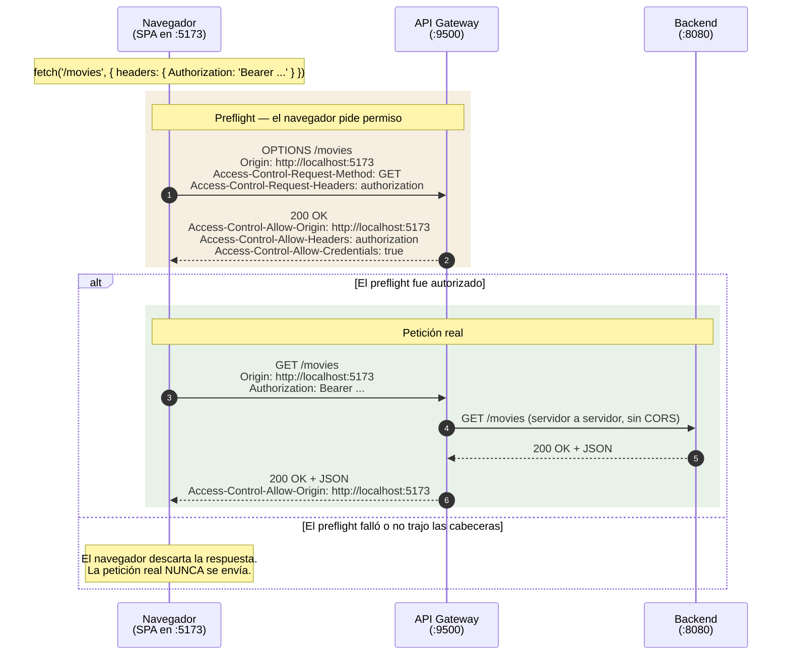
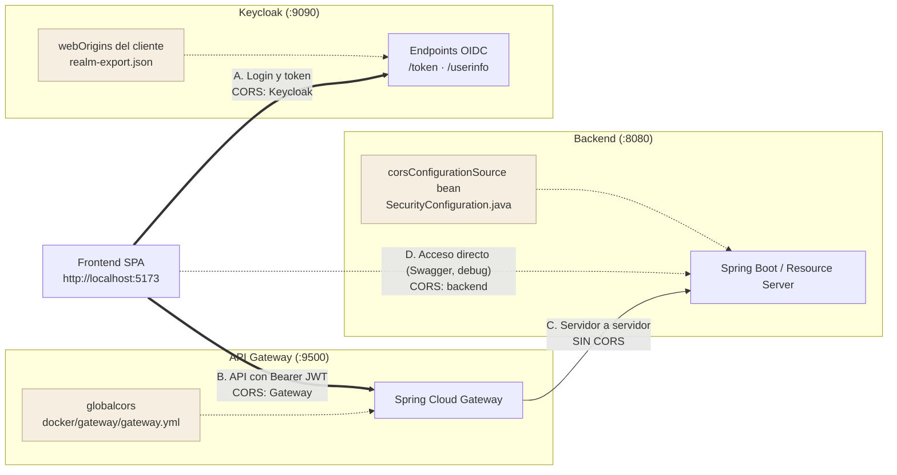
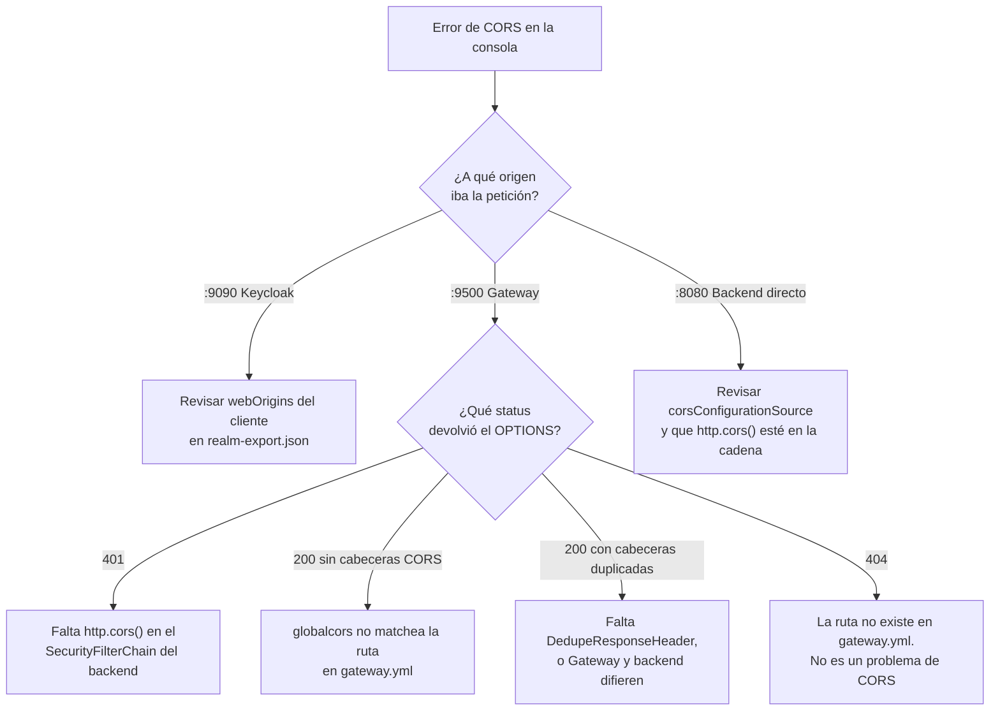

# CORS en VideoClub

Este documento explica dónde se configura CORS en la plataforma, por qué está donde está, y cuáles son los errores que ya se cometieron en este repositorio para que no se vuelvan a cometer.

CORS es, con diferencia, la fuente número uno de confusión del laboratorio. Casi siempre porque se lo intenta arreglar en el lugar equivocado.

---

## 1. Qué es y qué no es CORS

CORS (*Cross-Origin Resource Sharing*) es un mecanismo **del navegador**. No es seguridad del servidor.

El navegador aplica la *Same-Origin Policy*: JavaScript que corre en un origen no puede leer la respuesta de otro origen, salvo que ese otro origen lo autorice explícitamente con cabeceras de respuesta.

Un **origen** es la tupla `esquema + host + puerto`. Nada más:

| Valor | ¿Es un origen válido? |
| --- | --- |
| `http://localhost:5173` | Sí |
| `http://localhost:5173/` | No — la barra final sobra |
| `http://localhost:8080/swagger-ui/` | No — un origen no lleva path |
| `localhost:5173` | No — falta el esquema |

Dos consecuencias que hay que tener claras:

* **CORS no protege nada.** Un `curl`, Postman o cualquier cliente que no sea un navegador ignora CORS por completo. La autorización real la hace Spring Security validando el JWT.
* **CORS solo aplica entre orígenes distintos.** La comunicación Gateway → backend es servidor a servidor: ahí no hay navegador, y por lo tanto no hay CORS.

---

## 2. El preflight

Antes de una petición "no simple", el navegador manda una petición `OPTIONS` previa —el *preflight*— para preguntar si tiene permiso. Una petición se vuelve no simple, entre otras cosas, cuando lleva la cabecera `Authorization`.

Como toda la plataforma usa `Authorization: Bearer <JWT>`, **prácticamente todas las peticiones del frontend disparan preflight**.



El punto clave del diagrama es la rama de error: **si el preflight falla, la petición real no llega a salir**. Por eso en la pestaña *Network* ves un `OPTIONS` en rojo y ningún `GET` detrás, y por eso buscar el problema en los logs del backend no sirve de nada: el backend jamás se enteró.

> **Ojo con el `OPTIONS` y la autenticación.** El preflight viaja **sin** la cabecera `Authorization` —justamente está preguntando si puede mandarla—. Si la cadena de seguridad exige autenticación para el `OPTIONS`, devuelve `401`, el navegador lo interpreta como preflight denegado y la petición real muere. Spring Security resuelve esto cuando el soporte de CORS está activado en la cadena de filtros (ver sección 4).

---

## 3. Dónde se configura CORS en esta plataforma

Hay **tres** lugares que hablan de orígenes. Cada uno cubre un tramo distinto, y confundirlos es el error clásico.



| Tramo | Quién decide | Archivo |
| --- | --- | --- |
| **A.** SPA → Keycloak | `webOrigins` del cliente | `docker/keycloak/realm-export.json` |
| **B.** SPA → Gateway | `globalcors` | `docker/gateway/gateway.yml` |
| **C.** Gateway → Backend | nadie: no hay navegador | — |
| **D.** SPA/Swagger → Backend directo | bean `corsConfigurationSource` | `SecurityConfiguration.java` |

**El `webOrigins` de Keycloak no tiene absolutamente nada que ver con el CORS de tu backend.** Solo autoriza que el JavaScript de la SPA lea las respuestas de los endpoints *de Keycloak*. Es el malentendido más caro del laboratorio: se toca `webOrigins` esperando arreglar un `/movies` bloqueado, y no se mueve nada.

---

## 4. Configuración vigente

### 4.1. Gateway — `docker/gateway/gateway.yml`

Es el camino normal del frontend y, por lo tanto, la configuración que más importa.

```yaml
spring:
  cloud:
    gateway:
      server:
        webflux:
          globalcors:
            cors-configurations:
              '[/**]':
                allowedOriginPatterns: "*"
                allowedMethods: "*"
                allowedHeaders: "*"
                allowCredentials: true
```

Además, **cada ruta** lleva este filtro:

```yaml
filters:
  - DedupeResponseHeader=Access-Control-Allow-Origin Access-Control-Allow-Credentials, RETAIN_UNIQUE
```

Está ahí porque el Gateway agrega sus cabeceras CORS y el backend agrega las suyas. Si las dos llegan al navegador, este ve un `Access-Control-Allow-Origin` duplicado y **rechaza la respuesta**, aunque ambos valores fueran correctos. La especificación exige exactamente un valor.

> `RETAIN_UNIQUE` colapsa valores **idénticos**. Hoy funciona porque Gateway y backend devuelven el mismo origen. El día que difieran vas a tener dos valores distintos y el navegador va a cortar igual. El filtro tapa el síntoma; la solución de fondo es que una sola capa emita las cabeceras.

### 4.2. Backend — `SecurityConfiguration.java`

```java
@Bean
public CorsConfigurationSource corsConfigurationSource() {
    CorsConfiguration configuration = new CorsConfiguration();
    configuration.setAllowedOrigins(List.of("http://localhost:5173", "http://localhost:3000"));
    configuration.setAllowedMethods(List.of("GET", "POST", "PUT", "DELETE", "OPTIONS", "HEAD"));
    configuration.setAllowedHeaders(List.of("Authorization", "Content-Type", "Accept", "X-Requested-With"));
    configuration.setAllowCredentials(true);

    UrlBasedCorsConfigurationSource source = new UrlBasedCorsConfigurationSource();
    source.registerCorsConfiguration("/**", configuration);
    return source;
}
```

Y en la cadena de filtros:

```java
http.cors(withDefaults())
    .csrf(AbstractHttpConfigurer::disable);
```

`http.cors(...)` es **obligatorio**. Sin esa línea, la cadena de filtros de Spring Security corre antes que el `DispatcherServlet`, el `OPTIONS` del preflight llega sin `Authorization`, la regla `anyRequest().authenticated()` lo rechaza con `401` y el navegador da el preflight por denegado. El síntoma que ves es un error de CORS; la causa real es de autenticación.

### 4.3. Keycloak — `docker/keycloak/realm-export.json`

```json
"webOrigins": ["+"]
```

`"+"` significa *derivá los orígenes permitidos de los `redirectUris` de este cliente*. Como los `redirectUris` ya listan `:5173`, `:3000` y `:8080`, no hace falta repetirlos.

Valores especiales de Keycloak:

| Valor | Significado |
| --- | --- |
| `"+"` | Deriva los orígenes de los `redirectUris` — **el que conviene usar** |
| `"*"` | Permite cualquier origen |
| `"http://localhost:5173"` | Un origen explícito |

---

## 5. Errores reales cometidos en este repositorio

Los cuatro son casos verídicos, ya corregidos. Se documentan porque todos son fáciles de repetir.

### 5.1. `addMapping()` recibe un path, no un origen

```java
// MAL — nunca hizo nada
registry.addMapping("http://localhost:5173").allowedOrigins("*");
```

La firma es `CorsRegistry.addMapping(String pathPattern)`. Ese código registraba la configuración CORS para la ruta `"http://localhost:5173"`, que ningún request iba a igualar jamás. El primer argumento es un patrón de ruta (`"/**"`), y el origen va en `allowedOrigins()`.

### 5.2. Dos configuraciones de CORS compitiendo

El mismo bloque de arriba vivía en `VideoApplication` como `WebMvcConfigurer`, mientras `SecurityConfiguration` declaraba un bean `corsConfigurationSource`.

**El bean gana siempre.** El `CorsConfigurer` de Spring Security resuelve primero un bean de tipo `CorsConfigurationSource`, y solo cae al `HandlerMappingIntrospector` —que es quien lee el `CorsRegistry` de MVC— si ese bean no existe. Como todas las peticiones pasan por la cadena de filtros, el `WebMvcConfigurer` no decidía nada ni con la ruta corregida.

El bean se eliminó. **Una sola fuente de verdad por capa.**

### 5.3. Un origen con path

```json
"webOrigins": ["http://localhost:8080/swagger-ui/"]
```

Un origen es `esquema + host + puerto`. Ese valor nunca iba a coincidir. Lo correcto es `"http://localhost:8080"`.

### 5.4. `"/*"` no es un comodín de Keycloak

```json
"webOrigins": ["+", "/*", "http://localhost:8080", "http://localhost:3000", "http://localhost:5173"]
```

El comodín de Keycloak es `"*"`, no `"/*"`. Un valor relativo se resuelve contra el `rootUrl` del cliente, que acá está vacío. Además, `"+"` ya cubría los tres orígenes explícitos. Quedó en `["+"]`.

---

## 6. La trampa de `allowCredentials`

```java
configuration.setAllowedOrigins(List.of("*"));
configuration.setAllowCredentials(true);   // IllegalArgumentException en arranque
```

La especificación prohíbe combinar `Access-Control-Allow-Origin: *` con credenciales: sería un agujero de seguridad. Spring valida esto y falla al levantar.

Si necesitás credenciales y comodín a la vez, usá **`allowedOriginPatterns`**, que refleja el origen concreto de la petición en la respuesta en lugar de emitir un `*` literal:

```java
configuration.setAllowedOriginPatterns(List.of("*"));
configuration.setAllowCredentials(true);   // válido
```

Es exactamente lo que hace el Gateway en `gateway.yml`.

---

## 7. Diagnóstico



Tres reglas para no perder tiempo:

1. **Mirá siempre el `OPTIONS`, no el `GET`.** Si el preflight falla, el `GET` nunca se envía y los logs del backend están vacíos con razón.
2. **Un error de CORS puede ser un `401`, un `404` o un `500` disfrazados.** El navegador reporta "CORS" porque la respuesta no traía las cabeceras, pero la causa puede ser cualquier fallo previo. Reproducí con `curl` para ver el status real.
3. **Si `curl` funciona y el navegador no, es CORS.** Si `curl` tampoco funciona, el problema es otro y CORS es una pista falsa.

---

## 8. Verificación con curl

Simulá un preflight a mano. `curl` no aplica CORS, así que ves las cabeceras crudas:

```bash
curl -i -X OPTIONS 'http://localhost:9500/movies' \
  -H 'Origin: http://localhost:5173' \
  -H 'Access-Control-Request-Method: GET' \
  -H 'Access-Control-Request-Headers: authorization'
```

Qué tenés que ver:

* Status `200` o `204`.
* `Access-Control-Allow-Origin: http://localhost:5173` — **una sola vez**.
* `Access-Control-Allow-Headers` incluyendo `authorization`.
* Si usás credenciales: `Access-Control-Allow-Credentials: true` y el origen **concreto**, nunca `*`.

Para detectar cabeceras duplicadas:

```bash
curl -s -i -X OPTIONS 'http://localhost:9500/movies' \
  -H 'Origin: http://localhost:5173' \
  -H 'Access-Control-Request-Method: GET' \
  | rg -i 'access-control-allow-origin'
```

Si esa línea aparece **dos veces**, el navegador va a rechazar la respuesta. Ese es el escenario que `DedupeResponseHeader` está conteniendo.

---

## 9. Recomendación

Hoy el CORS está configurado en dos capas —Gateway y backend— y el `DedupeResponseHeader` existe para limpiar el choque entre ambas.

Si el frontend consume todo a través del Gateway (`:9500`), **la configuración del backend es redundante**: el navegador nunca habla con `:8080` directamente, y el tramo Gateway → backend no pasa por CORS.

La configuración más simple y menos frágil es **CORS en una sola capa: el Gateway**. El backend mantiene su bean solo mientras se lo siga accediendo directo —Swagger UI en `:8080/swagger-ui/`, o pruebas locales sin Gateway—. Cuando ese acceso directo deje de existir, el bean del backend y el filtro `DedupeResponseHeader` se pueden eliminar juntos.

---

## 10. Referencias

* [MDN — Cross-Origin Resource Sharing](https://developer.mozilla.org/en-US/docs/Web/HTTP/CORS)
* [Fetch Standard — CORS protocol](https://fetch.spec.whatwg.org/#http-cors-protocol)
* [Spring Security — CORS](https://docs.spring.io/spring-security/reference/servlet/integrations/cors.html)
* [Spring Cloud Gateway — CORS Configuration](https://docs.spring.io/spring-cloud-gateway/reference/spring-cloud-gateway/cors-configuration.html)
* [Keycloak — Managing OIDC clients](https://www.keycloak.org/docs/latest/server_admin/#_oidc_clients)
