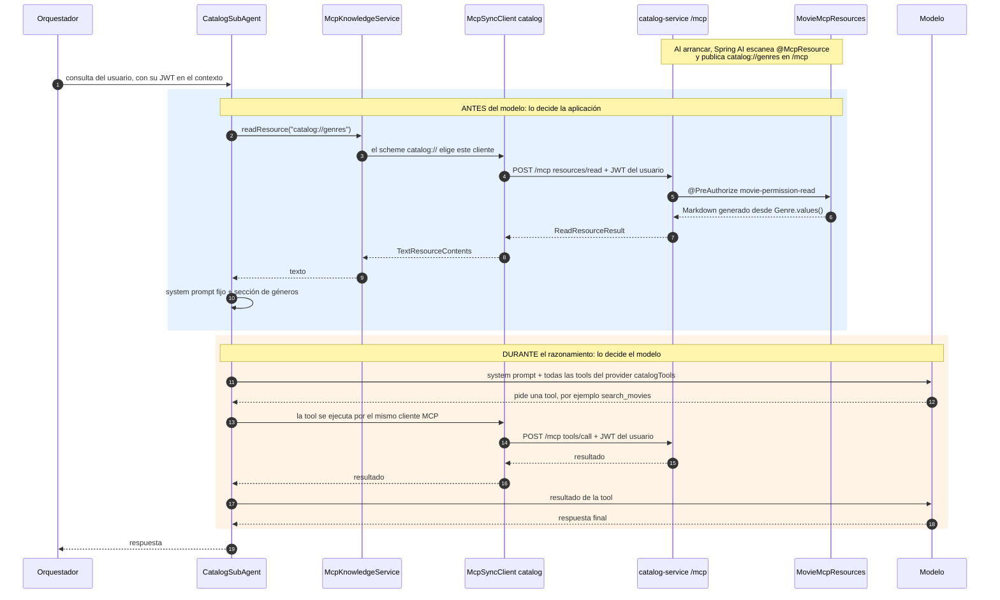

# Incorporación de MCP Resources y MCP Prompts

Hoy el ecosistema usa una sola de las tres primitivas de MCP: **Tools** (`@McpTool`). Este plan incorpora las otras dos —**Resources** (`@McpResource`) y **Prompts** (`@McpPrompt`)— sobre el dominio **que hoy existe**, y deja el patrón montado para los casos de uso con más negocio que vengan después.

> [!IMPORTANT]
> **Este proyecto es una base didáctica.** El objetivo no es resolver el dominio del videoclub, sino dejar el patrón lo bastante claro como para que quien después modele préstamos, reservas o sanciones sepa exactamente dónde va cada cosa. Por eso todo lo que se expone acá sale de datos reales: un recurso que devuelve texto inventado no enseña el patrón, enseña a inventar.

---

## 1. Por qué tres primitivas y no una

La diferencia no es de implementación, es de **quién decide**:

| Primitiva | Quién la invoca | Costo | Para qué sirve |
| :--- | :--- | :--- | :--- |
| **Tool** | El **modelo**, cuando razona que la necesita | Un round trip de tool-calling | Ejecutar una acción o traer datos que el modelo pidió |
| **Resource** | La **aplicación**, antes de hablarle al modelo | Ninguno: se inyecta como contexto | Dar contexto que el modelo no tiene por qué salir a buscar |
| **Prompt** | El **usuario** o la aplicación, eligiendo un flujo | Ninguno | Reutilizar un procedimiento que el dueño del dominio definió |

Hoy todo pasa por Tools. Eso obliga al modelo a gastar una llamada para traer datos que la aplicación ya sabe que va a necesitar, y deja los procedimientos escritos en el prompt del agente en vez de en el servicio que es dueño del dominio.

> [!NOTE]
> **La infraestructura ya está montada.** Los logs de arranque de ambos servicios ya muestran los providers escaneando y encontrando cero:
> ```
> SyncStatelessMcpResourceProvider : No resource methods found in the provided resource objects: []
> SyncStatelessMcpPromptProvider   : No prompt methods found in the provided prompt objects: []
> ```
> No hay que agregar dependencias ni autoconfiguración: sólo faltan los `@Component` con los métodos anotados.

---

## 2. Compatibilidad con el stack actual

| Tema | Estado |
| :--- | :--- |
| **Transporte** | `protocol: stateless` sirve Resources y Prompts sin cambios. *Sampling* y *elicitation* sí exigirían stateful; no están en este plan. |
| **Seguridad** | Resources y Prompts viajan por el mismo `POST /mcp`, ya protegido por el Resource Server y alcanzado por el Token Relay. No hay endpoint nuevo que asegurar. |
| **Gateway** | Sin cambios: el agente habla MCP por la red interna de Docker, no por `:9500`. |
| **Autorización** | `@PreAuthorize` sobre los métodos, igual que en las Tools — con la misma apuesta sobre el descubrimiento proxy-aware. Ver [trampa R1](#r1-el-descubrimiento-proxy-aware-también-aplica-a-resources-y-prompts). |

---

## 3. Cambios propuestos — `catalog-service`

### [NEW] `catalog-service/.../mcp/MovieMcpResources.java`

```java
@McpResource(
    uri = "catalog://movies/{id}",
    name = "movie_card",
    title = "Ficha de película",
    description = "Ficha de una película del catálogo en Markdown, lista para inyectar como contexto.",
    mimeType = "text/markdown")
@PreAuthorize("hasAuthority('movie-permission-read')")
public String movieCard(String id) { ... }
```

**Qué devuelve:** los campos que la entidad `Movie` realmente tiene — `title`, `genre`, `price`, `imageUrl` — renderizados en Markdown.

**Por qué no es un duplicado de `get_movie`:** es el mismo dato en otra representación y con otro consumidor. `get_movie` devuelve `MovieDTO` en JSON para que el modelo lo parsee cuando decidió pedirlo. El recurso devuelve prosa que la aplicación inyecta como contexto sin gastar un tool call. **Esa distinción es el contenido de la clase.**

### [NEW] Recurso de géneros

```java
@McpResource(
    uri = "catalog://genres",
    name = "catalog_genres",
    title = "Géneros del catálogo",
    mimeType = "text/markdown")
@PreAuthorize("hasAuthority('movie-permission-read')")
public String genres() { ... }
```

Devuelve los 10 valores del enum `Genre`: `ACTION`, `COMEDY`, `DRAMA`, `HORROR`, `SCIENCE_FICTION`, `ROMANCE`, `THRILLER`, `ANIMATION`, `DOCUMENTARY`, `FANTASY`.

**Este es el caso más limpio del plan.** Es conocimiento estático, real y hoy invisible para el agente: si el usuario pide "algo de ciencia ficción", el modelo tiene que adivinar que la constante se escribe `SCIENCE_FICTION` y no `Sci-Fi`. Además la base lo valida con un `CHECK` constraint, así que equivocarse no es un detalle estético: es un `500`.

### [NEW] `catalog-service/.../mcp/MovieMcpPrompts.java`

```java
@McpPrompt(
    name = "catalog-alta-pelicula",
    title = "Alta de película",
    description = "Procedimiento para dar de alta una película sin chocar contra las validaciones del catálogo.")
public GetPromptResult altaPelicula(
        @McpArg(name = "titulo", description = "Título tentativo", required = true) String titulo) { ... }
```

El prompt codifica **reglas que el servicio ya impone hoy**:

1. Buscar con `search_movies` antes de crear: el título tiene `UNIQUE`, y repetirlo devuelve `400` con `{Exists.movie.title}`.
2. El género debe ser uno de los 10 del enum — leer `catalog://genres` antes de elegir.
3. `price` es decimal con dos posiciones; `imageUrl` admite `null`.

Eso no es política inventada: es el contrato real de `MovieResource` y `MovieTitleUnique`.

---

## 4. Cambios propuestos — `membership-service`

### [NEW] `membership-service/.../mcp/MembershipMcpResources.java`

```java
@McpResource(
    uri = "membership://socios/{id}",
    name = "socio_card",
    title = "Ficha de socio",
    mimeType = "text/markdown")
@PreAuthorize("hasAuthority('socio-permission-read')")
public String socioCard(String id) { ... }
```

Campos reales de `Socio`: `nombre`, `apellido`, `username`, `email`, `activo`, `fechaAlta`, `fechaBaja`.

> [!WARNING]
> **`activo` es un `boolean`, no un estado.** Hoy no existen "Suspendido" ni "Moroso": el modelo sólo distingue alta y baja lógica. La ficha debe decir *activo / dado de baja* y nada más. Inventar una categoría en el Markdown la vuelve real para el modelo, que después la va a citar con total seguridad.

### [NEW] `membership-service/.../mcp/MembershipMcpPrompts.java`

```java
@McpPrompt(
    name = "membership-alta-socio",
    title = "Alta de socio",
    description = "Flujo de alta y por qué el socio no aparece de inmediato.")
```

**Este es el prompt con más valor real de todo el plan**, porque encapsula la parte contraintuitiva del sistema:

1. El alta se hace contra `POST /api/users`, que crea el usuario en **Keycloak**, no en la base local.
2. Keycloak emite el evento, el SPI lo publica en `keycloak.events`, el ACL lo normaliza y lo republica en `videoclub.events`, y recién ahí `SocioEventListener` crea el `Socio`.
3. **Es consistencia eventual: entre el `201` del alta y el socio visible en `list_socios` pasan milisegundos, pero pasan.** Un agente que consulte inmediatamente después de crear y no encuentre nada no debe concluir que el alta falló.

Ese conocimiento hoy no está escrito en ningún lado que el agente pueda leer, y es exactamente la clase de regla que el dueño del dominio debe publicar en vez de que cada cliente la descubra a los golpes.

---

## 5. Cambios propuestos — `videoclub-agent`

### [NEW] `McpKnowledgeService.java`

Fachada sobre los dos `McpSyncClient` que ya existen. Rutea la lectura de un recurso por el *scheme* de la URI: `catalog://` al cliente de catálogo, `membership://` al de membresía.

```java
String readResource(String uri);   // rutea por scheme
```

Su único consumidor es `CatalogSubAgent`, que lee `catalog://genres` para enriquecer su system prompt.

> [!IMPORTANT]
> **Un scheme desconocido tiene que fallar fuerte, no elegir un cliente por descarte.** Es la misma lógica del fail-fast de `AbstractDomainSubAgent`: si mandás una URI mal escrita al servidor equivocado, el error que vuelve es "recurso no encontrado" y parece un problema de datos cuando en realidad es de ruteo.

### Sin endpoints de introspección en el agente

> [!IMPORTANT]
> **Decisión posterior a la implementación.** Una primera versión agregó a `AgentController` tres endpoints —`GET /api/agent/resources`, `GET /api/agent/prompts` y `GET /api/agent/resources/content?uri=`— junto con los métodos de listado y `getPrompt` en `McpKnowledgeService`. **Se eliminaron** porque:
>
> * **No tenían consumidor.** Ni el frontend, ni las colecciones `.http`, ni Postman, ni la documentación los usaban. `getPrompt` directamente no lo llamaba nadie. `GET /api/agent/tools` sí se conserva: lo usa el indicador de tools del frontend.
> * **`/resources/content?uri=` era un proxy genérico** hacia cualquier recurso MCP. No filtraba datos, porque el Token Relay mantiene la identidad del usuario, pero era superficie expuesta sin motivo, y además convertía todos los errores en un `500` genérico.
> * **Para explorar recursos y prompts ya existe la herramienta estándar:** MCP Inspector, conectado directamente a cada servicio. El client `videoclub-mcp` del realm ya tiene como redirect `http://localhost:6274/*`, el puerto por defecto del Inspector. Consultar el servidor directamente, y no a través del agente, además muestra la primitiva donde vive.
>
> Queda como criterio para el proyecto: **no exponer endpoints "por las dudas".** Un endpoint nace cuando tiene quien lo use.

> [!NOTE]
> **Los prompts MCP los exponen los servicios, pero hoy el agente no los consume.** Están disponibles para cualquier cliente MCP —MCP Inspector, Claude Code— y para un uso futuro dentro del agente.

### [MODIFY] `CatalogSubAgent.java`

Inyectar `catalog://genres` en el system prompt del sub-agente de catálogo, en lugar de dejar que el modelo adivine los nombres de los géneros. Si la lectura falla, registra un `WARN` y sigue sin la lista: a diferencia de quedarse sin tools, perder la lista solo quita una ayuda. `MembershipSubAgent` no cambia, porque no tiene nada que inyectar.

> [!CAUTION]
> **No leer recursos en el constructor.** Los sub-agentes se construyen al arrancar el contexto, cuando todavía no hay ningún usuario y el Token Relay no tiene token que propagar. La lectura va en el momento de la consulta, bajo la identidad de quien pregunta — que es justamente lo que hace confiable la recuperación perezosa de los clientes MCP.

---

## 6. Hints nativos (GraalVM)

### Sin cambios en `NativeRuntimeHints.java`

> [!IMPORTANT]
> **Corrección sobre la versión anterior de este plan.** Proponía registrar a mano los hints de los nuevos `@Component`. **No hace falta, y agregarlos sería ruido.** Spring AI ya los registra: `McpServerAnnotationScannerAutoConfiguration` incluye un procesador AOT que escanea los beans anotados con `@McpTool`, `@McpResource`, `@McpPrompt` y `@McpComplete`, y registra **todos sus miembros** para reflexión.
>
> Es la misma razón por la que `MovieMcpTools` nunca necesitó un hint propio y funcionó en nativo desde el primer día. El hint que sí hizo falta, el de `MovieTitleUniqueValidator`, era para una clase que **no** tiene ninguna de esas anotaciones y que Spring construye por fuera del grafo de beans.

> [!WARNING]
> **Que el AOT de Spring AI cubra los beans no reemplaza probar en nativo.** Ningún test en JVM puede fallar por un hint faltante: ya nos pasó con `MovieTitleUniqueValidator`, con `./mvnw test` en verde, contenedor `healthy` y `500` en la primera llamada real. La verificación nativa de la sección 9 sigue siendo obligatoria.
>
> **La regla para decidir si una clase necesita hint propio:** si lleva una anotación MCP, la cubre Spring AI. Si Spring la instancia por reflexión fuera del grafo normal —un `ConstraintValidator`, un converter armado a mano—, necesita hint y test con `RuntimeHintsPredicates`, siguiendo `NativeRuntimeHintsTest`.

---

## 7. Trampas

### R1. El descubrimiento proxy-aware también aplica a Resources y Prompts

Poner `@PreAuthorize` sobre un método `@McpResource` proxifica el bean, y el descubrimiento sólo lo encuentra porque `SyncMcpAnnotationProviders` resuelve `AopUtils.getTargetClass(bean)` antes de leer los métodos. Es la misma apuesta documentada en `MovieMcpTools` y en `docs/mcp-server.md` §4.

**Falla silenciosa:** si esa resolución desaparece en una versión futura, el servidor arranca anunciando **cero** recursos, sin ningún error en el log. Replicar el test de descubrimiento que ya existe para tools (`McpToolsSecurityTest#everyToolIsDiscoverable`) para recursos y prompts.

### R2. Un recurso que inventa datos es peor que no tenerlo

Un `500` se ve. Un recurso que afirma que existen "socios morosos" no se ve: el modelo lo repite con seguridad y el usuario le cree. **Todo lo que devuelva un recurso tiene que poder rastrearse hasta un campo de una entidad o una constante del código.**

### R3. Los recursos no llevan la autorización puesta

Un Resource se inyecta como contexto **antes** de que el modelo razone, así que es la aplicación la que decide leerlo. Si el `@PreAuthorize` queda afuera, cualquier consulta de cualquier usuario termina inyectando datos que ese usuario no puede ver por REST. La autoridad tiene que ser la misma que la del endpoint equivalente: `movie-permission-read` para catálogo, `socio-permission-read` para socios.

> [!CAUTION]
> **Las authorities de este realm son de grano fino y no hay roles de realm.** El realm `videoclub` define `movie-permission-read/create/update/delete`, `socio-permission-read` y `user-permission-read/create` como *client roles* de `videoclub-frontend`. **No existen `ROLE_USER`, `ROLE_ADMIN` ni `SCOPE_read`**, y además `GrantedAuthorityDefaults("")` elimina el prefijo `ROLE_`. Un `hasAnyAuthority('ROLE_USER', ...)` deniega al 100% de los usuarios.

### R4. Las variables de la URI se ligan por posición, no por nombre

Verificado en `AbstractMcpResourceMethodCallback`: las variables de `catalog://movies/{id}` se asignan **en el orden del template** a los parámetros del método que no son especiales. El nombre del parámetro es irrelevante. Tres reglas se validan **al arrancar**, y un error ahí tumba el contexto con un mensaje explícito:

* cada variable necesita un parámetro;
* esos parámetros tienen que ser `String`;
* la cantidad tiene que coincidir.

**La trampa silenciosa es otra:** con dos o más variables, `catalog://{a}/{b}` ligado a `(String b, String a)` arranca sin error y **cruza los valores en runtime**. Con una sola variable no hay ambigüedad posible.

### R5. Recurso fijo y plantilla son primitivas distintas

`catalog://genres` se registra como **recurso**; `catalog://movies/{id}`, que tiene una variable, como **plantilla de recurso**. MCP las lista por separado (`resources/list` y `resources/templates/list`), y `SyncMcpAnnotationProviders` también: `statelessResourceSpecifications` para las fijas y `statelessResourceTemplateSpecifications` para las plantillas.

**Falla silenciosa:** un test de descubrimiento que solo consulte la lista de recursos fijos no ve ninguna plantilla y pasa igual si la plantilla desaparece.

### R6. Dos servidores con la misma tool: el cliente renombra en vez de fallar

Verificado en `spring-ai-mcp-2.0.1`. El builder de `SyncMcpToolCallbackProvider` usa por defecto `DefaultMcpToolNamePrefixGenerator`, y cuando un nombre de tool ya existe lo **renombra** en lugar de rechazarlo:

```java
if (!this.allUsedToolNames.add(uniqueToolName)) {
    uniqueToolName = "alt_" + this.counter.getAndIncrement() + "_" + uniqueToolName;
    logger.warn("Tool name '" + tool.name() + "' already exists. ...");
}
```

El agente usa ese generador sin haberlo elegido: `McpClientConfiguration` no configura ninguno.

**Falla silenciosa:** el nombre resultante (`alt_0_search`) no tiene significado para el modelo y depende del orden en que se descubrieron los servidores. El modelo recibe una tool que no sabe para qué sirve ni a qué dominio pertenece, y la elige peor o no la elige. Si en algún momento se vuelve a filtrar tools por nombre, ese filtro la descartaría sin ningún error.

**Por qué hoy no ocurre:** las tools llevan el dominio en el nombre (`list_movies`, `list_socios`) y cada sub-agente usa un provider de un solo servidor. Es una convención, no una garantía. Ver la tarea pendiente [T1](#t1-hacer-explícita-la-política-de-nombres-de-tools).

---

## 8. Cómo extender esto cuando el dominio crezca

Lo que hace a este plan una **base** y no un ejercicio cerrado:

| Cuando aparezca… | El recurso o prompt que lo acompaña |
| :--- | :--- |
| Entidad `Prestamo` con plazos y vencimientos | `membership://policies/loans` deja de ser texto inventado y pasa a derivarse de la configuración real (plazo, tope de préstamos simultáneos) |
| Estados de socio más allá de `activo` | `membership://tiers` con los valores reales del enum, igual que `catalog://genres` hoy |
| Reglas de sanción por demora | Prompt `membership-debt-triage` con el procedimiento que el dominio implemente |
| Campos nuevos en `Movie` (año, sinopsis, director) | La ficha de `catalog://movies/{id}` los suma sin cambiar su firma |
| **Un microservicio nuevo con sus propias tools** | Nombrar las tools con su dominio y resolver antes la tarea pendiente [T1](#t1-hacer-explícita-la-política-de-nombres-de-tools): es el caso en que una colisión de nombres deja de ser teórica |

**La regla que conviene sostener:** un recurso nace cuando existe el dato, no antes. Mientras tanto, el patrón queda demostrado con `catalog://genres`, que es pequeño, verdadero y suficiente para explicar la primitiva.

---

## 9. Plan de verificación

### Tests automatizados

1. **Descubrimiento** (`catalog-service` y `membership-service`): que los providers encuentren los recursos, las plantillas y los prompts esperados a través del camino real —`SyncMcpAnnotationProviders`— y no del API público proxy-blind. Recursos fijos y plantillas se afirman **por separado** (ver [R5](#r5-recurso-fijo-y-plantilla-son-primitivas-distintas)). Espejo de `McpToolsSecurityTest#everyToolIsDiscoverable`.
2. **Autorización**: cada recurso denegado sin la authority correspondiente y permitido con ella, más `AuthenticationCredentialsNotFoundException` con contexto vacío. Espejo de los casos que ya existen para tools.
3. **Hints nativos**: ninguno propio (ver sección 6). La cobertura nativa se comprueba con el build nativo de la verificación manual, no con un test en JVM.
4. **Agente**: `McpKnowledgeServiceTest` — ruteo por scheme, y que un scheme desconocido lance en vez de elegir un cliente.

### Verificación manual

**Explorar recursos, plantillas y prompts de un servicio** con MCP Inspector, conectado directamente al servidor:

```bash
npx @modelcontextprotocol/inspector
```

Conectarse a `http://localhost:8081/mcp` (catálogo) o `http://localhost:8082/mcp` (membresía) con transporte *Streamable HTTP*, autenticándose con el client `videoclub-mcp`.

1. **Autorización real:** autenticado como `usuariocliente` (que no tiene `socio-permission-read`), leer `membership://socios/{id}` debe devolver un error de acceso denegado, no una ficha. Como `usuarioadmin`, debe devolver la ficha.
2. **Prueba conversacional con los géneros**, verificada en vivo sobre imágenes nativas. En la base hay películas de solo algunos géneros y ninguna tool lista géneros, así que si el agente nombra un género sin películas, ese dato solo pudo salir del recurso:
   * *"¿Qué géneros de películas maneja el videoclub, aunque todavía no haya películas cargadas de ese género?"* → responde `CatalogSubAgent`, con `Tools: []`, y nombra los 10 géneros del enum.
   * *"Dá de alta Rocky como película de deportes"* (como `usuarioadmin`) → avisa que "deportes" no es un género válido y ofrece constantes reales, sin llamar a `create_movie` con un valor que la base rechazaría.
3. **En imagen nativa:** repetir 1 y 2 sobre `BUILD_TARGET=native-runtime`. **Es el único modo que puede revelar un hint faltante.**

> [!NOTE]
> **Por qué en el chat no se ve la lectura del recurso.** Una tool la pide el modelo mientras razona, y el frontend la muestra. El recurso lo lee la aplicación **antes** de que el modelo empiece, en cada consulta de catálogo, así que no hay nada que mostrar "en el medio". Es la diferencia central entre las dos primitivas.

---

## 10. Cómo se conecta el conocimiento entre los servicios y el agente

Esta sección documenta cómo viaja hoy el conocimiento del dominio desde un servicio hasta el modelo, de quién es cada parte, y qué mecanismos ofrece MCP para que cada servicio publique lo suyo. Las tareas concretas que se desprenden están en la [sección 11](#11-tareas-pendientes).

### 10.1. El recorrido de un recurso, paso a paso



**La diferencia que explica todo el diagrama:** el bloque azul ocurre **antes** de que el modelo empiece, en **cada** consulta de catálogo, la necesite o no. El bloque naranja ocurre **durante** el razonamiento, y solo si el modelo decide que necesita una tool.

Por eso en el chat se ven las tools usadas y no se ve la lectura del recurso. No es que el modelo "no la haya usado": nunca la pidió, porque ya la tenía en sus instrucciones al empezar.

### 10.2. De quién es cada parte del system prompt

El system prompt de `CatalogSubAgent` no es un problema por su tamaño. El problema es que **mezcla conocimiento de tres dueños distintos** en un único `String.format` de Java.

| Qué dice hoy el prompt | Dueño | Dónde debería vivir | Estado |
| :--- | :--- | :--- | :--- |
| Descripción del dominio: *"atendés consultas sobre películas, estrenos, géneros…"* | `catalog-service` | `instructions` del servidor MCP | Pendiente: [T3](#t3-usar-las-instructions-del-servidor-como-descripción-del-dominio) |
| Procedimiento de alta: *"podés crear películas con `create_movie`"* | `catalog-service` | Publicado por el servidor | **Hecho**: recurso `catalog://procedures/movie-creation` ([T4](#t4-publicar-el-procedimiento-de-alta-desde-el-servidor)) |
| Géneros válidos | `catalog-service` | Recurso `catalog://genres` | **Hecho** |
| Qué tools tiene el sub-agente | `catalog-service` | Lo que expone su servidor MCP | **Hecho**: ver 10.5 |
| *"Usá siempre las tools"*, tono, *"respondé en español"* | agente | System prompt del agente | Correcto donde está |
| Formato `json:movies` para las tarjetas (≈40 % del prompt) | agente + frontend | System prompt, pero en un template | Pendiente: [T6](#t6-sacar-el-contrato-de-formato-del-stringformat) |

> [!NOTE]
> **La duplicación se resolvió.** Los pasos del procedimiento de alta viven en un único lugar de `catalog-service` (`MovieCreationProcedure#steps()`, en `ar.unrn.video.catalog.mcp`), y desde ahí se sirven de dos formas: como el recurso `catalog://procedures/movie-creation`, que `CatalogSubAgent` inyecta en su system prompt igual que `catalog://genres`, y como el prompt `catalog-alta-pelicula`, para el flujo que elige el usuario con un `titulo` concreto. El test de regresión que ancla que no vuelvan a divergir es `McpResourcesSecurityTest.procedureResourceAndPromptShareTheSameSteps`.

### 10.3. Los cuatro mecanismos de MCP para que un servicio publique su conocimiento

MCP no ofrece dos mecanismos para esto, sino **cuatro**. Todas las APIs de la tabla se verificaron contra `mcp-core-2.0.0`.

| Mecanismo | Qué transporta | Cómo lo lee el agente | Costo por consulta | Estado en el proyecto |
| :--- | :--- | :--- | :--- | :--- |
| **`instructions`** | Descripción del servidor y de su dominio | `McpSyncClient.getServerInstructions()` | Ninguno: llega en el handshake | El catálogo **ya las envía** (verificado en vivo); el agente las ignora |
| **Recurso** | Datos y constantes del dominio | `readResource(ReadResourceRequest.builder(uri).build())` | Una llamada; se puede cachear | Implementado y consumido: `catalog://genres`, `catalog://procedures/movie-creation` |
| **Prompt** | Procedimientos y flujos | `getPrompt(GetPromptRequest.builder(nombre).arguments(args).build())` | Una llamada; se puede cachear | Publicados por ambos servicios; el agente no los consume, por diseño (ver [T4](#t4-publicar-el-procedimiento-de-alta-desde-el-servidor)) |
| **Metadatos de tool** | Si una tool es de lectura, destructiva o idempotente | `McpSchema.Tool.annotations().readOnlyHint()`, desde un `McpToolFilter` | Ninguno: llegan con el descubrimiento | Declarados en todas las tools (ADR-011); el agente no los usa |

El respaldo de la primera fila se puede comprobar en cualquier momento. Con el stack levantado, este comando hace el handshake `initialize` contra `catalog-service` y muestra las `instructions` que devuelve:

```bash
TOKEN=$(curl -s -X POST "http://localhost:9090/realms/videoclub/protocol/openid-connect/token" \
  -d "grant_type=password" -d "client_id=videoclub-frontend" \
  -d "username=usuarioadmin" -d "password=usuarioadmin" -d "scope=openid" | jq -r .access_token)

docker exec videoclub-catalog-prod curl -s -X POST http://localhost:8081/mcp \
  -H "Authorization: Bearer $TOKEN" \
  -H "Content-Type: application/json" \
  -H "Accept: application/json, text/event-stream" \
  -d '{"jsonrpc":"2.0","id":1,"method":"initialize","params":{"protocolVersion":"2025-06-18","capabilities":{},"clientInfo":{"name":"probe","version":"1"}}}' \
  | jq -r .result.instructions
```

Resultado observado:

```
Herramientas del catalogo de peliculas del VideoClub UNRN: listado, busqueda, consulta por id y alta de peliculas. No expone datos de socios.
```

> [!NOTE]
> En `docker-compose.prod.yml` los servicios no publican su puerto al host, por eso el `curl` corre dentro del contenedor. Con `docker-compose.yml` (desarrollo) el puerto `8081` sí está publicado y alcanza con `curl -s -X POST http://localhost:8081/mcp ...` desde el host. Si el texto cambia, la fuente es `spring.ai.mcp.server.instructions` en `catalog-service/src/main/resources/application.yml`.

### 10.4. Precauciones antes de mover conocimiento al servidor

* **Todo lo que llega del servidor entra al system prompt.** Es aceptable porque los servidores son propios. Con un servidor MCP de terceros sería una vía directa para inyectar instrucciones al modelo, y ese contenido tendría que tratarse como no confiable.
* **Los metadatos de tool son pistas, no seguridad.** Sirven para decidir qué se le ofrece al modelo. Quién puede ejecutar qué lo sigue decidiendo el `@PreAuthorize` del servidor, con el token del usuario.
* **Si el servidor no responde, el agente degrada, no se cae.** Es lo que ya hace con los géneros: sin la lista, el sub-agente sigue funcionando.
* **Recursos y prompts casi no cambian**, así que se pueden cachear en lugar de pedirlos en cada consulta. `instructions` no necesita caché: ya viene del handshake.

### 10.5. Decisión: los sub-agentes ya no tienen una lista de tools escrita a mano

**Estado: implementado.** Revierte la parte de la decisión D3 de [arquitectura-dos-servicios.md](arquitectura-dos-servicios.md) que decía *"se conserva el filtro por nombre de `AbstractDomainSubAgent`"*.

Hasta ahora, `CatalogSubAgent` y `MembershipSubAgent` declaraban la lista de nombres de tools que aceptaban (`CATALOG_TOOL_NAMES`, `MEMBERSHIP_TOOL_NAMES`), y `AbstractDomainSubAgent` descartaba cualquier otra. La lista venía de cuando un único servidor exponía las seis tools y había que separarlas por nombre. Desde la separación en dos servicios, cada sub-agente recibe un provider **dedicado** (`@Qualifier("catalogTools")`, `@Qualifier("membershipTools")`) que solo contiene las tools de su servidor, así que la lista duplicaba información que ya estaba resuelta por configuración y obligaba a tocar el agente cada vez que un servicio agregaba una tool.

Ahora:

* **Cada sub-agente usa todas las tools de su provider dedicado.** El límite del dominio vive en `McpClientConfiguration`: qué cliente respalda a qué provider.
* **El fail-fast se mantiene.** Si el provider no expone ninguna tool, por ejemplo porque el servidor está caído, el sub-agente falla en lugar de dejar que el modelo responda sin datos reales.
* **La autorización no cambia.** Cada llamada a una tool viaja con el JWT del usuario y la valida el `@PreAuthorize` del servidor. La lista de nombres nunca fue un control de seguridad.

**Qué lo comprueba.** Las dos afirmaciones de comportamiento están cubiertas por tests en el repositorio `videoclub-agent`, en `src/test/java/ar/unrn/video/agent/subagents/`:

| Afirmación | Tests | Qué verifican |
| :--- | :--- | :--- |
| El fail-fast se mantiene | `CatalogSubAgentTest.shouldFailFastWhenNoCatalogToolsDiscovered` y `MembershipSubAgentTest.shouldFailFastWhenNoMembershipToolsDiscovered` | Con un provider **vacío**, el sub-agente lanza `IllegalStateException` en lugar de ejecutar el modelo sin tools. |
| No hay filtro por nombre | `CatalogSubAgentTest.shouldResolveAllToolsFromDedicatedProviderWithoutFiltering` y `MembershipSubAgentTest.shouldResolveAllToolsFromDedicatedProviderWithoutFiltering` | Una tool llamada `delete_movie`, que nunca figuró en ninguna lista, **tiene que llegar** al sub-agente. |

El segundo par funciona además como **control de regresión**: si alguien vuelve a introducir un filtro por nombre, esos tests fallan en lugar de que una tool desaparezca en silencio.

> [!IMPORTANT]
> **Costo aceptado:** una tool nueva que se agregue en un servicio le llega al modelo del sub-agente **automáticamente**, sin revisión en el agente. Si el proyecto necesita que las tools de escritura requieran habilitación explícita, la forma de lograrlo sin volver a una lista de nombres está en la tarea [T5](#t5-política-de-tools-por-metadatos-y-no-por-nombre).

---

## 11. Tareas pendientes

### T1. Hacer explícita la política de nombres de tools

**Estado:** pendiente. Surge de la revisión de un artículo externo sobre Spring AI MCP, contrastado contra el código fuente de `spring-ai-mcp-2.0.1`.

#### Qué hay que hacer

1. En `videoclub-agent/.../config/McpClientConfiguration.java`, configurar explícitamente los tres `SyncMcpToolCallbackProvider` (`catalogTools`, `membershipTools` y el `@Primary` agregado) con:

   ```java
   SyncMcpToolCallbackProvider.builder()
           .mcpClients(catalogMcpClient)
           .toolNamePrefixGenerator(McpToolNamePrefixGenerator.noPrefix())
           .build();
   ```

2. Documentar como convención del proyecto que **toda tool lleva su dominio en el nombre** (`list_movies`, `get_socio`), y no un nombre genérico (`list`, `search`, `get_by_id`).

3. Agregar un test que construya un provider sobre dos clientes simulados que exponen el mismo nombre y verifique que `getToolCallbacks()` lanza `IllegalStateException`.

#### Qué aporta

**Convierte una falla silenciosa en una falla visible**, que es la misma filosofía que ya sigue `AbstractDomainSubAgent` cuando un sub-agente se queda sin tools. Con `noPrefix()`, dos tools con el mismo nombre no se renombran: llegan a la validación de `SyncMcpToolCallbackProvider`, que lanza `IllegalStateException("Multiple tools with the same name (...)")` en el primer descubrimiento.

Eso importa por el propósito de este proyecto. Hoy son dos servicios y la colisión es teórica. Cuando se sumen servicios nuevos, el error aparece durante el desarrollo de quien introdujo el nombre repetido, y no semanas después como una tool que el agente dejó de encontrar sin ningún error en el log.

**Hace visible una decisión que hoy es implícita.** El proyecto depende de que los nombres no colisionen, pero en ningún lado está escrito. Configurar el generador a mano deja la política en el código, donde la ve quien lo lee.

#### Costo aceptado

Con `noPrefix()`, una colisión en el provider agregado hace fallar `GET /api/agent/tools` en lugar de listar la tool como `alt_0_...`. Se prefiere así: un listado que falla avisa del problema; uno que muestra un nombre inventado lo esconde.

> [!WARNING]
> **Si en esta tarea se usa también `toolFilter`, atención a la firma.** En Spring AI 2.0.1, `McpToolFilter` es `BiPredicate<McpConnectionInfo, McpSchema.Tool>`: el segundo parámetro es el objeto `Tool`, no su nombre. Un filtro escrito como `(server, toolName) -> Set.of("x").contains(toolName)` **compila**, porque `Set.contains` acepta cualquier `Object`, pero devuelve siempre `false`: el cliente se queda sin ninguna tool y no hay error. Se comprobó compilando y ejecutando ese código contra 2.0.1. La forma correcta es `(info, tool) -> Set.of("x").contains(tool.name())`.

### T2. Afinar la regla que decide que una tool fue denegada

**Estado:** pendiente, con prioridad baja. Surge de la prueba de punta a punta sobre imágenes nativas.

#### El problema

`TrackingToolCallback` (líneas 60-64) decide que una tool fue **denegada** buscando texto en el mensaje de error:

```java
msg.contains("Access Denied")
|| msg.contains("AccessDeniedException")
|| msg.contains("403")                       // demasiado amplio
|| msg.contains("Forbidden")
|| msg.toLowerCase().contains("denied")      // demasiado amplio
|| msg.toLowerCase().contains("permis")      // demasiado amplio
```

`"No movie found with id 14030"` contiene `"403"`, así que un "no existe" se registra en `toolsDenied` y **el frontend lo muestra como una tool denegada**. Hace falta que el número coincida, pero cuando pasa el usuario ve un motivo falso.

#### Qué hay que hacer

1. Buscar la frase `Access Denied` o el nombre `AccessDeniedException`, y no números sueltos ni fragmentos de palabras.
2. Agregar un test con un mensaje de "no existe" que contenga `403` y verificar que **no** se registre como denegado.

#### Límite que hay que respetar

**La denegación solo puede detectarse por texto.** Verificado en las fuentes de Spring AI 2.0.1, el camino completo es:

1. `@PreAuthorize` lanza `AccessDeniedException` **antes** de que corra el método de la tool, así que el servicio no tiene oportunidad de traducirla.
2. Del lado del servidor, `AbstractSyncMcpToolMethodCallback.createSyncErrorResult` la convierte en un `CallToolResult` con `isError: true` y el mensaje de la excepción **como texto**.
3. Del lado del cliente, `SyncMcpToolCallback` lanza `ToolExecutionException("Error calling tool: " + contenido)`.

**En ningún punto aparece un código de error**: lo único que llega a `TrackingToolCallback` es texto. Por eso la regla no puede reemplazarse por un código, y tiene que ser precisa.

> [!NOTE]
> **Tools y recursos fallan distinto.** Una tool devuelve un resultado normal marcado con `isError: true`. Un recurso, en cambio, falla con un error JSON-RPC (`-32602`, verificado en `SyncStatelessMcpResourceMethodCallback`). Quien escriba código que maneje errores de las dos primitivas no puede asumir que se comportan igual.

#### Qué aporta

**El chat deja de mostrar motivos falsos.** Una tool que no encontró datos deja de aparecer como denegada, y el indicador de tools denegadas vuelve a significar exactamente eso.

### T3. Usar las `instructions` del servidor como descripción del dominio

**Estado:** pendiente.

**Qué:** reemplazar la parte del system prompt de cada sub-agente que describe su dominio por las `instructions` que publica su servidor. Incluye `MembershipSubAgent`, cuyo prompt todavía nombra sus tools a mano (*"get_socio, list_socios"*): después de la sección 10.5 esos nombres ya no los controla el agente, así que es texto que puede quedar desactualizado.

**Cómo:** `catalogMcpClient.getServerInstructions()`. No agrega ninguna llamada: el valor llega en el handshake `initialize`. El texto se escribe en `spring.ai.mcp.server.instructions` del `application.yml` de cada servicio, que pasa a ser la única fuente.

**Qué aporta:** el servicio que es dueño del dominio lo describe una sola vez, y lo reciben igual el agente propio y cualquier cliente MCP externo (Claude Code, MCP Inspector).

**Cuidados:**
* Si el handshake de arranque falló, por ejemplo porque el servicio estaba caído al iniciar el agente, `getServerInstructions()` devuelve `null` hasta que el cliente se reinicializa en el primer request autenticado. El sub-agente tiene que tolerarlo.
* El texto actual de `instructions` está pensado como descripción corta para clientes externos y está escrito sin tildes. Antes de usarlo como parte del prompt conviene revisarlo.

### T4. Publicar el procedimiento de alta desde el servidor

**Estado:** hecho. Se eligió el camino del **recurso**: `catalog://procedures/movie-creation`, sin argumentos, inyectado por `CatalogSubAgent` igual que `catalog://genres`. Es la opción correcta para este caso porque el procedimiento de alta es contexto que el sub-agente necesita tener siempre disponible, no un flujo que el usuario elige explícitamente con un título en mano — que es justamente lo que exige el prompt `catalog-alta-pelicula`, que queda publicado pero sin consumidor en el agente, por diseño.

**Qué:** eliminar del prompt del agente la frase *"podés crear películas con `create_movie`"* y usar el procedimiento que ya publica `catalog-service`, con las reglas reales del dominio.

**La decisión: prompt MCP o recurso.** El prompt `catalog-alta-pelicula` existe, pero tiene el argumento `titulo` **obligatorio**. Y el system prompt se arma **antes** de que el modelo razone, cuando todavía no se sabe si el usuario va a pedir un alta ni con qué título. Hay dos caminos:

| Camino | Cómo | Cuándo conviene |
| :--- | :--- | :--- |
| **Recurso** | Publicar el procedimiento como `catalog://procedures/movie-creation`, sin argumentos, e inyectarlo igual que los géneros | Cuando es contexto que el agente debe tener siempre. **Es el caso de este sub-agente.** |
| **Prompt MCP** | `getPrompt(GetPromptRequest.builder("catalog-alta-pelicula").arguments(Map.of("titulo", t)).build())` | Cuando lo elige el **usuario** como un flujo guiado, con datos que ya conoce. Es el uso para el que MCP define los prompts. |

Esta tarea es el mejor ejemplo del proyecto para distinguir las primitivas de la sección 1: **un prompt MCP lo elige quien usa el cliente; un recurso lo inyecta la aplicación.**

**Relación con la decisión de la sección 5:** `McpKnowledgeService.getPrompt` se eliminó por no tener consumidor. Si se elige el camino del prompt, vuelve **con** un consumidor, que es exactamente el criterio que dejó esa decisión.

### T5. Política de tools por metadatos y no por nombre

**Estado:** pendiente y **opcional**. Solo hace falta si el proyecto quiere que las tools de escritura no lleguen al modelo automáticamente (ver el costo aceptado en 10.5).

**Qué:** configurar un `McpToolFilter` en el provider de cada sub-agente que deje pasar las tools de solo lectura y exija habilitación explícita para las de escritura.

**Cómo:**

```java
SyncMcpToolCallbackProvider.builder()
        .mcpClients(catalogMcpClient)
        .toolFilter((connection, tool) ->
                tool.annotations() != null && Boolean.TRUE.equals(tool.annotations().readOnlyHint()))
        .build();
```

Las tools ya declaran esos metadatos (ADR-011): `list_movies`, `get_movie` y `search_movies` con `readOnlyHint = true`, y `create_movie` con `readOnlyHint = false`.

**Cuidados:**
* Los metadatos son pistas que declara el servidor, no un control de seguridad (ver 10.4).
* Respetar la firma de `McpToolFilter`: el segundo parámetro es un `McpSchema.Tool`, no un nombre. Ver la advertencia de [T1](#t1-hacer-explícita-la-política-de-nombres-de-tools).

### T6. Sacar el contrato de formato del `String.format`

**Estado:** pendiente.

**Qué:** mover la regla de formato de Generative UI (el bloque `json:movies` que el frontend convierte en tarjetas, cerca del 40 % del system prompt de `CatalogSubAgent`) a un template versionado en `src/main/resources` del **agente**.

**Cómo:** `SystemPromptTemplate` de Spring AI, disponible en `spring-ai-model-2.0.1`, cargando el archivo como `Resource`.

**Qué aporta:** el texto se lee y se revisa como texto, no como una cadena de Java con comillas y `\n` escapados, y se puede cambiar sin tocar la lógica.

> [!CAUTION]
> **Este conocimiento no va al servidor.** El formato `json:movies` es un contrato entre el agente y el frontend: `catalog-service` no sabe que existen las tarjetas de React. Publicarlo desde el servicio acoplaría el dominio a una decisión de interfaz, y cambiar la UI obligaría a redesplegar el catálogo.

