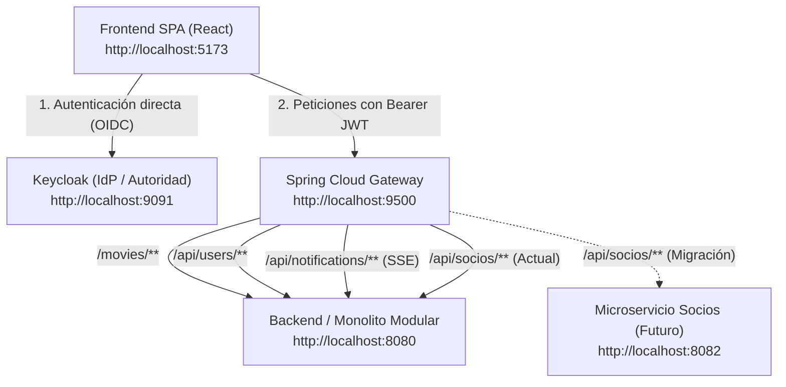
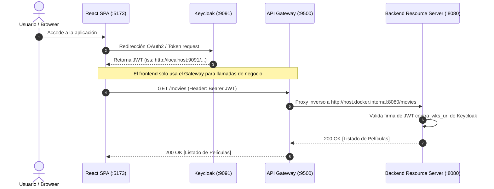

# Arquitectura y Configuración del API Gateway

Este documento describe la arquitectura, decisiones de diseño, configuración de red, manejo de CORS y estrategias de prueba del **API Gateway** en la plataforma VideoClub.

---

## 1. Rol y Propósito del API Gateway

El API Gateway actúa como el **punto único de entrada (Single Point of Entry)** para los clientes externos (como la aplicación SPA en React) hacia los servicios internos del backend.



### Principios Fundamentales
1. **Desacoplamiento Topológico:** Los clientes frontales desconocen direcciones IP, puertos internos y topología de red de los microservicios.
2. **Fachada Orientada a Recursos (Resource-Oriented Facade):** Las URLs expuestas al frontend representan entidades del dominio (`/movies`, `/api/socios`), no nombres de servicios o contenedores.
3. **Evolución sin Ruptura:** Permite extraer módulos a microservicios independientes cambiando únicamente la regla de ruteo del Gateway, sin alterar una sola línea de código en el frontend.

---

## 2. Decisiones de Arquitectura (ADR)

### ADR 1: Rutas Basadas en Recursos vs. Prefijos de Servicio

* **Contexto:** Inicialmente se consideró utilizar prefijos como `/catalogo/movies/**` o fijar `VITE_API_BASE_URL=http://localhost:9500/catalogo`.
* **Problema:** Si el frontend ata su base URL a `/catalogo`, no puede consumir otros servicios (`/socios`, `/alquileres`) a través del mismo Gateway sin múltiples instancias de clientes HTTP o refactorizaciones de código.
* **Decisión:** Implementar **Resource-Based Routing**:
  * Base URL del frontend: `http://localhost:9500`
  * El frontend invoca `/movies`, `/api/socios`, `/api/users`, `/api/notifications`.
  * El Gateway inspecciona el path y despacha al servicio correspondiente.
* **Beneficio:** Transición transparente de monolito modular a microservicios. Cuando el módulo `Socio` se convierta en un servicio independiente en el puerto `8082`, solo se modifica la URI de destino en el Gateway.

---

### ADR 2: Separación del Plano de Identidad (Keycloak fuera del Gateway)

* **Pregunta:** *¿Debería enrutarse Keycloak a través del API Gateway (ej. `/auth/**`)?*
* **Decisión:** **NO**. Keycloak debe mantenerse en su propio puerto y endpoint de autoridad (`:9091`).
* **Justificación Técnica:**
  1. **Separación de Planos:** Keycloak opera en el **Identity Control Plane** (emisión de tokens, flujos OIDC, consentimiento). El Gateway opera en el **Data Plane** (orquestación y ruteo de peticiones de negocio).
  2. **Validación del Claim `iss` (Issuer):** Según la especificación OpenID Connect Core 1.0, los tokens JWT contienen el claim obligatorio `iss` (ej. `http://localhost:9091/realms/videoclub`). Los Resource Servers (Spring Boot) validan que el `iss` coincida exactamente con el emisor configurado en `spring.security.oauth2.resourceserver.jwt.issuer-uri`. Si las peticiones pasan por el Gateway bajo otra URL, se producen discrepancias que provocan `JwtValidationException: Invalid issuer`.
  3. **Flujo Canónico OAuth2/OIDC:**
     * El navegador interactúa directamente con Keycloak para login, redirecciones y refresh tokens.
     * El navegador adjunta el `access_token` resultante en el header `Authorization: Bearer <token>` hacia el Gateway.



---

## 3. Manejo de CORS y Headers Duplicados

### El Problema de la Duplicación de Cabeceras
Cuando tanto Spring Boot (`SecurityConfiguration`) como Spring Cloud Gateway agregan la cabecera `Access-Control-Allow-Origin: http://localhost:5173`, la respuesta HTTP contiene dos valores idénticos o concatenados por coma:
```http
Access-Control-Allow-Origin: http://localhost:5173, http://localhost:5173
```
La especificación W3C / Fetch Standard prohíbe valores múltiples en `Access-Control-Allow-Origin`. Al recibir esto, el navegador bloquea la petición por violación de CORS, afectando tanto llamadas `fetch` como conexiones persistentes de Server-Sent Events (`EventSource`).

### Regla W3C: Wildcard vs. Credenciales
La especificación establece que cuando `Access-Control-Allow-Credentials` es `true`, el valor de `Access-Control-Allow-Origin` **no puede ser `*`**.

### Solución Implementada
1. **`allowedOriginPatterns: "*"`:** Permite cualquier origen sin violar la especificación, ya que Spring refleja dinámicamente el origen que emitió la petición (`Origin: http://localhost:5173`).
2. **Filtro `DedupeResponseHeader`:** Elimina cabeceras CORS duplicadas generadas tanto por el Gateway como por los microservicios aguas abajo.

Fragmento de configuración en `docker/gateway/gateway.yml`:
```yaml
spring:
  cloud:
    gateway:
      server:
        webflux:
          globalcors:
            cors-configurations:
              '[/**]':
                allowedOriginPatterns: "*"
                allowedMethods: "*"
                allowedHeaders: "*"
                allowCredentials: true
          routes:
            - id: service-catalogo
              uri: http://host.docker.internal:8080
              predicates:
                - Path=/movies/**
              filters:
                - DedupeResponseHeader=Access-Control-Allow-Origin Access-Control-Allow-Credentials, RETAIN_UNIQUE
```

---

## 4. Despliegue con Docker Compose

El Gateway utiliza la imagen compilada con **GraalVM Native Image** (`registry.gitlab.com/public-unrn/apigateway:1.0`).

### Consideración sobre Imágenes Nativas (AOT)
Las imágenes GraalVM AOT tienen un classpath estático e inmutable en tiempo de ejecución. Filtros como `RequestRateLimiter` requieren que la dependencia reactiva de Redis (`spring-boot-starter-data-redis-reactive`) y los beans asociados (`KeyResolver`) hayan sido analizados y compilados en el artefacto nativo. No se pueden inyectar dinámicamente si la imagen base no los incluye.

### Definición del Servicio en `docker/apigateway.yaml`
```yaml
services:
  gateway:
    image: registry.gitlab.com/public-unrn/apigateway:1.0
    container_name: videoclub-gateway-1
    ports:
      - "9500:9500"
    extra_hosts:
      - "host.docker.internal:host-gateway"
    volumes:
      - ./gateway/gateway.yml:/workspace/config/application.yml:ro
```

* **`extra_hosts`:** Permite que el contenedor del Gateway en entornos Linux resuelva `host.docker.internal` hacia el host de desarrollo (donde corre `springboot-sso` en `:8080`).
* **Volumen `/workspace/config/application.yml`:** Monta el archivo externo de rutas y CORS sin necesidad de lidiar con el formateo sensible de variables de entorno en listas y mapas YAML.

---

## 5. Tabla de Rutas Activas

| ID de Ruta | Predicado (Path) | Destino Interno | Filtros Aplicados |
| :--- | :--- | :--- | :--- |
| `service-catalogo` | `/movies/**` | `http://host.docker.internal:8080` | `DedupeResponseHeader` |
| `service-socios` | `/api/socios/**` | `http://host.docker.internal:8080` | `DedupeResponseHeader` |
| `service-users` | `/api/users/**` | `http://host.docker.internal:8080` | `DedupeResponseHeader` |
| `service-notificaciones` | `/api/notifications/**` | `http://host.docker.internal:8080` | `DedupeResponseHeader` |

---

## 6. Verificación y Testing

### Configuración del Frontend (`react-sso/.env`)
```env
VITE_API_BASE_URL=http://localhost:9500
```

### Pruebas Automatizadas con Cliente HTTP
Las pruebas se encuentran centralizadas en [VideoClub con Seguridad.http](file:///home/horacio/proyectos/unrn/taller/springboot-sso/postman/VideoClub%20con%20Seguridad.http):

1. **Prueba Directa al Backend (:8080):**
   ```http
   GET http://localhost:8080/movies
   Authorization: Bearer {{access_token}}
   ```
2. **Prueba a través del API Gateway (:9500):**
   ```http
   GET http://localhost:9500/movies
   Authorization: Bearer {{access_token}}
   ```
3. **Soporte Server-Sent Events (SSE):**
   ```bash
   curl -N -H "Accept: text/event-stream" http://localhost:9500/api/notifications/subscribe
   ```
