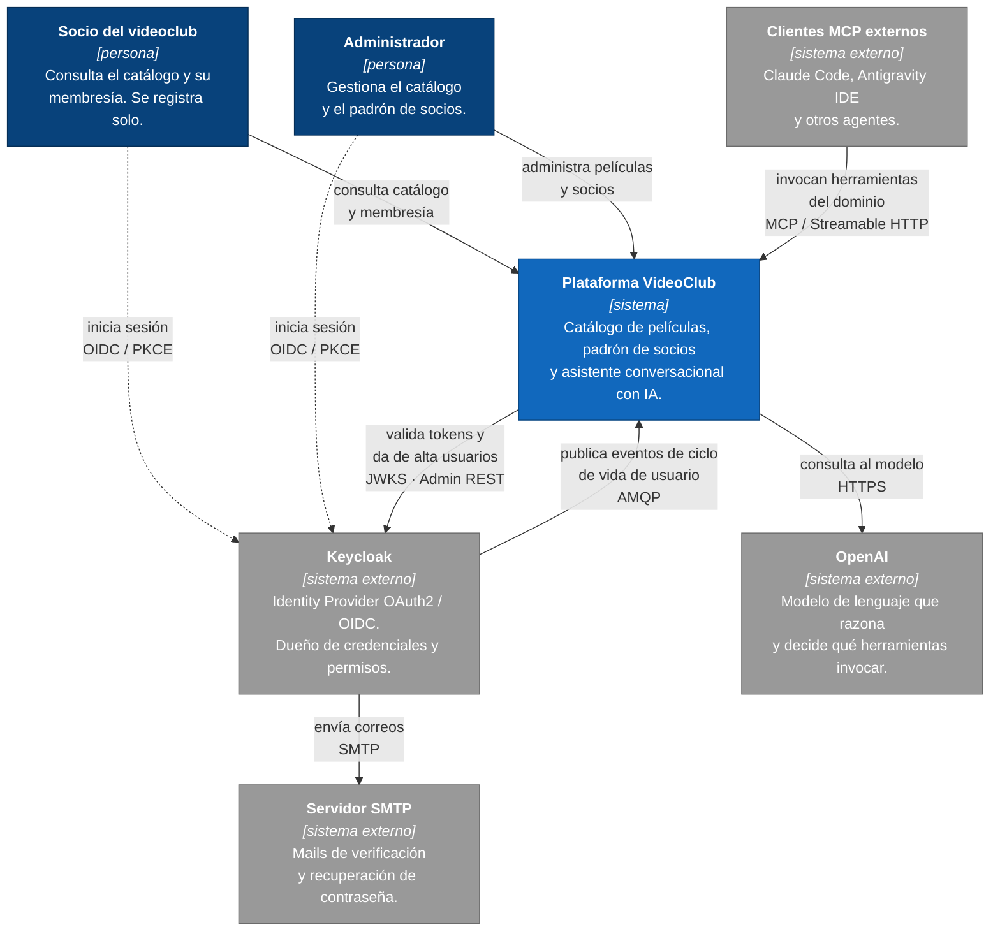
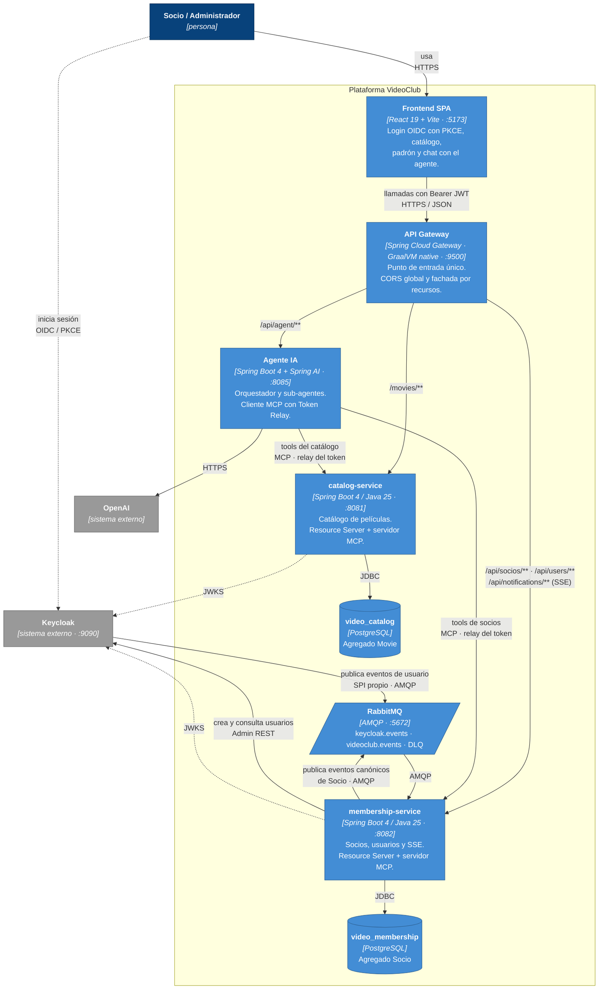

# Arquitectura de la Plataforma (Modelo C4)

Vista de conjunto de la plataforma VideoClub usando el [modelo C4](https://c4model.com/): dos niveles de zoom, de lo general a lo concreto.

El resto de la documentación entra en detalle por dominio —seguridad, CORS, MCP, mensajería—. **Este documento es el mapa que da sentido a los demás:** si es la primera vez que mirás el sistema, empezá acá.

> [!NOTE]
> **Por qué `flowchart` y no la sintaxis `C4Context` de Mermaid.** Mermaid trae palabras clave propias para C4 (`C4Context`, `C4Container`), pero su renderizador las maqueta en **una sola columna**, con las etiquetas de relación superpuestas hasta volverse ilegibles. Se probó, incluido `UpdateLayoutConfig($c4ShapeInRow=...)`, que en la versión actual no tiene efecto.
>
> Lo que importa del C4 es el **modelo** —los niveles de abstracción y el vocabulario de elementos—, no la palabra clave. Estos diagramas usan `flowchart` respetando la convención de colores de C4: azul oscuro para personas, azul para elementos del sistema, gris para lo externo. Si algún día el renderizador mejora, la traducción es mecánica.

> [!NOTE]
> **Por qué dos niveles y no cuatro.** C4 define Contexto, Contenedores, Componentes y Código. Los dos primeros responden *qué es el sistema* y *de qué piezas está hecho*, y son los que envejecen despacio. El nivel de Componentes cambia con cada refactor y se documenta mejor cerca del código; el de Código lo genera el IDE mejor que cualquier diagrama a mano.

---

## Nivel 1 — Contexto del sistema

Quién usa la plataforma y con qué sistemas externos habla. Sin detalles de implementación: acá no hay puertos ni tecnologías.

**Lo que este nivel deja claro:**

* **La identidad no le pertenece a la plataforma.** Keycloak es un sistema externo: la plataforma no guarda contraseñas ni decide quién es quién, solo **verifica firmas** de tokens que emitió otro. Por eso `Socio` tiene un `keycloakId` y no un password.
* **La relación con Keycloak es bidireccional y asimétrica.** La plataforma le pregunta (validar tokens, crear usuarios) *y además* le escucha: Keycloak publica lo que pasa con sus usuarios y la plataforma reacciona. Esa segunda flecha es la que explica por qué existe todo el aparato de mensajería.
* **Los clientes MCP externos son usuarios de primera clase**, no un agregado. El agente propio de la plataforma consume la misma interfaz que Claude Code.

---

## Nivel 2 — Contenedores

Zoom adentro de la plataforma: qué procesos corren, con qué tecnología y cómo se hablan entre ellos.

### Las tres reglas que gobiernan este diagrama

**1. Cada servicio es dueño de su base.** No hay una sola flecha de `catalog-service` a `video_membership`, ni al revés. Un `JOIN` entre películas y socios no es una mala práctica que haya que recordar evitar: es algo que la conexión no permite. Ver [ADR-013](adr.md#adr-013-un-esquema-por-microservicio-database-per-service).

**2. Entre servicios de dominio no hay HTTP.** Fijate que **no existe ninguna flecha directa entre `catalog-service` y `membership-service`**. Si alguna vez necesitan enterarse de algo del otro, el camino es RabbitMQ. La única llamada HTTP saliente de todo el backend es `membership-service → Keycloak`, y es una excepción deliberada y acotada. Ver [ADR-014](adr.md#adr-014-comunicación-este-oeste-solo-por-bus-de-mensajes-no-por-http).

**3. El agente es un cliente, no un par.** Habla con los dos servicios por HTTP, y eso no contradice la regla anterior: es tráfico **norte-sur** (alguien de afuera pidiendo), no **este-oeste** (dos servicios del mismo nivel acoplándose).

### Dos flechas que conviene mirar dos veces

**`keycloak → rabbit`**: Keycloak no sabe que existe la plataforma. Publica sus eventos a un exchange mediante un SPI propio, y quien quiera se suscribe. Esa indiferencia es lo que permite reemplazar Keycloak por otro IdP sin tocar el dominio de Socios — siempre que se escriba el adaptador equivalente.

**`agent → catalog` / `agent → membership`**: dicen *"relay del token del usuario"* y no *"cuenta de servicio"*. El agente **no** tiene permisos propios sobre el dominio: propaga el JWT de quien preguntó. Si un usuario no puede ver el padrón por REST, tampoco lo ve preguntándole al agente. Es la diferencia entre un asistente y una puerta trasera.

---

## Qué NO está en estos diagramas, y dónde mirarlo

| Tema | Documento |
| :--- | :--- |
| Flujos OAuth2/OIDC paso a paso, PKCE, mapeo de claims a authorities | [seguridad-oauth2-openid-connect-keycloak.md](seguridad-oauth2-openid-connect-keycloak.md) |
| Topología AMQP completa: exchanges, colas, bindings, DLQ | [keycloak-rabbitmq-integration.md](keycloak-rabbitmq-integration.md) |
| Herramientas MCP, autorización por tool, clientes externos | [mcp-server.md](mcp-server.md) |
| Ruteo del gateway y resolución de CORS en el borde | [api-gateway.md](api-gateway.md) · [CORS.md](CORS.md) |
| Modelo de dominio de Socio y consistencia eventual | [socios.md](socios.md) |
| Por qué el backend son dos proyectos Maven independientes | [arquitectura-dos-servicios.md](arquitectura-dos-servicios.md) |
| Todas las decisiones con su contexto y sus consecuencias | [adr.md](adr.md) |
