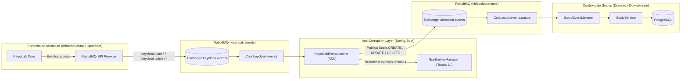

# Exchange dedicado para los eventos de Keycloak (`amq.topic` → `keycloak.events`)

Mover la publicación de eventos del SPI de Keycloak desde el exchange built-in `amq.topic` hacia un exchange propio y gestionable, `keycloak.events`, manteniendo la separación de dos exchanges: uno de infraestructura para los eventos técnicos del proveedor de identidad y otro de negocio (`videoclub.events`) para los eventos canónicos de dominio.

## User Review Required

> [!NOTE]
> **Alineación unificada del nombre del exchange (`keycloak.events`)**
> El nombre del exchange debe coincidir de punta a punta entre el productor de infraestructura y el consumidor. Todos los puntos se encuentran ahora alineados en `keycloak.events`:
>
> | Componente / Archivo | Configuración aplicada | Estado |
> |---|---|---|
> | `docker/keycloak/keycloak-spi/.../RabbitMQEventListenerProviderFactory.java:51` | `env("RABBITMQ_EXCHANGE", "keycloak.events")` | [DONE] |
> | `docker/keycloak.yaml:20` | `${RABBITMQ_EXCHANGE:-keycloak.events}` | [DONE] |
> | `src/main/resources/application.yml:96` | `${RABBITMQ_EXCHANGE:keycloak.events}` | [DONE] |
> | `src/main/java/ar/unrn/video/config/RabbitMQConfig.java:26` | `@Value("${keycloak.rabbitmq.exchange:keycloak.events}")` | [DONE] |
> | `./.env` y `./docker/.env` | `RABBITMQ_EXCHANGE=keycloak.events` | [DONE] |
> | `./.env.example` | `RABBITMQ_EXCHANGE=keycloak.events` | [DONE] |
>
> **Prevención de fallo silencioso**: Si el SPI publica en un exchange y la cola `keycloak-events` está bindeada a otro, no hay excepción ni mensaje en la DLQ: la cola simplemente no recibe nada. Al unificar defaults explícitos y variables en todos los niveles se elimina esta posibilidad de desincronización.

> [!IMPORTANT]
> **Recrear el contenedor de Keycloak destruye datos**
> Las variables de entorno se fijan al **crear** el contenedor: `docker restart` no toma el cambio, hace falta `--force-recreate`. Y en este setup eso borra la base:
> - `DB_VENDOR=h2` con `start-dev`, y **no hay volumen** para `/opt/keycloak/data` (los únicos binds son el jar del SPI, `realm-export.json` y `themes`).
> - Se pierden los usuarios del realm y vuelven sólo los definidos en `realm-export.json`.
> - Las filas de la tabla `socio` quedan huérfanas, apuntando a `keycloakId` que ya no existen.
>
> Confirmado con el usuario: es un entorno de prueba y se puede borrar todo. La causa de fondo — la falta de volumen — queda registrada como deuda al final de este documento.

---

## Decisiones de Arquitectura (ADR)

### ¿Por qué un exchange propio y no `amq.topic`?

`amq.topic` es un exchange **built-in** de RabbitMQ, y eso trae tres limitaciones concretas:

1. **No se puede gestionar.** RabbitMQ reserva el prefijo `amq.`: no se puede borrar ni recrear, así que su ciclo de vida no es nuestro.
2. **No admite permisos finos.** Los permisos de RabbitMQ son expresiones regulares sobre el nombre del exchange. Con `amq.topic` no hay forma de otorgarle al SPI permiso para publicar *sus* eventos sin dárselo sobre el exchange compartido que usa todo el broker.
3. **No comunica nada.** En la consola de management, `keycloak.events` dice qué transporta; `amq.topic` es un cajón de sastre.

### ¿Por qué NO usar un único exchange para todo (`videoclub.events`)?

Técnicamente **funciona**, y por eso conviene entender qué se pierde.

Las routing keys no colisionan (`keycloak.user.#` y `keycloak.admin.USER.*` contra `Socio.#`), pero no es eso lo que evita el problema: lo que lo evita es que son **colas distintas con bindings distintos**. El `messageConverter` tiene `setAlwaysConvertToInferredType(true)`, así que infiere el tipo desde la firma del listener — `KeycloakEvent` en uno, `Event<String, SocioPayload>` en el otro — y cada listener sólo ve mensajes de su propia cola. Las formas heterogéneas conviven sin romperse.

Lo que se pierde es la **garantía estructural**. Con dos exchanges, que un evento crudo de Keycloak llegue a la cola de Socios es imposible. Con uno solo, queda a un binding descuidado de distancia: un `#` mal puesto mete mensajes con la forma equivocada en una cola y terminan en la DLQ. El límite deja de ser estructural y pasa a ser una convención de prefijos.

Y hay una razón de diseño, no sólo de robustez: los dos exchanges transportan **idiomas distintos**.

| | `keycloak.events` | `videoclub.events` |
|---|---|---|
| Contenido | eventos técnicos del proveedor | eventos canónicos de dominio |
| Vocabulario | `keycloak.user.LOGIN` | `Socio.CREATE` |
| Dueño | la infraestructura de identidad | el dominio del videoclub |

Compartir el exchange convierte al Anti-Corruption Layer en un relay dentro de la misma habitación, y mata el argumento que sostiene todo el diseño: poder extraer el Bounded Context de Socios a un servicio aparte sin tocar el ACL.

### ¿Por qué NO emitir `Event<K,T>` directamente desde el SPI?

A primera vista parece tentador: emitir directamente `Event<String, SocioPayload>` desde el SPI de Keycloak hacia `videoclub.events` evitaría tener que recibir un mensaje en `keycloak.events` para volver a despacharlo a otro exchange (el llamado *two-hop relay*).

Técnicamente es posible y trivial —el SPI ya construye un `ObjectNode`, y `Event<K,T>` es sólo JSON—. Sin embargo, se descarta categóricamente por cuatro principios de arquitectura:



1. **Inversión de Dependencias y Acoplamiento (DIP / Clean Architecture)**:
   Keycloak es un proveedor de identidad de propósito general (**infraestructura genérica / Upstream**). El videoclub es el **dominio de negocio / Downstream**.
   - Si el SPI emitiera eventos con la forma `Event<String, SocioPayload>` o con la routing key `Socio.CREATE`, el proveedor de identidad pasaría a conocer el vocabulario y las entidades de negocio del videoclub.
   - Cualquier cambio en las reglas o datos de `Socio` exigiría modificar, recompilar y redesplegar un plugin de Java dentro del contenedor de Keycloak (`/opt/keycloak/providers`).
   - Principio rector: **el dominio se apoya en la infraestructura; la infraestructura jamás debe depender del dominio**.

2. **Dumb Pipes, Smart Endpoints (Martin Fowler)**:
   Los buses de mensajería y sus adaptadores de borde deben operar como *dumb pipes* (tuberías neutras y tontas).
   - Si el SPI realizara traducción a modelos de negocio, se convertiría en un *smart pipe*.
   - Si mañana se incorpora un nuevo servicio (por ejemplo, *Facturación*, *Biblioteca* o *Auditoría Corporativa*), ¿el plugin de Keycloak tendría que conocer y emitir eventos para cada uno de ellos? No es escalable ni gobernable.

3. **El stream técnico crudo es requerido por otros consumidores**:
   `react-sso/src/hooks/useNotifications.ts` consume vía SSE eventos técnicos que no representan entidades de dominio pero sí importan a la UI: `LOGIN` (con dirección IP), `UPDATE_PASSWORD`, `UPDATE_TOTP`, `VERIFY_EMAIL` y `SEND_VERIFY_EMAIL`.
   - De todo el abanico de eventos de Keycloak, sólo un subconjunto (`REGISTER`, `USER.CREATE`, `USER.UPDATE`, `USER.DELETE`) tiene correspondencia con `Socio`.
   - Si el SPI únicamente emitiera eventos de dominio, se rompería el subsistema de notificaciones en tiempo real.

4. **El Anti-Corruption Layer (ACL) como frontera de aislamiento**:
   El componente `KeycloakEventListener` implementa formalmente el patrón **Anti-Corruption Layer (ACL)** de Domain-Driven Design (DDD):
   - Aísla al dominio del videoclub de los cambios y particularidades del proveedor de identidad.
   - Si en el futuro Keycloak es reemplazado por otro Identity Provider (Auth0, Okta, Amazon Cognito o LDAP), **el microservicio de Socios no requiere modificar una sola línea de código**: la única pieza a adaptar es el ACL.
   - El "doble salto" (consumir de `keycloak.events` y publicar en `videoclub.events`) no es redundancia: es el precio deliberado para mantener desacoplamiento estructural y permitir extraer el Bounded Context de Socios a un microservicio independiente en cualquier momento.

> **Punto medio considerado y descartado:** que el SPI emita un envelope canónico con vocabulario de infraestructura (`aggregate="KeycloakUser"` en lugar de `"Socio"`). Unifica el formato del bus sin meter "Socio" dentro de Keycloak, pero sigue haciendo falta el ACL para mapear `KeycloakUser → Socio`, y agrega el versionado de un contrato de envelope cruzando el límite de un plugin. Ganancia marginal, costo real.

---

## Proposed Changes

### 1. SPI de Keycloak

#### [DONE] [RabbitMQEventListenerProviderFactory.java](file:///home/horacio/proyectos/unrn/taller/springboot-sso/docker/keycloak/keycloak-spi/src/main/java/ar/unrn/keycloak/spi/RabbitMQEventListenerProviderFactory.java)
**Ya aplicado y el jar ya recompilado.** Se agregó en `init()`, después de `createChannel()`:

```java
channel.exchangeDeclare(exchange, "topic", true);
```

Este era el bloqueante real del cambio, no el nombre del exchange. El SPI **nunca declaraba** el exchange: funcionaba sólo porque `amq.topic` siempre existe. Apuntando `RABBITMQ_EXCHANGE` a cualquier otro nombre, el primer `basicPublish` falla con 404, el broker cierra el **único canal de por vida** del SPI, y desde ahí todo evento se descarta en silencio por este guard, hasta reiniciar Keycloak:

```java
if (channel == null || !channel.isOpen()) {
    LOG.warning("RabbitMQ channel not available — dropping event");
    return;
}
```

Declarar es idempotente, así que re-declarar `amq.topic` con propiedades coincidentes es un no-op: el cambio es seguro incluso si se decide no mover el exchange.

#### [DONE] mismo archivo — alinear el default
- `env("RABBITMQ_EXCHANGE", "amq.topic")` → `env("RABBITMQ_EXCHANGE", "keycloak.events")`.
- Javadoc de la clase actualizado, documentando que el exchange se declara al arrancar.
- Jar recompilado con `mvn -o package`. Verificado con `javap` que la constante `amq.topic` ya no está en el `.class` y que quedan `keycloak.events` y `topic`.

#### [DONE] [README.md del SPI](file:///home/horacio/proyectos/unrn/taller/springboot-sso/docker/keycloak/keycloak-spi/README.md)
- Default Exchange → `keycloak.events`, tipo `topic` y durable.
- Documentado que **el SPI declara el exchange** al iniciar, y que declarar es idempotente (apuntarlo a `amq.topic` sigue funcionando).
- Instrucción de binding y tabla de variables de entorno actualizadas.

---

### 2. Configuración de la aplicación

#### [DONE] [application.yml](file:///home/horacio/proyectos/unrn/taller/springboot-sso/src/main/resources/application.yml)
- `exchange: ${RABBITMQ_EXCHANGE:amq.topic}` → `${RABBITMQ_EXCHANGE:keycloak.events}`.

#### [DONE] [docker/keycloak.yaml](file:///home/horacio/proyectos/unrn/taller/springboot-sso/docker/keycloak.yaml)
- `RABBITMQ_EXCHANGE: ${RABBITMQ_EXCHANGE}` → `${RABBITMQ_EXCHANGE:-keycloak.events}`, con un comentario que explica por qué el default es obligatorio acá.

> Es la única de las cuatro puntas **sin** valor por defecto. Hoy, si `docker/.env` no define la variable, Compose inyecta cadena vacía, el SPI cae a su propio default y se produce exactamente la desincronización silenciosa descrita arriba. Poner el default acá elimina esa clase de falla.

#### [DONE] `./.env` y `./docker/.env`
- En **ambos**: `RABBITMQ_EXCHANGE=keycloak.events`.
- En `docker/.env`: **borrado** `KK_TO_RMQ_EXCHANGE=amq.topic` (resto legacy del plugin anterior).

#### [DONE] [RabbitMQConfig.java](file:///home/horacio/proyectos/unrn/taller/springboot-sso/src/main/java/ar/unrn/video/config/RabbitMQConfig.java)
- `@Value("${keycloak.rabbitmq.exchange:amq.topic}")` → `@Value("${keycloak.rabbitmq.exchange:keycloak.events}")`.
- Comentario actualizado para documentar `keycloak.events` como topic durable.

#### [DONE] [.env.example](file:///home/horacio/proyectos/unrn/taller/springboot-sso/.env.example)
- `RABBITMQ_EXCHANGE=amq.topic` → `RABBITMQ_EXCHANGE=keycloak.events`.

---

### 3. Migración del entorno

**Estado: [DONE] — Completado y verificado en vivo.**

1. **Keycloak recreado:**
   ```bash
   docker compose -f docker/services.yaml up -d --force-recreate keycloak
   ```
   Log confirmado:
   ```text
   RabbitMQ SPI connected to rabbit:5672 (exchange: keycloak.events, declared as durable topic)
   ```
2. **Aplicación Spring reiniciada:** Conexión a `keycloak.events` y bindings de `keycloak-events` establecidos con éxito.
3. **Bindings viejos limpiados:** `amq.topic` no tiene ningún binding residual hacia `keycloak-events`.
4. **Tabla de socios reconciliada:** Datos sincronizados consistentemente con los usuarios del realm vía `POST /api/socios/sync`.
5. **Roles en realm:** `socio-permission-read` presente y mapeado a `/videoclub-default/administrador`.

---

## Verification Plan

### Verificación automática
```bash
./mvnw test        # 14 tests; ninguno depende del nombre del exchange
npm run build && npm run lint   # en react-sso
```

Los tests no cubren el nombre del exchange: es configuración de topología, y se verifica contra el broker.

### Verificación manual

1. **El SPI declara el exchange.** En el log de Keycloak:
   ```
   RabbitMQ SPI connected to rabbit:5672 (exchange: keycloak.events, declared as durable topic)
   ```
2. **El exchange existe y es topic durable:**
   ```bash
   docker exec videoclub-rabbit-1 rabbitmqctl list_exchanges name type durable | rg keycloak
   ```
3. **Los bindings apuntan al exchange nuevo y ya no al viejo:**
   ```bash
   docker exec videoclub-rabbit-1 rabbitmqctl list_bindings source_name destination_name routing_key | rg -i "keycloak|socio"
   ```
   Esperado: `keycloak.events → keycloak-events` con las dos routing keys, `videoclub.events → socio.events.queue` con `Socio.#`, y **ninguna** entrada con `amq.topic` como origen.
4. **Camino de eventos completo:** crear un usuario con `POST /api/users` y comprobar que aparece el toast SSE y que el socio se da de alta solo en `GET /api/socios`.
5. **Baja lógica:** borrar ese usuario de Keycloak y verificar `activo=false` con `fechaBaja`.
6. **La DLQ queda vacía** durante todo el ejercicio:
   ```bash
   docker exec videoclub-rabbit-1 rabbitmqctl list_queues name messages | rg dlq
   ```
7. **Prueba de arranque invertido — la que justifica el cambio de código.** Levantar Keycloak con la aplicación Spring **apagada**, crear un usuario, y sólo entonces arrancar la aplicación. El evento debe estar esperando en la cola. Antes del `exchangeDeclare`, este escenario dejaba el canal del SPI cerrado y descartaba todos los eventos en silencio.

---

## Deuda registrada, fuera de alcance

- **Falta un volumen para `/opt/keycloak/data`.** Es la causa de fondo de que cualquier cambio de configuración de Keycloak cueste el estado del realm. Con un volumen —o mejor, moviendo Keycloak a PostgreSQL en lugar de `start-dev` con H2— recrear el contenedor pasa a ser gratis. El exchange es la consecuencia; esto es el problema.
- **El SPI descarta eventos en silencio** cuando el canal no está disponible (`LOG.warning` + `return`). El `exchangeDeclare` elimina una de las causas, no el comportamiento. La red de seguridad sigue siendo la reconciliación (`POST /api/socios/sync`), que debería correr además de forma periódica y no sólo bajo demanda.
- **El SPI publica con `PERSISTENT_TEXT_PLAIN`**, lo que obliga al workaround de `contentType` en `RabbitMQConfig.messageConverter`. Arreglarlo en el origen —publicar `application/json`— permitiría borrar esa subclase anónima.
- **`SseEmitterManager.broadcast()` sigue enviando todos los eventos de autenticación a todos los clientes conectados**, exponiendo logins, IPs, emails y cambios de contraseña de un usuario al resto. `sendToUser(userId, ...)` y `KeycloakEvent.extractTargetUserId()` ya existen y no se usan.
