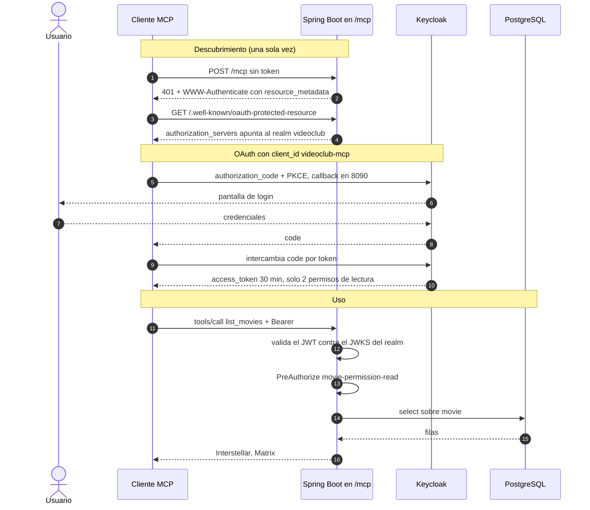
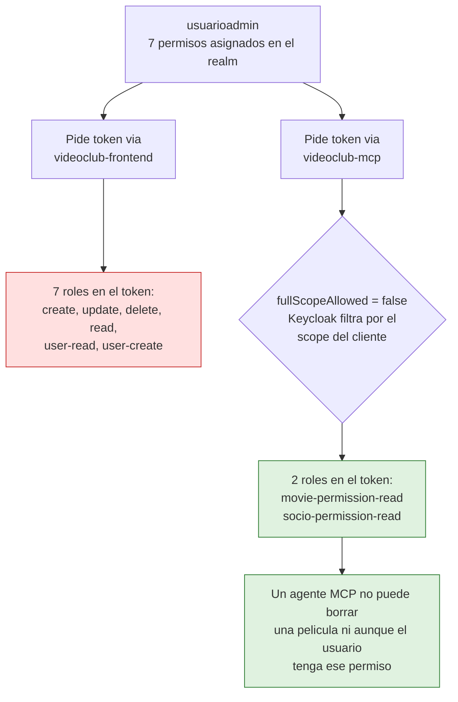
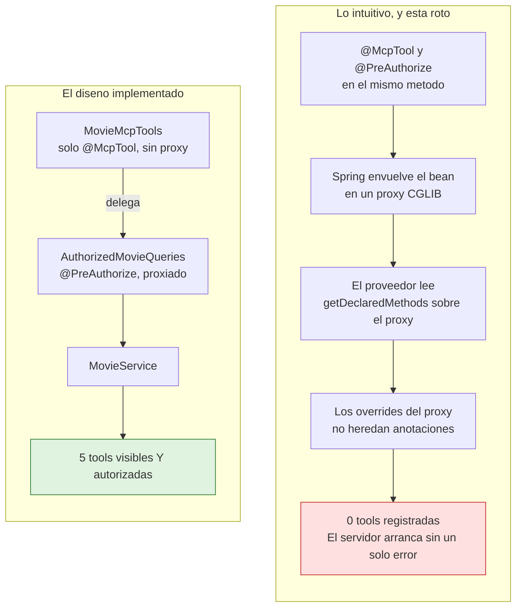

# Plan de Implementación: Servidor MCP con Spring AI y Seguridad Keycloak

Integrar un **Servidor Model Context Protocol (MCP)** en `springboot-sso` utilizando **Spring AI** para exponer herramientas de negocio del VideoClub a agentes de IA (Claude Desktop, Claude Code, MCP Inspector). El acceso se securiza como **OAuth2 Resource Server** con tokens JWT emitidos por **Keycloak**, reutilizando la configuración existente.

---

## Estado: implementado y verificado (Opcion A)

Implementado end-to-end y verificado contra la infraestructura real (PostgreSQL, Keycloak y RabbitMQ
en Docker). Las cinco herramientas responden sobre `POST /mcp` y un token de `usuariocliente`
—que solo tiene `movie-permission-read`— recibe `Access Denied` al invocar `list_socios`.

Dos correcciones surgieron al implementar y estan reflejadas mas abajo:

1. `@PreAuthorize` **no puede ir sobre los metodos `@McpTool`** (ver el ADR correspondiente). La
   autorizacion vive en un delegado proxiado.
2. Las tools deben declarar sus *hints* de solo lectura de forma explicita; el default de Spring AI
   las anuncia como destructivas.

---

## Cómo funciona

### 1. Del descubrimiento a la primera consulta

El cliente MCP no sabe nada de Keycloak al arrancar: lo descubre a partir del 401 que devuelve el servidor.



El paso 2 es la pieza que evita el bridge en Node: el servidor le dice al cliente dónde autenticarse,
y el cliente se arregla solo.

> [!TIP]
> Versión explorable de este mismo diagrama, con capítulos guiados, temas claro/oscuro y exportación:
> [`docs/diagrams/mcp-oauth-flow.html`](diagrams/mcp-oauth-flow.html).
> Se regenera desde `docs/diagrams/mcp-oauth-flow.sequence.json` con la skill `archify`.

### 2. Por qué el token sale recortado

El mismo usuario, la misma contraseña, dos tokens distintos. La diferencia la hace el cliente por el
que pide el token.



El permiso no se bloquea en la tool: **nunca entra al token**. Es la diferencia entre confiar en que
nadie llame a la operación equivocada y hacer que esa operación sea imposible de pedir.

> [!TIP]
> Versión explorable: [`docs/diagrams/token-recortado.html`](diagrams/token-recortado.html).

### 3. Por donde viaja el dato personal del socio

El agente MCP suma un consumidor nuevo al padrón de socios. Este diagrama hace explícito de dónde
sale ese dato, dónde queda en reposo y quién lo lee.

> [!TIP]
> [`docs/diagrams/dato-personal-socio.html`](diagrams/dato-personal-socio.html) — flujo de datos con
> las fronteras de sensibilidad marcadas.

`email`, `nombre` y `apellido` nacen en Keycloak, viajan por RabbitMQ y quedan en la tabla `socio`.
Un único permiso —`socio-permission-read`— decide quién los lee. Hasta ahora del otro lado siempre
había un humano frente a la SPA; desde esta feature, también puede haber un agente.

### 4. La trampa del proxy CGLIB

Encontrada al implementar. Explica por qué la autorización vive en una clase aparte y no sobre el
método `@McpTool`.



El fallo es silencioso: el bean queda registrado como bean MCP, pero aporta cero herramientas.
`McpToolsSecurityTest.everyToolIsDiscoverable` existe para que eso rompa el build y no la demo.

> [!TIP]
> Versión explorable: [`docs/diagrams/proxy-cglib.html`](diagrams/proxy-cglib.html).

> [!NOTE]
> Los cuatro HTML se generan con la skill `archify` a partir de su `.json` vecino. Se les editó el
> arranque del tema para que abran **siempre en claro**: archify no expone eso como opción de
> autoría, así que el ajuste se aplica sobre el HTML entregado y hay que repetirlo tras cada
> `deliver`. El botón de tema del visor sigue funcionando.

---

## User Review Required

> [!IMPORTANT]
> **1. Alcance de las herramientas vs. modelo de dominio real.**
> `Movie` (`domain/Movie.java`) tiene **únicamente** `id` y `title`. `MovieDTO` idem. `MovieRepository` sólo declara `existsByTitleIgnoreCase`.
> No existen género, sinopsis, año ni stock, así que herramientas como `search_movies` por género o `get_movie` con "ficha técnica" **no son implementables hoy**.
> - **Opción A (elegida por defecto en este plan):** exponer sólo lo que el dominio soporta — `list_movies`, `get_movie`, `search_movies` por coincidencia de título, `list_socios`, `get_socio`.
> - **Opción B:** extender antes `Movie` (género, año, sinopsis) + migración de esquema. Es una feature aparte, con su propio plan.
>
> Si se prefiere la Opción B, este plan se ejecuta igual y las herramientas se enriquecen después.

> [!IMPORTANT]
> **2. Identidad del agente.**
> El agente **no** debe usar el service account `videoclub-backend`: ese cliente tiene permisos administrativos sobre Keycloak (`keycloak.admin.client-secret` en `application.yml`) y darle esa credencial a un agente equivale a entregarle la llave maestra del realm, sin trazabilidad de quién pidió qué.
> **Decisión de este plan:** el agente actúa siempre con el token de un **usuario** (`usuarioadmin` / `usuariocliente`). Los permisos efectivos son los del usuario y quedan auditados en los eventos de Keycloak.

> [!WARNING]
> **3. Registro del cliente MCP en Keycloak.**
> Para que un cliente MCP negocie OAuth por sí solo hace falta un cliente Keycloak público con PKCE y los `redirect-uri` de loopback que use el agente (`http://localhost:*/callback`).
> Keycloak soporta Dynamic Client Registration (RFC 7591), pero el registro anónimo está **deshabilitado por defecto**. Este plan asume **registro manual** de un cliente `videoclub-mcp` en `realm-export.json`.

---

## Decisiones de Arquitectura y Patrones (ADR)

### Transporte: Streamable HTTP, no SSE

El transporte HTTP+SSE quedó **deprecado en el spec MCP desde la revisión 2025-03-26**, reemplazado por **Streamable HTTP**. Spring AI 2.0.x ya refleja ese cambio: la propiedad `spring.ai.mcp.server.protocol` tiene tres valores (`SSE`, `STREAMABLE`, `STATELESS`) y su **default es `STREAMABLE`**, sobre el endpoint `/mcp`.

Escribir el servidor sobre SSE hoy es nacer con deuda. Se adopta Streamable HTTP.

### Sub-modo `STATELESS` para el primer alcance

Las tres implementaciones existen en `mcp-spring-webmvc` (`WebMvcSseServerTransportProvider`, `WebMvcStreamableServerTransportProvider`, `WebMvcStatelessServerTransport`).

Para un conjunto de herramientas **de sólo lectura**, `STATELESS` es el que mejor encaja:

- Cada llamada es un POST corriente al filtro de seguridad: el `SecurityContext` y el `@PreAuthorize` funcionan como en cualquier endpoint REST, sin depender de propagación de `ThreadLocal` hacia un hilo asíncrono de larga vida.
- El token se valida **en cada request**. Con una sesión SSE de horas, un token de minutos queda validado una sola vez al abrir el stream: la autorización envejece con la sesión.
- No hay estado de sesión en memoria, así que el servidor escala horizontalmente sin sticky sessions.

Se pierde lo que requiere canal servidor→cliente (sampling, elicitation, notificaciones de cambio de tools). Nada de eso hace falta para catálogo y socios.

> [!NOTE]
> La afirmación "en `STATELESS` el tool se ejecuta en el hilo del servlet y el `SecurityContext` está disponible" debe **verificarse empíricamente** en la tarea 6.1 antes de dar la seguridad por buena. Si no se cumpliera, la mitigación es `DelegatingSecurityContextExecutor` / `SecurityContextHolder.setStrategyName(MODE_INHERITABLETHREADLOCAL)`, documentada en la misma tarea.

### La autorización va en las tools, no en el `SecurityFilterChain`

Este es el punto crítico del diseño. Hoy los permisos viven **en los controllers**:

- `MovieResource.java:36` → `@PreAuthorize("hasAuthority('movie-permission-read')")`
- `SocioResource.java:33` → `@PreAuthorize("hasAuthority('socio-permission-read')")`

`MovieService` y `SocioService` **no tienen ninguna anotación de seguridad**. Una herramienta MCP que llame directamente a `socioService.findAll()` entra por debajo de la capa REST y **no atraviesa ningún control de permisos**: cualquier token válido del realm listaría todos los socios.

Pedirle a `SecurityConfiguration` que `/mcp/**` sea `.authenticated()` no arregla nada — y además ya está cubierto por el `anyRequest().authenticated()` existente. Autenticación no es autorización.

**Decisión:** cada operación expuesta lleva un `@PreAuthorize` con el mismo permiso que protege su endpoint REST equivalente. `@EnableMethodSecurity` ya está activo (`SecurityConfiguration.java:19`) y `GrantedAuthorityDefaults("")` elimina el prefijo `ROLE_`, por lo que `hasAuthority('movie-permission-read')` es la forma correcta.

#### Por qué la anotación NO puede ir sobre el método `@McpTool`

Verificado durante la implementación, con evidencia reproducible:

- `@PreAuthorize` envuelve su bean en un proxy CGLIB (`MovieMcpTools$$SpringCGLIB$$0`).
- El proveedor de tools recolecta los métodos con `getClass().getDeclaredMethods()` (verificado en el bytecode de `AbstractMcpToolProvider`). Sobre el proxy eso devuelve los *overrides* generados, **que no heredan anotaciones de método**.
- Resultado medido: `targetClass` expone las 3 tools; el proxy expone **cero**. El servidor arranca sin ninguna herramienta y el fallo sólo aparece en runtime.

El `BeanPostProcessor` que *detecta* los beans anotados sí usa `AopUtils.getTargetClass`, así que el bean queda registrado como "bean MCP" — pero sin aportar tools. El síntoma es un servidor que levanta limpio y no expone nada.

**Diseño resultante:**

- `MovieMcpTools` / `SocioMcpTools`: `@Component` **sin ninguna anotación que dispare proxy**, sólo `@McpTool`.
- `AuthorizedMovieQueries` / `AuthorizedSocioQueries`: `@Component` con `@PreAuthorize` por método. Son la frontera de autorización.

`McpToolsSecurityTest` cubre las dos mitades a la vez: que las cinco tools sigan siendo descubribles, y que ninguna devuelva datos sin el permiso correspondiente. Si alguien agrega `@Transactional` o `@PreAuthorize` a una clase de tools, el test falla.

### Las tools declaran sus hints de sólo lectura

Por defecto Spring AI anuncia cada tool con `readOnlyHint: false` y `destructiveHint: true`. Un agente que lea esos hints puede pedir confirmación al usuario para una consulta inofensiva, o —peor— confiar en la señal equivocada. Siendo todas las herramientas de sólo lectura, cada `@McpTool` declara explícitamente `readOnlyHint = true, destructiveHint = false, idempotentHint = true, openWorldHint = false`.

### El token va en el header, nunca en la query string

El spec de autorización MCP prohíbe explícitamente transportar el access token en la URI. `SecurityConfiguration` habilita hoy `setAllowUriQueryParameter(true)` para el `DefaultBearerTokenResolver` — eso existe por el `EventSource` del SSE de notificaciones del frontend, **no se toca**, pero los clientes MCP usan `Authorization: Bearer`.

### Descubrimiento OAuth con RFC 9728 (elimina el bridge)

Spring Security **7.1.1** (la versión que resuelve Boot 4.1.1 en este proyecto) incluye soporte nativo de *Protected Resource Metadata*: `OAuth2ProtectedResourceMetadataFilter` y el DSL `.oauth2ResourceServer(o -> o.protectedResourceMetadata(...))`.

Publicando `/.well-known/oauth-protected-resource` y devolviendo `WWW-Authenticate` con `resource_metadata` en el 401, un cliente MCP moderno descubre Keycloak y completa el flujo OAuth **por sí solo**. El bridge stdio en Node deja de ser el camino principal y queda como plan B para clientes viejos.

---

## Proposed Changes

### 1. Dependencias

#### [MODIFY] [pom.xml](file:///home/horacio/proyectos/unrn/taller/springboot-sso/pom.xml)

- Agregar `dependencyManagement` con `spring-ai-bom` en la versión **`2.0.1`**.
- Agregar `org.springframework.ai:spring-ai-starter-mcp-server-webmvc`.
- Agregar `org.springframework.security:spring-security-test` con `<scope>test</scope>` (hoy el proyecto sólo tiene `spring-boot-starter-test`, y sin esto no hay forma de escribir los tests de autorización de la sección de verificación).

> [!WARNING]
> **La versión importa y no es negociable.** El proyecto usa `spring-boot-starter-parent` **4.1.1** con Java 25.
> Spring AI **1.0.x / 1.1.x están construidas sobre Spring Boot 3.x** y no son compatibles.
> `spring-ai-starter-mcp-server-webmvc:2.0.1` declara `spring-boot-starter-web:4.1.1`, exactamente la versión de este proyecto.

### 2. Configuración del servidor MCP

#### [MODIFY] [application.yml](file:///home/horacio/proyectos/unrn/taller/springboot-sso/src/main/resources/application.yml)

```yaml
spring:
  ai:
    mcp:
      server:
        name: videoclub-mcp-server
        version: 1.0.0
        type: sync
        protocol: stateless          # SSE | STREAMABLE | STATELESS
        streamable-http:
          mcp-endpoint: /mcp
        instructions: >
          Herramientas de consulta del VideoClub UNRN: catálogo de películas y
          padrón de socios. Todas las operaciones son de sólo lectura.
```

> [!NOTE]
> Las propiedades `spring.ai.mcp.server.webmvc.sse-endpoint` y `.message-endpoint` **no existen** en Spring AI 2.0.x — Spring las ignora silenciosamente.
> El espacio real de propiedades (verificado en el `spring-configuration-metadata.json` del artefacto `spring-ai-autoconfigure-mcp-server-common:2.0.1`) es: `name`, `version`, `type`, `protocol`, `instructions`, `base-url`, `request-timeout`, `sse-endpoint`, `sse-message-endpoint`, `streamable-http.mcp-endpoint`, `capabilities.*`, `annotation-scanner.enabled`.

### 3. Herramientas de dominio (Tools)

Con `spring.ai.mcp.server.annotation-scanner.enabled` en `true` (default), los beans con métodos `@McpTool` se registran automáticamente. **No hace falta declarar un `ToolCallbackProvider` a mano**, así que la clase `McpConfig` del plan original se elimina del alcance.

`@McpTool` y `@McpToolParam` viven en `org.springframework.ai.mcp.annotation` (artefacto `spring-ai-mcp-annotations`, traído transitivamente por el starter). No confundir con `@Tool` de `spring-ai-model`, que es la ruta de registro alternativa vía `ToolCallbackProvider`.

#### [NEW] `ar.unrn.video.mcp.MovieMcpTools` y `ar.unrn.video.mcp.SocioMcpTools`

`@Component` sin ninguna anotación que dispare proxy. Sólo declaran las tools y delegan:

```java
@McpTool(
        name = "list_movies",
        annotations = @McpTool.McpAnnotations(
                readOnlyHint = true, destructiveHint = false, idempotentHint = true, openWorldHint = false
        ),
        title = "List movies",
        description = "Lists every movie in the VideoClub catalog, ordered by identifier."
)
public List<MovieDTO> listMovies() {
    return movies.findAll();
}
```

- `MovieMcpTools`: `list_movies`, `get_movie`, `search_movies`.
- `SocioMcpTools`: `list_socios`, `get_socio`.

#### [NEW] `ar.unrn.video.mcp.AuthorizedMovieQueries` y `ar.unrn.video.mcp.AuthorizedSocioQueries`

La frontera de autorización, y el único lugar con `@PreAuthorize`:

```java
@PreAuthorize("hasAuthority('socio-permission-read')")
public List<SocioDTO> findAll() {
    return socioService.findAll();
}
```

También traducen el `NotFoundException` sin mensaje que lanza la capa de servicio: por REST el
`GlobalExceptionHandler` lo convierte en un 404 y el mensaje nunca se lee, pero por MCP el mensaje
es todo lo que el agente recibe — sin traducción le llega `"null"`.

#### [MODIFY] `ar.unrn.video.repos.MovieRepository`

- Agregar `List<Movie> findByTitleContainingIgnoreCase(String title, Sort sort)` — hoy el repositorio no tiene ninguna capacidad de búsqueda.

#### [MODIFY] `ar.unrn.video.service.MovieService`

- Agregar `search(String query)` que mapee a `MovieDTO`, siguiendo el patrón de `findAll()`.

> [!WARNING]
> Sin los `@PreAuthorize` de los delegados, las herramientas exponen el padrón completo de socios a cualquier token autenticado del realm, porque `SocioService` no tiene control de acceso propio.

### 4. Seguridad y descubrimiento OAuth

#### [MODIFY] [SecurityConfiguration.java](file:///home/horacio/proyectos/unrn/taller/springboot-sso/src/main/java/ar/unrn/video/config/SecurityConfiguration.java)

- **No** agregar un matcher para `/mcp/**`: `anyRequest().authenticated()` ya lo cubre. Agregarlo sería ruido.
- Permitir el endpoint de metadata sin token — un cliente aún no autenticado tiene que poder leerlo:
  ```java
  .requestMatchers("/.well-known/oauth-protected-resource/**").permitAll()
  ```
- Publicar la metadata RFC 9728 con el soporte nativo de Spring Security 7.1.1:
  ```java
  .oauth2ResourceServer(oauth2 -> oauth2
      .protectedResourceMetadata(metadata -> metadata
          .protectedResourceMetadataCustomizer(builder -> builder
              .resource(mcpResourceUri)                 // p.ej. http://localhost:8080/mcp
              .resourceName("VideoClub MCP Server")
              .authorizationServer(keycloakIssuerUri)   // ${KEYCLOAK_ISSUER_URI}
              .bearerMethod("header")))
      .bearerTokenResolver(bearerTokenResolver)
      .jwt(...))
  ```
- CORS: `corsConfigurationSource()` hoy sólo admite `http://localhost:5173` y `http://localhost:3000`. Los clientes MCP de escritorio y el Inspector no son navegadores, así que **no requieren cambios**. Sólo si se agrega un cliente MCP web habrá que sumar su origen.

#### [MODIFY] `docker/keycloak/realm-export.json`

- Registrar el cliente público `videoclub-mcp`: `publicClient: true`, PKCE `S256`, `standardFlowEnabled: true`, `serviceAccountsEnabled: false`, `fullScopeAllowed: false`, con `redirectUris` de loopback explícitos (MCP Inspector en `6274`; agregar el puerto de cualquier otro cliente).
- No crear roles nuevos: las tools reutilizan `movie-permission-read` y `socio-permission-read`.
- **Sólo lectura por construcción:** los permisos son *client roles de `videoclub-frontend`*, así que con `fullScopeAllowed: false` un token emitido para `videoclub-mcp` no los lleva salvo que estén declarados en su scope. Se agrega en `clientScopeMappings` únicamente:

  ```json
  "videoclub-frontend": [
    { "client": "videoclub-mcp", "roles": ["movie-permission-read", "socio-permission-read"] }
  ]
  ```

  Con eso, aunque el usuario sea administrador y tenga `movie-permission-delete`, el token que obtiene un agente MCP **nunca** puede cargar ese permiso.

### 5. API Gateway

#### [MODIFY] [gateway.yml](file:///home/horacio/proyectos/unrn/taller/springboot-sso/docker/gateway/gateway.yml)

El gateway (Spring Cloud Gateway WebFlux, puerto 9500) rutea hoy `/movies/**`, `/api/socios/**`, `/api/users/**` y `/api/notifications/**`. **No hay ruta para MCP.**

- **Decisión por defecto:** los clientes MCP apuntan **directo a `http://localhost:8080/mcp`**. Es un canal de agentes, no tráfico del frontend, y evita una capa de proxy en el camino.
- Si más adelante se decide publicarlo por el gateway, agregar una ruta `service-mcp` con `Path=/mcp/**` **y** `/.well-known/oauth-protected-resource/**`, verificando que no se rompa el streaming de respuestas.

### 6. Cliente Bridge (Plan B — sólo si hace falta)

#### [NEW] `scripts/mcp-claude-bridge.mjs`

Sólo necesario para clientes MCP que **no** soporten OAuth remoto. Con la metadata RFC 9728 de la sección 4, un cliente moderno negocia el token solo y este script no se usa.

Si se implementa, debe cubrir lo que el plan original omitía:

1. Obtener el token de `${KEYCLOAK_URL}/realms/videoclub/protocol/openid-connect/token`.
2. **Refrescar el token antes de cada expiración.** Los access tokens de Keycloak duran minutos y una sesión de agente dura horas; sin refresh, el bridge muere a los cinco minutos.
3. Exponer stdio MCP local y proxear a `http://localhost:8080/mcp` con `Authorization: Bearer <token>`.
4. Nunca escribir el token en logs ni en la URL.

---

## Verification Plan

### Automated Tests — ejecutados, 26/26 en verde

```bash
./mvnw clean verify
```

1. **`McpToolsSecurityTest`** (contexto Spring mínimo con method security real y servicios mockeados; no necesita base de datos, broker ni Keycloak):
   - Las cinco tools siguen siendo descubribles sobre los beans reales. Es el guardián contra la regresión del proxy CGLIB descrita en el ADR.
   - Con `movie-permission-read` → las tools de catálogo responden.
   - **Sin `socio-permission-read` → `list_socios` y `get_socio` lanzan `AccessDeniedException`.**
   - Anónimo y contexto de seguridad vacío → denegados.
2. **`MovieServiceSearchTest`**: búsqueda parcial, case-insensitive, orden por `id` y resultado vacío.
3. **`McpToolsNotFoundTest`**: un id inexistente produce un mensaje accionable en vez de `null`.

> [!NOTE]
> Estos tests no cubren la capa HTTP (401, `WWW-Authenticate`, documento de metadata): el proyecto
> no tiene tests que levanten contexto completo y agregarlos ataría la suite a PostgreSQL. Esa
> parte se cubre en la verificación manual de abajo, que ya fue ejecutada.

### Manual Verification — ejecutada contra la infraestructura real

Todo lo siguiente fue corrido con PostgreSQL, Keycloak y RabbitMQ levantados en Docker:

1. `POST /mcp` sin token → **401**, con `WWW-Authenticate: Bearer resource_metadata="…/.well-known/oauth-protected-resource"`.
2. `GET /.well-known/oauth-protected-resource` sin token → **200**:
   ```json
   {"resource":"http://localhost:8080/mcp","bearer_methods_supported":["header"],
    "tls_client_certificate_bound_access_tokens":false,"resource_name":"VideoClub MCP Server",
    "authorization_servers":["http://localhost:9091/realms/videoclub"]}
   ```
3. `tools/list` con token válido → las cinco tools, todas con `readOnlyHint: true`.
4. `tools/call` `list_movies` con `usuariocliente` → datos del catálogo.
5. **`tools/call` `list_socios` con `usuariocliente` (sin `socio-permission-read`) → `Access Denied`, `isError: true`.** Es la prueba de que el agujero descrito en el ADR está cerrado.
6. `search_movies` con `"MAtri"` → sólo `Matrix` (parcial e insensible a mayúsculas); con `"zzz"` → lista vacía.
7. `get_movie` con id inexistente → `No movie found with id 99999`.

### Flujo OAuth — verificado end-to-end

Con `videoclub-mcp` ya creado en el Keycloak corriendo (vía Admin API, sin reimportar el realm):

```bash
claude mcp add --transport http \
  --client-id videoclub-mcp \
  --callback-port 8090 \
  videoclub http://localhost:8080/mcp
```

`Authentication successful. Connected to videoclub.` — y `list_movies` devolvió Interstellar y Matrix
desde una sesión de Claude Code, sin curl y sin token pegado a mano.

`access.token.lifespan` del cliente subido a **1800 s**, alineado con el `ssoSessionIdleTimeout` del
realm. Con los 300 s por defecto había que reautenticar cada cinco minutos. El resto de los clientes
queda intacto: es un atributo del cliente, no del realm.

## TODO — cerrar el registro dinámico de clientes

> [!WARNING]
> **Pendiente. Decisión consciente de dejarlo abierto por ahora, no un olvido.**

### Qué está abierto

Para que el flujo OAuth funcionara sin intervención manual se habilitó el registro dinámico de
clientes (RFC 7591). Hoy, cualquier proceso que corra en la máquina puede:

1. Auto-registrarse como cliente en el realm, sin credenciales.
2. Nacer con el scope `videoclub`, que le da `movie-permission-read` y `socio-permission-read`.
3. Abrir el navegador y, si el usuario loguea, obtener un token que lee el padrón completo de socios.

Sigue limitado por la política *Trusted Hosts* a hosts locales y redirect URIs en loopback. No es una
puerta a internet, pero es más de lo que había.

### Por qué ya no hace falta

El cliente MCP se conecta con `--client-id videoclub-mcp` explícito, así que no hay auto-registro.
La puerta está abierta y sin usar.

### Cómo cerrarla

Tres cambios por Admin API, en orden de importancia:

| # | Cambio | Efecto |
|---|---|---|
| 1 | Vaciar `trusted-hosts` en la policy *Trusted Hosts* | El endpoint de registro vuelve a responder 403. Es la puerta en sí. |
| 2 | Sacar `videoclub` de `defaultDefaultClientScopes` | Si alguien reabre la puerta, los clientes nuevos nacen sin permisos. |
| 3 | Quitar el scope-mapping de los 2 roles sobre el client scope `videoclub` | El scope deja de repartir permisos por el solo hecho de tenerlo. |

Espejar los tres en `docker/keycloak/realm-export.json`.

### Verificado: no rompe el cliente MCP

`videoclub-mcp` no depende de ninguno de los tres. Tiene sus propios caminos:

- El scope `videoclub` ya está en su `defaultClientScopes` — sacarlo del *default del realm* no se lo quita a un cliente existente.
- Tiene su propio scope-mapping a nivel cliente: `movie-permission-read`, `socio-permission-read`.

Son dos rutas independientes al mismo permiso. Cerrar una deja la otra intacta.

### Nota de entorno

La lista de `trusted-hosts` incluye `172.25.0.1`, el gateway del bridge de Docker **en la máquina
actual**. Keycloak corre en un contenedor, así que nunca ve `127.0.0.1`: ve esa IP. En otro entorno el
subnet cambia y hay que ajustarla — o, mejor, cerrar el registro dinámico y olvidarse del tema.

## Deuda Técnica y Fuera de Alcance

- **Modelo de dominio pobre.** `Movie` con `id` + `title` limita el valor de las herramientas. Enriquecerlo es un plan aparte (Opción B del User Review).
- **Sólo lectura.** No se exponen `create_movie` / `update_movie` / `delete_movie`. Escrituras iniciadas por un agente exigen antes decidir confirmación humana y auditoría; no entran en este alcance.
- **Sin rate limiting.** Un agente en loop puede martillar el endpoint. Si pasa a un entorno compartido, hace falta throttling en el gateway.
- **`allowUriQueryParameter(true)` sigue activo** globalmente por el SSE de notificaciones del frontend. Es deuda conocida y previa a este plan; MCP no la usa, pero convendría acotarla por ruta.
- **Sin observabilidad de tools.** No hay métricas de invocaciones ni de fallos por herramienta. Actuator/Prometheus ya está en el proyecto: es una extensión natural posterior.
