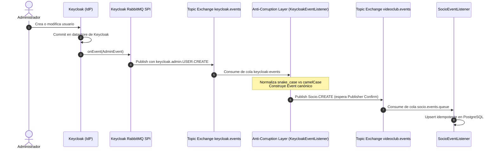
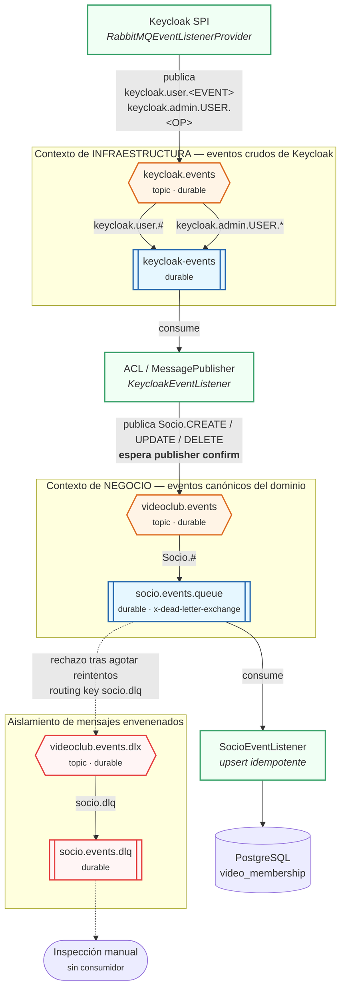
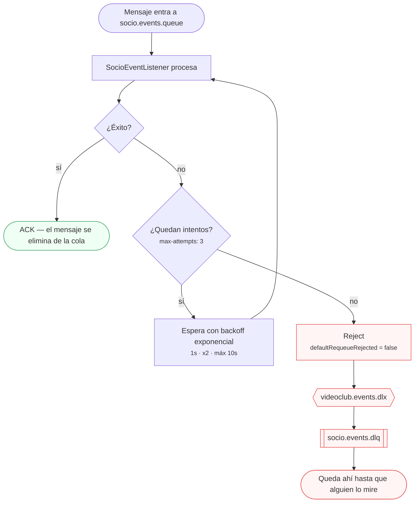

# Integración Keycloak, RabbitMQ y Anti-Corruption Layer (ACL)

Este documento detalla la arquitectura de integración reactiva basada en eventos entre **Keycloak**, el broker de mensajería **RabbitMQ** y la capa de adaptación (**Anti-Corruption Layer**) de la plataforma VideoClub.

---

## 1. Arquitectura de Integración

---

## 2. Plugin SPI para Keycloak (`keycloak-spi`)

El plugin reside en `docker/keycloak/keycloak-spi` y compila como un JAR embebido en el classpath de Keycloak (`/opt/keycloak/providers/keycloak-spi.jar`).

### Proveedores Implementados
* **`RabbitMQEventListenerProviderFactory`:**
  * Lee la configuración del broker vía variables de entorno (`RABBITMQ_HOST`, `RABBITMQ_PORT`, `RABBITMQ_USER`, `RABBITMQ_PASS`, `RABBITMQ_EXCHANGE`, `RABBITMQ_VHOST`).
  * Gestiona la conexión TCP persistente y el canal único con RabbitMQ.
  * Declara el exchange durable `keycloak.events` al inicializarse.
* **`RabbitMQEventListenerProvider`:**
  * `onEvent(Event event)`: Captura acciones de usuario final (`REGISTER`, `LOGIN`, `UPDATE_PASSWORD`) y publica con routing key `keycloak.user.<event_type>`.
  * `onEvent(AdminEvent event, boolean includeRepresentation)`: Captura acciones administrativas y publica con routing key `keycloak.admin.<resource_type>.<operation_type>`.
  * Serialización JSON segura: El payload de Keycloak se encapsula en JSON; si RabbitMQ no está disponible, captura la excepción y evita abortar la transacción de Keycloak.

---

## 3. Topología de Exchanges en RabbitMQ

El sistema utiliza una **topología de dos niveles** para aislar el contexto de infraestructura del contexto de negocio.

### 3.1. Vista completa: productores, exchanges, colas y consumidores

Mientras el diagrama de la sección 1 muestra el evento avanzando en el tiempo, éste muestra la **estructura estática** que ese evento atraviesa. Las etiquetas sobre las flechas de exchange a cola son los *binding patterns*: es el broker, y no el productor, quien decide a qué cola entra cada mensaje.

**Lo que este diagrama hace evidente:** el ACL es el único punto donde los dos contextos se tocan. Consume del mundo de Keycloak y produce hacia el mundo del dominio, y **no hay ninguna flecha que cruce directamente** de `keycloak.events` a `socio.events.queue`. Ese hueco es la frontera: el día que Keycloak cambie el formato de sus eventos, sólo hay un archivo que tocar.

Notar también que `keycloak-events` recibe **dos bindings** al mismo exchange. Una cola puede estar atada varias veces con patrones distintos, y es lo que permite capturar acciones de usuario final (`keycloak.user.#`) y administrativas (`keycloak.admin.USER.*`) sin declarar dos colas.

### 3.2. Camino del mensaje envenenado

Un mensaje que falla puede fallar por dos razones muy distintas, y el sistema las trata distinto. Ésta es la decisión que evita el bucle infinito:

> [!IMPORTANT]
> **`defaultRequeueRejected = false` es la línea que evita el bucle infinito.** El default de Spring AMQP es `true`: un mensaje rechazado vuelve a la cola, se vuelve a consumir, vuelve a fallar, y así para siempre — consumiendo CPU y bloqueando la cola con un payload que nunca va a funcionar.
>
> La distinción es entre **fallo transitorio** (la base se reinició, hubo un hipo de red), que el retry con backoff resuelve, y **mensaje envenenado** (un payload que ningún reintento va a arreglar), que hay que sacar del camino. Los reintentos corren primero; la DLQ es para lo que sobrevive a los tres.

### 3.3. Tablas de referencia

#### Exchanges

| Exchange | Tipo | Durabilidad | Rol Arquitectónico |
| :--- | :--- | :--- | :--- |
| **`keycloak.events`** | Topic | Durable | **Infraestructura:** Transporta eventos crudos de Keycloak (`keycloak.user.#`, `keycloak.admin.USER.*`). |
| **`videoclub.events`** | Topic | Durable | **Negocio:** Transporta eventos canónicos del dominio (`Socio.#`). |
| **`videoclub.events.dlx`** | Topic | Durable | **Dead Letter:** Recepciona mensajes rechazados tras agotar reintentos. |

#### Matriz de colas y bindings

| Cola | Exchange Origen | Routing Key Pattern | Dead Letter Destino |
| :--- | :--- | :--- | :--- |
| `keycloak-events` | `keycloak.events` | `keycloak.user.#` `keycloak.admin.USER.*` | — |
| `socio.events.queue` | `videoclub.events` | `Socio.#` | `videoclub.events.dlx` (`socio.dlq`) |
| `socio.events.dlq` | `videoclub.events.dlx` | `socio.dlq` | — |

---

## 4. Anti-Corruption Layer (ACL) (`KeycloakEventListener`)

El componente `ar.unrn.video.membership.service.KeycloakEventListener` actúa como frontera de traducción entre ambos mundos:

### Normalización de Formatos de Keycloak
* **Eventos de Usuario (`REGISTER`):** Los atributos del usuario vienen en el mapa `details` en *snake_case* (`username`, `email`, `first_name`, `last_name`).
* **Eventos Administrativos (`USER.CREATE`, `USER.UPDATE`):** Los atributos vienen en el objeto `representation` en *camelCase* (`username`, `email`, `firstName`, `lastName`).
* **Eventos de Eliminación (`USER.DELETE`):** No contienen `representation`. El ACL extrae el `userId` desde el `resourcePath` (`users/{id}`) mediante `KeycloakEvent.extractTargetUserId()`.

### Garantías de Publicación
Al reenviar el evento hacia `videoclub.events`, `MessagePublisher` utiliza:
* `publisher-confirm-type: correlated`
* Espera sincrónica con timeout de la confirmación del broker (`correlation.getFuture().get(...)`).
* Si el broker rechaza el mensaje, se lanza una `AmqpException` para que el mensaje original de `keycloak.events` no sea confirmado y pueda ser reprocesado.

---

## 5. Tabla de Configuración Unificada

Para prevenir fallos silenciosos por desalineación de nombres de exchanges, todos los componentes del sistema apuntan a `keycloak.events`:

| Archivo / Componente | Propiedad / Variable | Valor Configurado |
| :--- | :--- | :--- |
| `RabbitMQEventListenerProviderFactory.java` | Fallback de entorno | `keycloak.events` |
| `docker/keycloak.yaml` | `RABBITMQ_EXCHANGE` | `keycloak.events` |
| `application.yml` | `videoclub.keycloak.rabbitmq.exchange` | `${RABBITMQ_EXCHANGE:keycloak.events}` |
| `RabbitMQConfig.java` | `@Value` inyección | `@Value("${keycloak.rabbitmq.exchange:keycloak.events}")` |
| `.env` / `docker/.env` | Variable de entorno | `RABBITMQ_EXCHANGE=keycloak.events` |
| `.env.example` | Plantilla de variables | `RABBITMQ_EXCHANGE=keycloak.events` |
