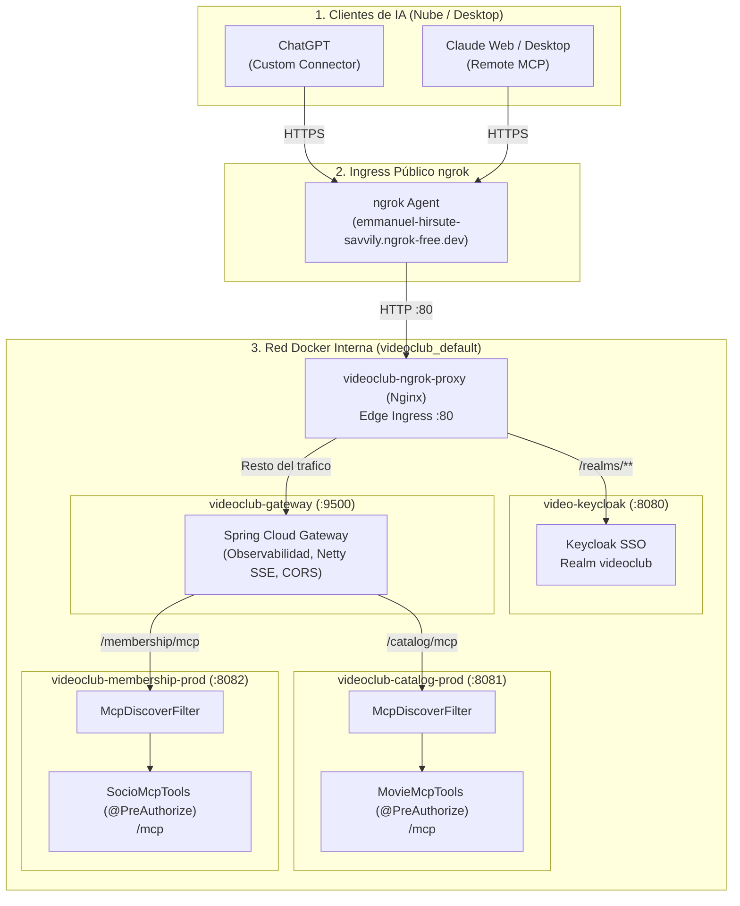
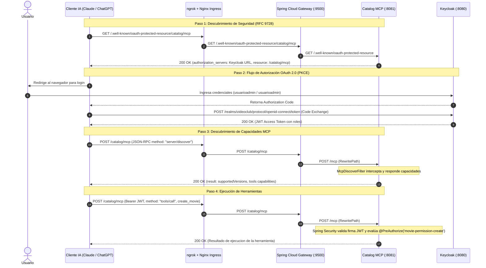

# Guía de Integración: Servidores MCP con Claude, ChatGPT y ngrok

Este documento detalla la arquitectura, configuración de seguridad, red y procedimientos para permitir que clientes remotos de Inteligencia Artificial (**Claude Desktop / Claude Web** y **ChatGPT Connectors**) se autentiquen mediante OAuth 2.0 (Keycloak) y consuman los servidores MCP (`catalog-service` y `membership-service`) utilizando **ngrok** con un dominio estático permanente y un reverse proxy interno.

---

## 1. Arquitectura de Integración

### 1.1. Topología de Red y Arquitectura Ingress + API Gateway

Dado que una cuenta estándar de ngrok provee **1 único dominio estático permanente**, se implementó un esquema desacoplado de dos capas:

1. **Edge Ingress (Nginx)**: Termina ngrok, atiende el tráfico de Keycloak (`/realms/**`) y delega todo el tráfico de negocio al Gateway.
2. **Spring Cloud Gateway (WebFlux / Netty :9500)**: Resuelve el enrutamiento interno hacia los microservicios (`catalog:8081`, `membership:8082`, `agent:8085`), centralizando observabilidad (OpenTelemetry, Prometheus, Tempo), CORS y reescritura de endpoints MCP.



### 1.2. Flujo de Interacción y Autenticación (Paso a Paso)



---

## 2. Modificaciones en Servicios Backend

### 2.1. Keycloak: Configuración de Hostname y Proxy Edge

*Archivos:* `docker/keycloak.yaml` y `docker/.env`

* **`KC_HOSTNAME`**: Fijado a la URL estática `https://emmanuel-hirsute-savvily.ngrok-free.dev`. Evita que Keycloak devuelva URLs `localhost` en redirects y OIDC discovery.
* **`KC_PROXY_HEADERS: xforwarded`**: Permite a Keycloak confiar en los headers `X-Forwarded-Proto`, `X-Forwarded-Host` y `X-Forwarded-For` inyectados por el proxy Nginx/ngrok, asegurando que las cookies de sesión lleven el flag `Secure`.

### 2.2. Keycloak: Cliente OAuth `videoclub-mcp`

*Archivo:* `docker/keycloak/realm-export.json`

1. **Redirect URIs permitidas**:
   * `https://claude.ai/api/mcp/auth_callback`
   * `https://claude.ai/*`
   * `https://chatgpt.com/connector_platform_oauth_redirect`
   * `https://chatgpt.com/*`
2. **Web Origins (CORS)**: `https://claude.ai`, `https://chatgpt.com`, `+`.
3. **Scope `service_account`**: Agregado como optional scope para resolver rechazos `invalid_scope` que envía ChatGPT por defecto.
4. **Habilitación de Roles Completos (`fullScopeAllowed: true`)**:
   * **Problema resuelto**: `videoclub-mcp` tenía `fullScopeAllowed: false` y solo mapeaba permisos de lectura. Keycloak omitía `movie-permission-create` del token aunque el usuario fuera administrador, provocando `403 Access Denied` al crear películas.
   * **Solución**: Al activar `fullScopeAllowed: true`, el access token de `usuarioadmin` incluye todos sus permisos de creación, actualización y borrado.

### 2.3. Keycloak: Inclusión Explícita de Scopes en Token (`include.in.token.scope`)

*Archivo:* `docker/keycloak/realm-export.json`

* **Problema**: Al conectar en ChatGPT, mostraba la advertencia: *"no se otorgaron todos los permisos solicitados. Es posible que algunas herramientas no funcionen hasta que lo vuelvas a conectar"*. ChatGPT solicita todos los scopes publicados (`roles`, `web-origins`, `basic`, `acr`), pero Keycloak los tenía configurados con `"include.in.token.scope": "false"`. Aunque los claims estaban en el JWT, Keycloak omitía sus nombres en el campo `scope` del JSON de `/token`, disparando una falsa alarma de ChatGPT.
* **Solución**: Se activó `"include.in.token.scope": "true"` en los Client Scopes (`roles`, `web-origins`, `service_account`, `acr`, `basic`), eliminando la advertencia.

### 2.4. Spring Boot MCP: Soporte para `server/discover`

*Archivos:*

* `catalog-service/src/main/java/ar/unrn/video/catalog/mcp/McpDiscoverFilter.java`
* `membership-service/src/main/java/ar/unrn/video/membership/mcp/McpDiscoverFilter.java`

* **Problema**: Clientes modernos como ChatGPT envían el método JSON-RPC `server/discover` (especificación MCP julio 2026). Spring AI MCP Starter 2.0.1 todavía no lo implementa nativamente y respondía con `500 Internal Server Error`.
* **Solución**: Se implementó un servlet filter con prioridad máxima (`Ordered.HIGHEST_PRECEDENCE`) que responde las capacidades del servidor (`supportedVersions`, `capabilities`, `serverInfo`) y delega el resto de los métodos a Spring AI.

---

## 3. Infraestructura de Red: Ingress (Nginx) + Spring Cloud Gateway

### 3.1. Edge Ingress (`docker/ngrok/nginx.conf`)

Nginx actúa como Ingress perimetral ultraliviano:

* `/realms/**`, `/resources/**`, `/js/**`, `/admin/**` $\rightarrow$ `http://video-keycloak:8080` (con buffers grandes para cabeceras OIDC).
* `/*` $\rightarrow$ `http://videoclub-gateway:9500` (todo el tráfico de APIs, MCP y agentes se delega al Gateway).

### 3.2. Spring Cloud Gateway (`docker/gateway/gateway.yml`)

Spring Cloud Gateway (WebFlux / Netty) centraliza el enrutamiento interno:

* `/catalog/mcp` $\rightarrow$ `http://catalog:8081/mcp`
* `/membership/mcp` $\rightarrow$ `http://membership:8082/mcp`
* `/.well-known/oauth-protected-resource/catalog/mcp` $\rightarrow$ `http://catalog:8081/.well-known/oauth-protected-resource`
* `/.well-known/oauth-protected-resource/membership/mcp` $\rightarrow$ `http://membership:8082/.well-known/oauth-protected-resource`
* `/movies/**`, `/api/socios/**`, `/api/agent/**` $\rightarrow$ microservicios correspondientes.

### 3.3. Docker Compose (`docker/ngrok.yaml`)

Compose independiente integrado a la red `videoclub_default`:

```yaml
name: videoclub

services:
  ngrok-proxy:
    image: nginx:alpine
    container_name: videoclub-ngrok-proxy
    restart: unless-stopped
    volumes:
      - ./ngrok/nginx.conf:/etc/nginx/conf.d/default.conf:ro
    networks:
      - default

  ngrok:
    image: ngrok/ngrok:latest
    container_name: videoclub-ngrok
    restart: unless-stopped
    command: http ngrok-proxy:80 --url ${NGROK_URL:-https://emmanuel-hirsute-savvily.ngrok-free.dev}
    environment:
      - NGROK_AUTHTOKEN=${NGROK_AUTHTOKEN}
    depends_on:
      - ngrok-proxy
    networks:
      - default
```

### 3.4. Comandos de Operación

Levantar ngrok y el reverse proxy:

```bash
docker compose --env-file docker/.env -f docker/ngrok.yaml up -d
```

Verificar estado del túnel:

```bash
docker exec videoclub-ngrok-proxy wget -qO- http://videoclub-ngrok:4040/api/tunnels
```

Bajar el servicio:

```bash
docker compose -f docker/ngrok.yaml down
```

---

## 4. Endpoints Estáticos Simétricos

Con esta arquitectura, todos los clientes de IA consumen un único host permanente con URLs simétricas:

| Servicio | Tipo | Endpoint Público |
| :--- | :--- | :--- |
| **Catalog MCP** | Servidor MCP | `https://emmanuel-hirsute-savvily.ngrok-free.dev/catalog/mcp` |
| **Catalog MCP** | Discovery RFC 9728 | `https://emmanuel-hirsute-savvily.ngrok-free.dev/.well-known/oauth-protected-resource/catalog/mcp` |
| **Membership MCP** | Servidor MCP | `https://emmanuel-hirsute-savvily.ngrok-free.dev/membership/mcp` |
| **Membership MCP** | Discovery RFC 9728 | `https://emmanuel-hirsute-savvily.ngrok-free.dev/.well-known/oauth-protected-resource/membership/mcp` |
| **Keycloak SSO** | Issuer / OIDC | `https://emmanuel-hirsute-savvily.ngrok-free.dev/realms/videoclub` |

---

## 5. Configuración en Clientes de IA

### 5.1. Conectar ChatGPT (Custom Connectors / GPTs)

1. En ChatGPT, ir a **Ajustes** > **Conectores** > **Agregar conector** (o crear un GPT con Actions).
2. URL del Servidor MCP:
   * **Catálogo de Películas:** `https://emmanuel-hirsute-savvily.ngrok-free.dev/catalog/mcp`
   * **Padrón de Socios:** `https://emmanuel-hirsute-savvily.ngrok-free.dev/membership/mcp`
3. Tipo de Autenticación: **OAuth**.
4. ChatGPT consultará el discovery y obtendrá automáticamente la URL de Keycloak.
5. Iniciar sesión con:
   * **Usuario:** `usuarioadmin`
   * **Contraseña:** `usuarioadmin`

### 5.2. Conectar Claude (Desktop / Web)

1. En la configuración de MCP de Claude (`claude_desktop_config.json` o conectores remotos):

   ```json
   {
     "mcpServers": {
       "videoclub-catalog": {
         "url": "https://emmanuel-hirsute-savvily.ngrok-free.dev/catalog/mcp"
       },
       "videoclub-membership": {
         "url": "https://emmanuel-hirsute-savvily.ngrok-free.dev/membership/mcp"
       }
     }
   }
   ```

2. Claude abrirá el navegador para autenticar contra Keycloak mediante OAuth 2.0 PKCE.
3. Si ngrok muestra la pantalla inicial de advertencia (*"You are about to visit..."*), hacer clic en **"Visit Site"** (se realiza una única vez).
4. Iniciar sesión con `usuarioadmin` / `usuarioadmin`.

---

## 6. Usuarios y Matriz de Permisos

| Usuario | Contraseña | Roles / Permisos | Acciones Permitidas en MCP |
| :--- | :--- | :--- | :--- |
| **`usuarioadmin`** | `usuarioadmin` | `administrador` (`movie-permission-*`, `socio-permission-*`) | Lectura (`list_movies`, `get_movie`, `search_movies`) y **Escritura** (`create_movie`). |
| **`usuariocliente`** | `usuariocliente` | `cliente` (`movie-permission-read`, `socio-permission-read`) | **Únicamente lectura**. Cualquier intento de `create_movie` devuelve `403 Access Denied`. |
