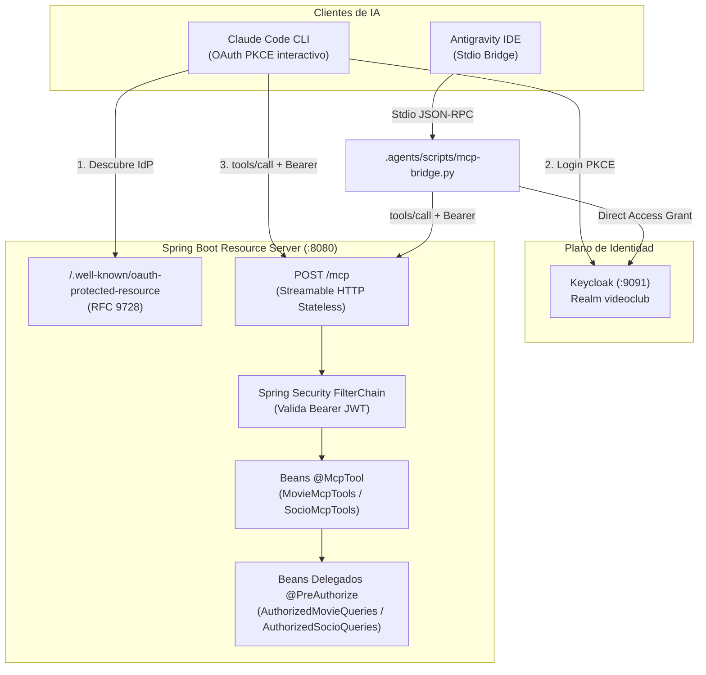

# Servidor Model Context Protocol (MCP) con Spring AI y Keycloak

Este documento describe la arquitectura, herramientas, modelo de autorización y mecanismos de integración del **Servidor Model Context Protocol (MCP)** en la plataforma VideoClub.

---

## 1. Visión General

El servidor MCP permite a agentes de Inteligencia Artificial (Claude Code CLI, Antigravity IDE, agentes locales) interactuar de forma segura con el catálogo de películas y el padrón de socios del videoclub.



---

## 2. Configuración y Transporte MCP

El servidor utiliza **Streamable HTTP en modo `STATELESS`** configurado en `application.yml`:

```yaml
spring:
  ai:
    mcp:
      server:
        name: videoclub-mcp-server
        version: 1.0.0
        type: sync
        protocol: stateless
        streamable-http:
          mcp-endpoint: /mcp
        instructions: >
          Herramientas de consulta del VideoClub UNRN: catalogo de peliculas y padron de
          socios. Todas las operaciones son de solo lectura.
```

### Características del Modo `STATELESS`
* **Validación per-request:** Cada petición es un POST HTTP independiente donde Spring Security evalúa el token Bearer en el hilo del servlet.
* **Sin sesiones en memoria:** Permite escalar horizontalmente sin afinidad de sesiones (*sticky sessions*).
* **Cabecera requerida:** Las peticiones deben incluir `Accept: application/json, text/event-stream` y `Content-Type: application/json`.

---

## 3. Catálogo de Herramientas (Tools)

El servidor expone 5 herramientas de consulta. Todas declaran explícitamente anotaciones de solo lectura para garantizar que los modelos no las traten como operaciones destructivas:

| Nombre de Tool | Título | Permiso Requerido | Descripción |
| :--- | :--- | :--- | :--- |
| `list_movies` | List movies | `movie-permission-read` | Lista todas las películas en el catálogo (ID y título). |
| `get_movie` | Get movie by id | `movie-permission-read` | Retorna el detalle de una película por su ID. |
| `search_movies` | Search movies by title | `movie-permission-read` | Búsqueda insensible a mayúsculas por coincidencia de título. |
| `list_socios` | List members | `socio-permission-read` | Lista todos los miembros del videoclub y su estado activo. |
| `get_socio` | Get member by id | `socio-permission-read` | Retorna la ficha completa de un socio por su ID. |

---

## 4. Arquitectura de Autorización: Delegados Proxiados

Para evitar que Spring Security envuelva las clases `@McpTool` en proxies CGLIB (lo cual ocultaría las anotaciones de las herramientas frente al scanner de Spring AI), se desacopla la definición de la tool de su frontera de seguridad:

1. **Beans de Herramientas (`MovieMcpTools`, `SocioMcpTools`):**
   * Anotados con `@Component`.
   * Contienen los métodos `@McpTool` puros sin `@PreAuthorize`.
   * Inyectan y delegan inmediatamente la consulta en el bean autorizado.
2. **Beans Delegados (`AuthorizedMovieQueries`, `AuthorizedSocioQueries`):**
   * Anotados con `@Component` y `@PreAuthorize`.
   * Ejecutan la verificación de privilegios sobre el `SecurityContext` autenticado:
     ```java
     @PreAuthorize("hasAuthority('socio-permission-read')")
     public List<SocioDTO> findAllSocios() {
         return socioService.findAll();
     }
     ```

### Comportamiento por Perfil de Usuario
* **`usuarioadmin` (Administrador):** Posee `movie-permission-read` y `socio-permission-read`. Puede invocar las 5 herramientas.
* **`usuariocliente` (Socio):** Solo posee `movie-permission-read`. Si el agente intenta invocar `list_socios` o `get_socio`, Spring Security bloquea la llamada y responde un error JSON-RPC con `isError: true` y mensaje `Access Denied`.

---

## 5. Integración con Clientes de IA

### Opción A: Claude Code CLI (OAuth 2.0 PKCE Interactivo)
Utiliza el soporte nativo de descubrimiento **RFC 9728** publicado en `/.well-known/oauth-protected-resource`:

```bash
claude mcp add --transport http \
  --client-id videoclub-mcp \
  --callback-port 8090 \
  videoclub http://localhost:8080/mcp
```

1. Claude se conecta a `/mcp` sin token y recibe un `401 Unauthorized` con cabecera `WWW-Authenticate`.
2. Lee `/.well-known/oauth-protected-resource` y descubre la URL del Realm de Keycloak.
3. Inicia el flujo Authorization Code + PKCE abriendo el navegador para el inicio de sesión.
4. Recibe el callback en `http://localhost:8090/*` y almacena las credenciales en su almacén local.

### Opción B: Antigravity IDE (Stdio Bridge Desatendido)
Antigravity no posee un servidor de callbacks OAuth interactivo para conexiones locales. Se utiliza un bridge en Python ([`.agents/scripts/mcp-bridge.py`](file:///home/horacio/proyectos/unrn/taller/springboot-sso/.agents/scripts/mcp-bridge.py)) configurado en [`.agents/mcp_config.json`](file:///home/horacio/proyectos/unrn/taller/springboot-sso/.agents/mcp_config.json):

```json
{
  "mcpServers": {
    "videoclub": {
      "command": "python3",
      "args": [
        "/home/horacio/proyectos/unrn/taller/springboot-sso/.agents/scripts/mcp-bridge.py"
      ],
      "env": {
        "KEYCLOAK_URL": "http://localhost:9091",
        "KEYCLOAK_REALM": "videoclub",
        "KEYCLOAK_CLIENT_ID": "videoclub-mcp",
        "KEYCLOAK_USER": "usuarioadmin",
        "KEYCLOAK_PASSWORD": "usuarioadmin",
        "MCP_URL": "http://localhost:8080/mcp"
      }
    }
  }
}
```

* **Renovación automática:** Utiliza Direct Access Grants contra Keycloak y renueva el token antes de su vencimiento (1800 s).
* **Intercepción de Sondeo:** Responde al método de descubrimiento de Antigravity (`server/discover`) con el error estándar `-32601 Method not found`, permitiendo que el cliente proceda sin fallas al handshake de `initialize`.

---

## 6. Pruebas Automatizadas

La suite [McpToolsSecurityTest.java](file:///home/horacio/proyectos/unrn/taller/springboot-sso/src/test/java/ar/unrn/video/McpToolsSecurityTest.java) verifica de forma aislada:
1. Que las 5 herramientas sean descubribles por el `SyncStatelessMcpToolProvider` de Spring AI.
2. Que una llamada anónima falle con `AuthenticationCredentialsNotFoundException`.
3. Que un usuario con rol `movie-permission-read` pueda consultar películas pero reciba `AccessDeniedException` al consultar socios.
4. Que un usuario con rol `socio-permission-read` acceda a la información del padrón.
