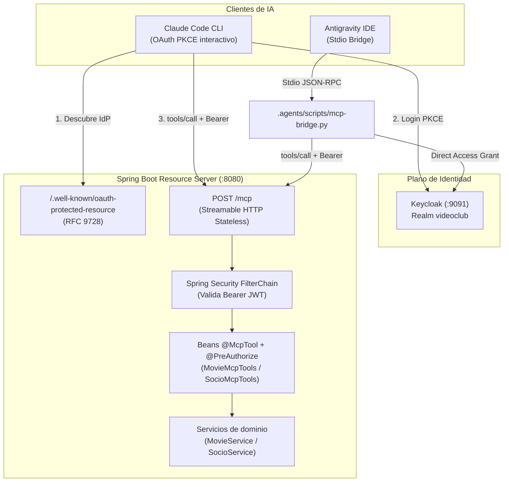
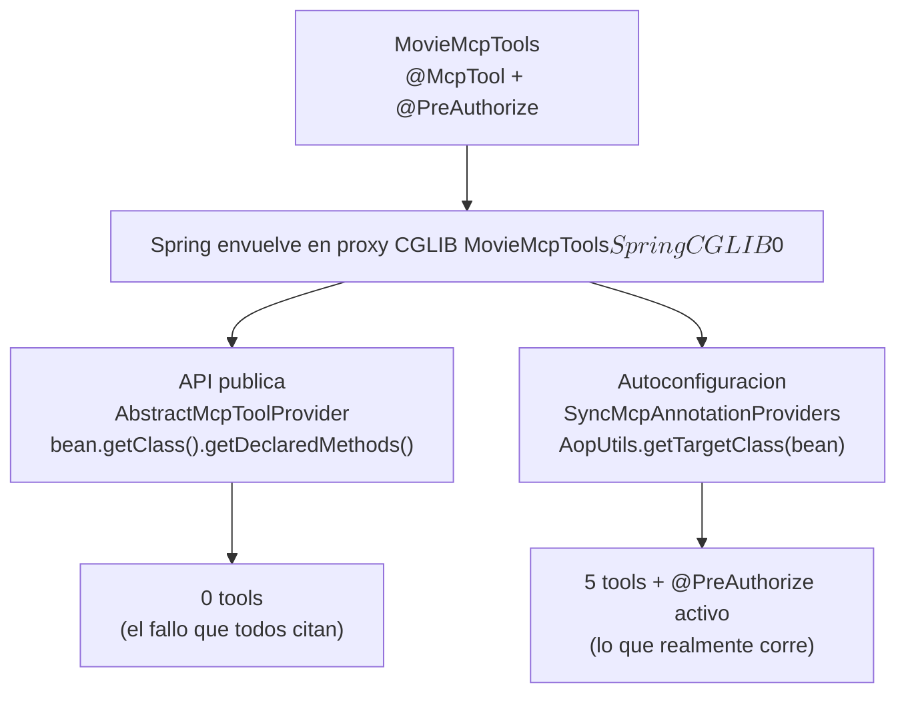
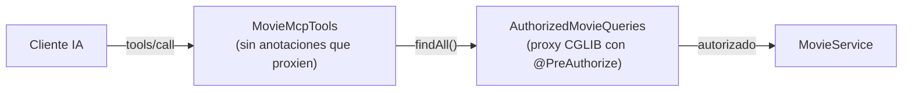

# Servidor Model Context Protocol (MCP) con Spring AI y Keycloak

Este documento describe la arquitectura, herramientas, modelo de autorización y mecanismos de integración del **Servidor Model Context Protocol (MCP)** en la plataforma VideoClub.

---

## 1. Visión General

El servidor MCP permite a agentes de Inteligencia Artificial (Claude Code CLI, Antigravity IDE, agentes locales) interactuar de forma segura con el catálogo de películas y el padrón de socios del videoclub.



---

## 2. Configuración y Transporte MCP

El servidor utiliza **Streamable HTTP en modo `STATELESS`** configurado en `application.yml`:

```yaml
spring:
  ai:
    mcp:
      server:
        name: videoclub-mcp-server
        version: 1.0.0
        type: sync
        protocol: stateless
        streamable-http:
          mcp-endpoint: /mcp
        instructions: >
          Herramientas de consulta del VideoClub UNRN: catalogo de peliculas y padron de
          socios. Todas las operaciones son de solo lectura.
```

### Características del Modo `STATELESS`

* **Validación per-request:** Cada petición es un POST HTTP independiente donde Spring Security evalúa el token Bearer en el hilo del servlet.
* **Sin sesiones en memoria:** Permite escalar horizontalmente sin afinidad de sesiones (*sticky sessions*).
* **Cabecera requerida:** Las peticiones deben incluir `Accept: application/json, text/event-stream` y `Content-Type: application/json`.

---

## 3. Catálogo de Herramientas (Tools)

El servidor expone 5 herramientas de consulta. Todas declaran explícitamente anotaciones de solo lectura para garantizar que los modelos no las traten como operaciones destructivas:

| Nombre de Tool | Título | Permiso Requerido | Descripción |
| :--- | :--- | :--- | :--- |
| `list_movies` | List movies | `movie-permission-read` | Lista todas las películas en el catálogo (ID y título). |
| `get_movie` | Get movie by id | `movie-permission-read` | Retorna el detalle de una película por su ID. |
| `search_movies` | Search movies by title | `movie-permission-read` | Búsqueda insensible a mayúsculas por coincidencia de título. |
| `list_socios` | List members | `socio-permission-read` | Lista todos los miembros del videoclub y su estado activo. |
| `get_socio` | Get member by id | `socio-permission-read` | Retorna la ficha completa de un socio por su ID. |

---

## 4. Arquitectura de Autorización: `@PreAuthorize` sobre las Tools

Cada método `@McpTool` lleva su `@PreAuthorize` encima, en la misma clase:

```java
@Component
public class MovieMcpTools {

    @McpTool(name = "list_movies", title = "List movies", description = "...")
    @PreAuthorize("hasAuthority('movie-permission-read')")
    public List<MovieDTO> listMovies() {
        return movieService.findAll();
    }
}
```

Esto es importante porque **los servicios no tienen control de acceso propio**: `MovieService` y
`SocioService` están protegidos por la capa REST (`MovieResource`, `SocioResource`). Las tools MCP
llegan al servicio por debajo de esa capa, así que el `@PreAuthorize` de arriba es lo único que
separa un token autenticado del dato.

### ¿No rompía esto el descubrimiento de herramientas?

Es la objeción esperable, porque la afirmación circula mucho. La respuesta corta: **no, en Spring AI
2.0.1 no lo rompe.** La afirmación es correcta en su mecanismo y equivocada en su conclusión, y vale
la pena entender exactamente dónde se parte en dos.

#### La mitad que es cierta

1. `@PreAuthorize` hace que Spring envuelva el bean en un proxy CGLIB: una subclase generada en
   runtime, del tipo `MovieMcpTools$$SpringCGLIB$$0`.
2. La JLS **no propaga las anotaciones de un método a los overrides** de una subclase.
3. El proveedor público de Spring AI lee los métodos de forma ingenua:

   ```java
   // spring-ai-mcp-annotations 2.0.1 — AbstractMcpToolProvider.java:45-47
   protected Method[] doGetClassMethods(Object bean) {
       return bean.getClass().getDeclaredMethods();
   }
   ```

Sobre un proxy, ese `getDeclaredMethods()` devuelve los overrides generados, que no tienen
`@McpTool`. Cero herramientas.

#### La mitad que no se suele verificar

La aplicación **nunca instancia ese proveedor**. El registro de tools lo hace la autoconfiguración
de `spring-ai-autoconfigure-mcp-server-common`, en
`StatelessServerSpecificationFactoryAutoConfiguration$SyncStatelessServerSpecificationConfiguration`,
que delega en `SyncMcpAnnotationProviders.statelessToolSpecifications(...)`. Esa fábrica usa
subclases privadas que **sobreescriben** el descubrimiento:

```java
// spring-ai-mcp-annotations 2.0.1 — AnnotationProviderUtil.java:43-44
ReflectionUtils.getUniqueDeclaredMethods(
    AopUtils.isAopProxy(bean) ? AopUtils.getTargetClass(bean) : bean.getClass());
```

Resuelve la clase target **antes** de leer los métodos, así que encuentra las anotaciones. Lo mismo
ocurre en la etapa previa, la detección de beans candidatos
(`AbstractAnnotatedMethodBeanPostProcessor:46` → `AopUtils.getTargetClass(bean) // Handle proxied beans`).

¿Y la seguridad? Los `Method` salen de la clase target pero se invocan sobre la **instancia proxy**.
La reflexión de Java despacha virtualmente al override de CGLIB, que es donde vive el interceptor de
Spring Security. El permiso se exige igual.

> 📊 Versión interactiva de este contraste, con las dos vistas guiadas y las notas de riesgo:
> [`docs/diagrams/proxy-cglib.html`](diagrams/proxy-cglib.html) (abrir en el navegador).



#### Verificación empírica

Los dos caminos están fijados por tests en
[McpToolsSecurityTest.java](file:///home/horacio/proyectos/unrn/taller/springboot-sso/src/test/java/ar/unrn/video/McpToolsSecurityTest.java),
así que estos números son reproducibles con `mvn test`, no una medición perdida:

| Observación | Resultado | Test |
| --- | --- | --- |
| `AopUtils.isAopProxy(movieMcpTools)` | `true` | `everyToolIsDiscoverable` |
| `SyncMcpAnnotationProviders.statelessToolSpecifications(...)` | **5 tools** | `everyToolIsDiscoverable` |
| `new SyncStatelessMcpToolProvider(...).getToolSpecifications()` | **0 tools** | `publicProviderApiIsProxyBlind` |
| Llamada sin `SecurityContext` | `AuthenticationCredentialsNotFoundException` | `toolsDenyMissingSecurityContext` |
| Llamada con la authority incorrecta | `AccessDeniedException` | `socioToolsDenyWithoutSocioPermission` |

---

### ⚠️ La apuesta que hace este diseño

Esto hay que decirlo sin maquillaje: **el arreglo funciona por un detalle de implementación, no por
un contrato publicado.**

El comportamiento proxy-consciente vive en `SyncMcpAnnotationProviders`, una clase de integración
interna de Spring AI. La API **pública** (`AbstractMcpToolProvider`) sigue siendo ciega a los
proxies. Nadie prometió que ese override vaya a seguir existiendo.

**Qué pasa si un upgrade de Spring AI lo elimina:** el servidor arranca sin ningún error en los logs
y publica una lista vacía de herramientas. `tools/list` devuelve `[]` y el agente se queda sin nada
que invocar. Es un fallo silencioso, del peor tipo.

**Cómo nos enteramos antes que el usuario:** `everyToolIsDiscoverable()` ejercita exactamente el
camino de producción (`SyncMcpAnnotationProviders`) sobre beans ya proxiados. Si el override
desaparece, ese test se pone rojo en el build, no en producción. Y `publicProviderApiIsProxyBlind()`
fija el otro lado: documenta que la API pública ve cero tools hoy. Si algún día ese test empieza a
fallar, significa que Spring AI hizo proxy-consciente también a la API pública — el riesgo se acabó
y ese test se puede borrar.

**Riesgo secundario, hoy inactivo:** el descubrimiento toma los `Method` de la clase target y los
invoca sobre el proxy. Con CGLIB funciona. Con un proxy dinámico JDK (basado en interfaz) fallaría
con `IllegalArgumentException`. Spring Boot usa CGLIB por defecto y estas clases no implementan
interfaces, así que no aplica; pero si alguna vez se les extrae una interfaz y se fuerza
`proxyTargetClass=false`, vuelve al tablero.

### 🔧 Cómo corregirlo si rompe

El camino de vuelta es mecánico y está probado: **reintroducir el patrón Delegate**, que es
exactamente lo que este proyecto tenía antes.

1. Crear un `@Component` por agregado — `AuthorizedMovieQueries`, `AuthorizedSocioQueries` — que
   reciba el `Service` y exponga un método por operación.
2. Mover **todos** los `@PreAuthorize` a esas clases nuevas.
3. Dejar las clases de tools libres de cualquier anotación que dispare proxies (`@PreAuthorize`,
   `@Transactional`, `@Cacheable`). Al no ser proxiadas, `getClass().getDeclaredMethods()` vuelve a
   ver los `@McpTool` y cualquier proveedor las descubre.
4. Las tools pasan a delegar: `movies.findAll()` en lugar de `movieService.findAll()`.



El costo del delegate es un bean extra y un salto de indirección por agregado. El beneficio es que
el descubrimiento deja de depender de qué camino use la versión de Spring AI instalada. Se eligió la
variante directa por simplicidad de lectura —el permiso queda al lado de la operación que protege—
asumiendo conscientemente la dependencia, y con los tests puestos para que el día que falle sea un
build rojo y no un incidente.

### Comportamiento por Perfil de Usuario

* **`usuarioadmin` (Administrador):** Posee `movie-permission-read` y `socio-permission-read`. Puede invocar las 5 herramientas.
* **`usuariocliente` (Socio):** Solo posee `movie-permission-read`. Si el agente intenta invocar `list_socios` o `get_socio`, Spring Security bloquea la llamada y responde un error JSON-RPC con `isError: true` y mensaje `Access Denied`.

---

## 5. Integración con Clientes de IA

### Opción A: Claude Code CLI (OAuth 2.0 PKCE Interactivo)

Utiliza el soporte nativo de descubrimiento **RFC 9728** publicado en `/.well-known/oauth-protected-resource`:

```bash
claude mcp add --transport http \
  --client-id videoclub-mcp \
  --callback-port 8090 \
  videoclub http://localhost:8080/mcp
```

1. Claude se conecta a `/mcp` sin token y recibe un `401 Unauthorized` con cabecera `WWW-Authenticate`.
2. Lee `/.well-known/oauth-protected-resource` y descubre la URL del Realm de Keycloak.
3. Inicia el flujo Authorization Code + PKCE abriendo el navegador para el inicio de sesión.
4. Recibe el callback en `http://localhost:8090/*` y almacena las credenciales en su almacén local.

### Opción B: Antigravity IDE (Stdio Bridge Desatendido)

Antigravity no posee un servidor de callbacks OAuth interactivo para conexiones locales. Se utiliza un bridge en Python ([`.agents/scripts/mcp-bridge.py`](file:///home/horacio/proyectos/unrn/taller/springboot-sso/.agents/scripts/mcp-bridge.py)) configurado en [`.agents/mcp_config.json`](file:///home/horacio/proyectos/unrn/taller/springboot-sso/.agents/mcp_config.json):

```json
{
  "mcpServers": {
    "videoclub": {
      "command": "python3",
      "args": [
        "/home/horacio/proyectos/unrn/taller/springboot-sso/.agents/scripts/mcp-bridge.py"
      ],
      "env": {
        "KEYCLOAK_URL": "http://localhost:9091",
        "KEYCLOAK_REALM": "videoclub",
        "KEYCLOAK_CLIENT_ID": "videoclub-mcp",
        "KEYCLOAK_USER": "usuarioadmin",
        "KEYCLOAK_PASSWORD": "usuarioadmin",
        "MCP_URL": "http://localhost:8080/mcp"
      }
    }
  }
}
```

* **Renovación automática:** Utiliza Direct Access Grants contra Keycloak y renueva el token antes de su vencimiento (1800 s).
* **Intercepción de Sondeo:** Responde al método de descubrimiento de Antigravity (`server/discover`) con el error estándar `-32601 Method not found`, permitiendo que el cliente proceda sin fallas al handshake de `initialize`.

---

## 6. Pruebas Automatizadas

La suite [McpToolsSecurityTest.java](file:///home/horacio/proyectos/unrn/taller/springboot-sso/src/test/java/ar/unrn/video/McpToolsSecurityTest.java) verifica de forma aislada:

1. Que las 5 herramientas sean descubribles **por el camino que usa el servidor real**
   (`SyncMcpAnnotationProviders`), sobre beans ya proxiados por `@PreAuthorize`. Este es el test
   centinela del riesgo descrito en §4: si un upgrade de Spring AI rompe el descubrimiento
   proxy-consciente, falla acá y no en producción.
2. Que la API pública `SyncStatelessMcpToolProvider` siga viendo **cero** herramientas sobre esos
   mismos beans. Documenta el fallo que se evitaría con el patrón Delegate; si algún día deja de
   fallar, el riesgo desapareció.
3. Que una llamada anónima falle con `AuthenticationCredentialsNotFoundException`.
4. Que un usuario con rol `movie-permission-read` pueda consultar películas pero reciba `AccessDeniedException` al consultar socios.
5. Que un usuario con rol `socio-permission-read` acceda a la información del padrón.
