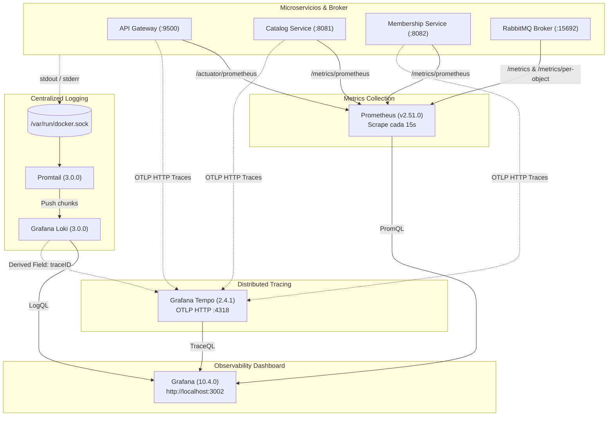

# Observabilidad en VideoClub Platform (Métricas, Logs y Trazas)

Esta guía documenta la arquitectura, diseño y operación del stack de observabilidad de la plataforma VideoClub: **Prometheus**, **Grafana**, **Loki**, **Promtail** y **Tempo**.

---

## 🧭 Filosofía de Diseño: Opt-in y Zero-Overhead

1. **Stack Desacoplado (Opt-in)**: Toda la infraestructura de telemetría reside en `docker/observability.yaml`, completamente separada de los servicios esenciales de `docker/services.yaml`. Si un desarrollador no requiere monitoreo, el stack no se levanta y consume **0 MB de RAM y 0% de CPU**.
2. **Aislamiento Estricto de Puertos**: Solo se expone hacia el host el puerto de visualización de **Grafana** (`3002:3000` vía `${GRAFANA_PORT:-3002}`). Todo el tráfico interno de telemetría —scraping de Prometheus (`:9090`), ingestión de Loki (`:3100`), recolección OTLP de Tempo (`:4317`/`:4318`) y métricas de RabbitMQ (`:15692`)— fluye de forma privada y encriptada por la red interna `videoclub_default`.
3. **Acceso Anónimo (Admin)**: Grafana está preconfigurado con login anónimo en rol `Admin` (`GF_AUTH_ANONYMOUS_ENABLED=true`), eliminando la fricción de autenticación en entornos locales y de laboratorio.
4. **Provisioning Declarativo as Code**: Datasources y dashboards se aprovisionan automáticamente desde el sistema de archivos (`docker/observability/grafana/`). No se requiere configuración manual en la UI de Grafana.

---

## 🏗️ Arquitectura de Telemetría



---

## 📊 1. Métricas y RabbitMQ (Decisiones y Trampas)

### Coarse Aggregates vs. Per-Object Metrics

Por defecto, el plugin `rabbitmq_prometheus` habilitado en RabbitMQ expone sus métricas en el puerto `15692`:

* `/metrics`: Retorna métricas generales agregadas del nodo y cluster (memoria Erlang, descriptores de archivo, totales globales de mensajes). **No incluye labels de colas ni exchanges** para evitar problemas de alta cardinalidad en clusters masivos.
* `/metrics/per-object`: Retorna métricas desglosadas con labels individuales por objeto (`queue="keycloak-events"`, `exchange="videoclub.events"`, `vhost="/"`).

> [!IMPORTANT]
> **La Trampa de los Dashboards de Kubernetes:**
> Al importar dashboards comunitarios para RabbitMQ diseñados para el Kubernetes Operator, muchos paneles quedan vacíos (`No data`). Esto ocurre porque dependen de métricas sintéticas como `rabbitmq_identity_info` filtradas por `namespace="$namespace"` y `rabbitmq_cluster="$cluster"`. En un entorno Docker Compose standalone, esas variables fallan silenciosamente.

### Configuración en Prometheus (`prometheus.yml`)

Prometheus recolecta ambos endpoints en jobs dedicados:

```yaml
  - job_name: 'rabbitmq'
    metrics_path: '/metrics'
    static_configs:
      - targets: ['rabbit:15692']

  - job_name: 'rabbitmq-per-object'
    metrics_path: '/metrics/per-object'
    scrape_interval: 15s
    static_configs:
      - targets: ['rabbit:15692']
```

### Dashboard `RabbitMQ Overview`

Disponible en Grafana con filtros dinámicos por `VHost`, `Queue` y `Exchange`:

* **KPIs Rápidos**: Total de colas, exchanges, mensajes listos (Ready), mensajes sin confirmar (Unacked), consumidores activos y memoria física usada por el runtime Erlang.
* **Tabla de Estado de Colas**: Lista cada cola con sus mensajes listos, mensajes en procesamiento, consumidores conectados y memoria RAM en bytes.
* **Flujo de Mensajería en Exchanges**: Muestra mensajes publicados, confirmados y descartados por falta de ruta (*unroutable dropped*), junto al mapeo en tiempo real `Exchange ➔ Queue`.

---

## 🪵 2. Logging Centralizado con Loki y Promtail

### Ingestión No Invasiva

Promtail se conecta directamente al socket de Docker del host (`/var/run/docker.sock`) y al directorio de contenedores (`/var/lib/docker/containers`).

* **Cero cambios en el código**: Los microservicios simplemente escriben en `stdout`/`stderr`.
* **Etiquetado Automático**: Promtail extrae metadatos de las etiquetas de Docker Compose y genera labels de búsqueda: `service`, `container`, `compose_project`.

### Restricciones de LogQL en Loki 3.0+

Loki 3.0 rechaza consultas que evalúen matchers vacíos (por ejemplo `{service=~".*"}`). El dashboard `Centralized Logs (Loki)` utiliza expresiones regulares estrictas:

```logql
{compose_project="videoclub", service=~"$service"} |= "$search"
```

### Correlación Log-to-Trace

En `docker/observability/grafana/provisioning/datasources/datasources.yaml`, el datasource de Loki incluye un campo derivado (*derived field*):

```yaml
derivedFields:
  - datasourceUid: Tempo
    matcherRegex: "(?i)trace_?id[\":= ]+([a-f0-9]+)"
    name: TraceID
    url: "$${__value.raw}"
```

Cuando un log de Spring Boot imprime un `traceId`, Grafana genera un enlace clickeable que abre directamente la cascada de ejecución (*trace waterfall*) en Tempo.

---

## 🔍 3. Trazabilidad Distribuida (Distributed Tracing con Tempo)

### Componentes de Tracing en Spring Boot 4

Para emitir trazas hacia Tempo sin agentes pesados, los microservicios utilizan:

1. `micrometer-tracing-bridge-otel`: Conecta el tracing de Micrometer con el SDK de OpenTelemetry.
2. `opentelemetry-exporter-otlp`: Exportador estándar OTLP vía HTTP.

En el `application.yml` de cada servicio:

```yaml
management:
  tracing:
    sampling:
      probability: 1.0  # 100% de muestreo para desarrollo
  otlp:
    tracing:
      endpoint: http://tempo:4318/v1/traces
```

### Consideración Crítica: GraalVM Native Image vs. JVM

> [!CAUTION]
> En aplicaciones compiladas a binario nativo con GraalVM (`*-native`):
>
> * Las dependencias de Maven y las autoconfiguraciones de Spring Boot AOT se procesan **en tiempo de compilación**.
> * Inyectar propiedades en `application.yml` o reiniciar un contenedor nativo **no tiene efecto si las clases de OpenTelemetry no formaron parte del binario inicial**.
> * Para que el tracing funcione en modo nativo, se requiere reconstruir la imagen (`mvn -Pnative native:compile`). En modo JVM estándar (`target: dev` o `target: runtime`), las librerías se cargan inmediatamente en el arranque.

---

## 🖥️ 4. Dashboards Pre-Aprovisionados

Los dashboards se encuentran en `docker/observability/grafana/dashboards/`:

| Dashboard | UID | Enlace Directo | Descripción |
| :--- | :--- | :--- | :--- |
| **RabbitMQ Overview** | `rabbitmq-overview` | [Ver Dashboard](http://localhost:3002/d/rabbitmq-overview/rabbitmq-overview) | Monitoreo integral de colas, exchanges, tasas de entrega, consumidores y memoria Erlang. |
| **Spring Boot & JVM** | `spring-boot-overview` | [Ver Dashboard](http://localhost:3002/d/spring-boot-overview/spring-boot-and-jvm-overview) | Métricas de CPU, Heap JVM, peticiones HTTP y **saturación del pool de conexiones a PostgreSQL (HikariCP)**. |
| **Centralized Logs** | `loki-logs-overview` | [Ver Dashboard](http://localhost:3002/d/loki-logs-overview/centralized-logs-loki) | Streaming de logs en vivo de todos los contenedores con filtros por servicio y búsqueda de texto. |
| **Distributed Tracing** | `tempo-tracing-overview` | [Ver Dashboard](http://localhost:3002/d/tempo-tracing-overview/distributed-tracing-tempo) | Búsqueda de trazas distribuidas y análisis de latencia extremo a extremo. |

---

## 🛠️ 5. Guía Operativa

### Iniciar el Stack de Observabilidad

Para iniciar el stack junto al resto de los servicios de la plataforma:

```bash
docker compose -f docker/observability.yaml up -d
```

### Verificar el Estado de los Contenedores

```bash
docker compose -f docker/observability.yaml ps
```

### Recargar Configuración de Prometheus en Caliente

Prometheus tiene habilitado el endpoint de gestión de ciclo de vida (`--web.enable-lifecycle`). Si modificás `prometheus.yml`, podés recargar las reglas sin reiniciar el contenedor:

```bash
docker exec videoclub-prometheus wget -qO- --post-data="" "http://localhost:9090/-/reload"
```

### Detener el Stack de Observabilidad

Para liberar los recursos del sistema:

```bash
docker compose -f docker/observability.yaml down
```

Para eliminar también los volúmenes persistentes de métricas, trazas y logs:

```bash
docker compose -f docker/observability.yaml down -v
```
