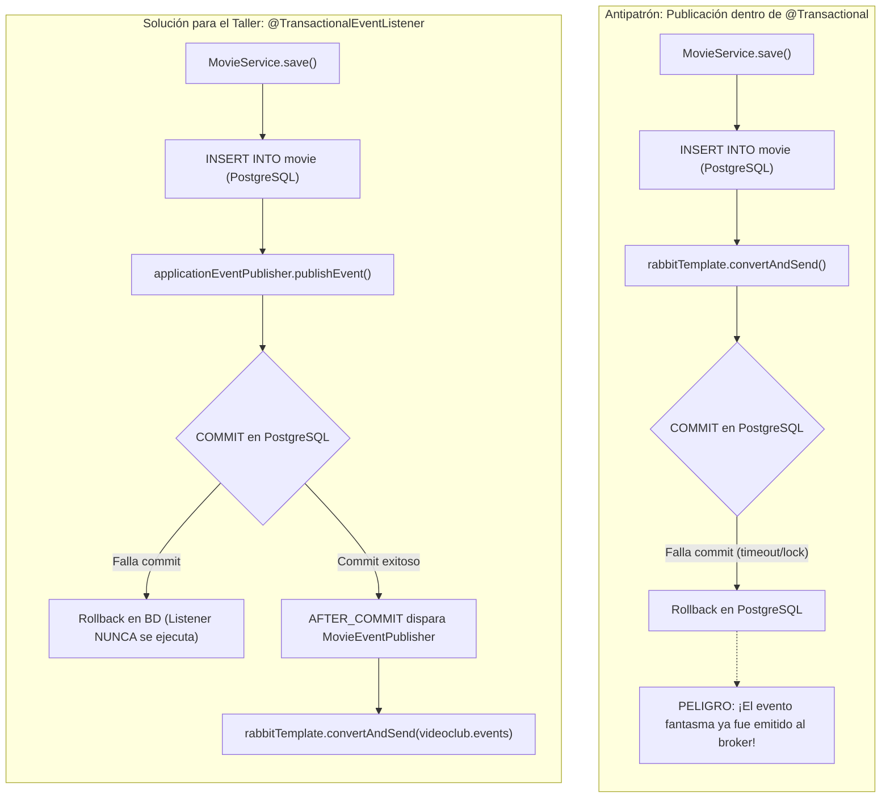
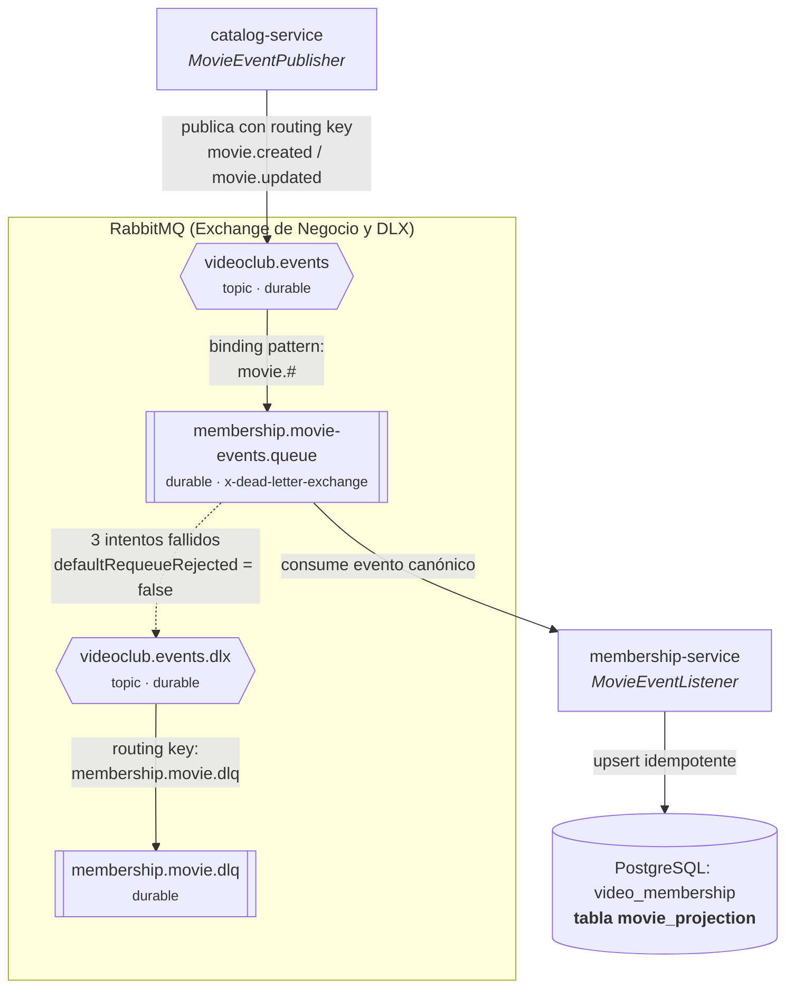
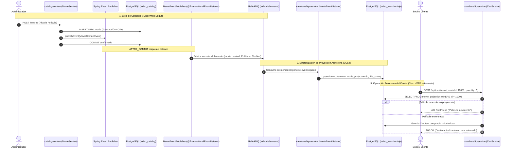
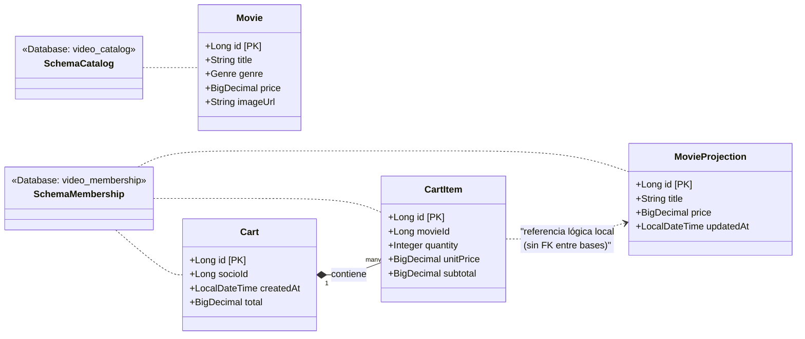
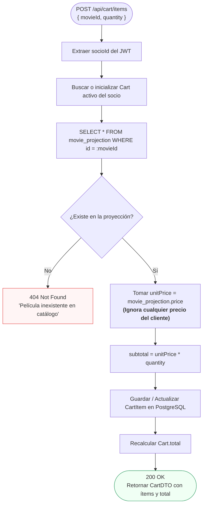

# Plan: Carrito de Compras en Membership — Event-Carried State Transfer (ECST) vía RabbitMQ

> [!NOTE]
> **Estado: Plan de diseño y guía pedagógica para clase.** Este documento detalla la arquitectura, el diseño técnico, la topología de mensajería y los pasos de implementación para introducir el patrón Event-Carried State Transfer (ECST) en el taller, contrastándolo con la integración previa de Keycloak.

---

## 1. Contexto y Objetivos Pedagógicos

El caso de uso a modelar en el taller consiste en permitir que los socios gestionen un **Carrito de Compras / Alquiler de Películas** dentro de `membership-service`, consumiendo información de películas proveniente de `catalog-service`.

### 1.1. Los Fundamentos Arquitectónicos

Este diseño se apoya en los ADRs vigentes del proyecto:

* **[ADR-013 (Database per Service)](../adr.md#adr-013-un-esquema-por-microservicio-database-per-service):** `membership-service` no tiene acceso al esquema `video_catalog`. No es posible hacer un `JOIN` relacional.
* **[ADR-014 (Comunicación Este-Oeste Asíncrona)](../adr.md#adr-014-comunicación-este-oeste-solo-por-bus-de-mensajes-no-por-http):** Está prohibido hacer llamadas HTTP sincrónicas (`GET http://catalog:8081/movies/{id}`) desde el carrito. Hacerlo crearía acoplamiento temporal y transformaría los microservicios en un *monolito distribuido*.
* **[ADR-015 (Event-Carried State Transfer y Proyecciones Locales)](../adr.md#adr-015-sincronización-entre-verticales-mediante-event-carried-state-transfer-ecst-y-réplica-de-proyecciones):** Patrón canónico de integración para la sincronización entre dominios.

### 1.2. La Gran Diferencia con Keycloak: El Dilema del Dual-Write

En la integración con Keycloak ([`keycloak-rabbitmq-integration.md`](../keycloak-rabbitmq-integration.md)), el productor era una caja negra externa: Keycloak hacía `COMMIT` en su base y luego su SPI intentaba publicar en RabbitMQ. Si el broker fallaba, el evento se descartaba; por eso en [ADR-002](../adr.md#adr-002-por-qué-no-aplican-saga-ni-transactional-outbox-en-la-sincronización-de-socios) se justificó la necesidad de un endpoint de reconciliación.

En `catalog-service`, **nosotros somos los dueños de la transacción en Spring Boot**. Si mezclamos base de datos y broker ingenuamente dentro de `@Transactional`, caemos en la trampa del **evento fantasma**:



### 1.3. El "Por Qué" Real: Autonomía y Seguridad Financiera

Replicar una proyección mínima (`id`, `title`, `price`) en la base de datos de membresía no se hace principalmente para validar si un ID existe, sino para:

1. **Autonomía Operativa y Resiliencia:** Si `catalog-service` sufre una caída o mantenimiento, el carrito sigue operativo al 100% leyendo de su base local.
2. **Seguridad e Integridad Financiera:** El cliente frontend envía `{ movieId, quantity }`. El precio unitario **jamás se recibe del cliente**; se toma de la proyección local sincronizada, evitando manipulación maliciosa de precios.

---

## 2. Topología Estática y Flujo de Mensajería

### 2.1. Mecánica de Enrutamiento: Productor, Routing Key, Exchange, Binding y Consumidor

Este diagrama ilustra las piezas fundamentales de RabbitMQ y cómo viaja el mensaje desde el productor hasta el consumidor:

```mermaid
flowchart LR
    subgraph PROD_BOX ["1. Productor (catalog-service)"]
        direction TB
        P["MovieEventPublisher<br/><code>rabbitTemplate.convertAndSend()</code>"]
    end

    subgraph BROKER_BOX ["2. Broker RabbitMQ"]
        direction TB
        EX{{"Exchange de Dominio<br/><b>videoclub.events</b><br/><small>(Type: topic, durable)</small>"}}
        
        Q[["Cola del Consumidor<br/><b>membership.movie-events.queue</b><br/><small>(durable)</small>"]]
        
        EX -->|"<b>Binding Pattern:</b><br/><code>movie.#</code>"| Q
    end

    subgraph CONS_BOX ["3. Consumidor (membership-service)"]
        direction TB
        C["MovieEventListener<br/><code>@RabbitListener</code>"]
        DB[("PostgreSQL<br/><code>movie_projection</code>")]
        C -->|"upsert local"| DB
    end

    %% Flujo del mensaje
    P -->|"<b>Publicación:</b><br/>Routing Key: <code>movie.created</code><br/><i>Payload: {id, title, price}</i>"| EX
    Q -->|"Entrega (Push AMQP)"| C

    classDef comp fill:#f0fff4,stroke:#38a169,stroke-width:2px
    classDef exchange fill:#fff4e6,stroke:#dd6b20,stroke-width:2px
    classDef queue fill:#e6f7ff,stroke:#2b6cb0,stroke-width:2px
    classDef db fill:#edf2f7,stroke:#4a5568,stroke-width:2px
    class P,C comp
    class EX exchange
    class Q queue
    class DB db
```



#### Los 4 Conceptos Clave para el Aula

1. **El Productor NUNCA publica a una cola:** `catalog-service` no conoce colas ni sabe quién lo escucha. Publica al exchange (`videoclub.events`) con una etiqueta de enrutamiento: la **Routing Key** (`movie.created` o `movie.updated`).
2. **El Exchange es el router:** Al ser de tipo `topic`, examina la Routing Key y busca coincidencias con las reglas de enlace (**Bindings**) registradas por las colas.
3. **El Binding con comodín (`movie.#`):** La cola declara su interés mediante el patrón `movie.#`, donde `#` coincide con cero o más palabras (captura `movie.created`, `movie.updated`, `movie.deleted`).
4. **El Consumidor solo escucha su COLA:** `@RabbitListener` se conecta exclusivamente a `membership.movie-events.queue`. Si `membership-service` se apaga, la cola retiene los mensajes en disco y se los entrega al reiniciar sin perder estado.

---

### 2.2. Topología de Resiliencia y Dead Letter Queue (DLQ)

Estructura completa de aislamiento de mensajes envenenados para prevenir bucles infinitos:



---

### 2.3. Flujo de Interacción Temporal (End-to-End)

Secuencia temporal dividida en los tres momentos del ciclo de vida:



---

## 3. Modelo de Datos y Esquemas Aislados

Cumpliendo con [ADR-013](../adr.md#adr-013-un-esquema-por-microservicio-database-per-service), cada microservicio tiene su esquema privado. `membership-service` almacena la réplica desnormalizada en `movie_projection`:



---

## 4. Lógica de Negocio y Seguridad en el Carrito

Flujo de decisión en `CartService.addItem()` que demuestra la validación local y el cálculo de importes confiable:



---

## 5. Plan de Implementación por Fases

### Fase 1: Productor en `catalog-service`

* **Paso 1.1:** Crear el DTO/Record canónico del evento de dominio:

  ```java
  public record MovieDomainEvent(Long movieId, String title, BigDecimal price, String eventType) {}
  ```

* **Paso 1.2:** En `MovieService`, inyectar `ApplicationEventPublisher` y emitir el evento en memoria tras guardar en `movieRepository.save(movie)`.
* **Paso 1.3:** Crear `MovieEventPublisher` con `@TransactionalEventListener(phase = TransactionPhase.AFTER_COMMIT)` que reciba el evento de Spring y utilice `RabbitTemplate` para despachar a `videoclub.events` con routing keys:
  * `movie.created` (al dar de alta una película).
  * `movie.updated` (al modificar precio o título).

### Fase 2: Topología de RabbitMQ en `membership-service`

* **Paso 2.1:** Configurar en `RabbitMQConfig.java`:
  * Cola durable: `membership.movie-events.queue`.
  * Dead Letter Exchange: `videoclub.events.dlx` con routing key `membership.movie.dlq`.
  * Binding: asociar la cola al exchange `videoclub.events` con pattern `movie.#`.
  * Establecer `defaultRequeueRejected = false` para evitar bucles infinitos en mensajes fallidos.

### Fase 3: Réplica Local (Proyección) en `membership-service`

* **Paso 3.1:** Crear la entidad `MovieProjection`:
  * Tabla `movie_projection` en el esquema `video_membership`.
  * Columnas: `id` (mismo ID del catálogo, sin generación automática), `title` (`varchar(255)`), `price` (`numeric(10,2)`), `updated_at` (`timestamp`).
* **Paso 3.2:** Crear `MovieProjectionRepository extends JpaRepository<MovieProjection, Long>`.
* **Paso 3.3:** Crear `MovieEventListener` con `@RabbitListener(queues = "membership.movie-events.queue")`:
  * Deserializar el payload.
  * Ejecutar upsert idempotente en `movie_projection`.

### Fase 4: Modelo y Lógica de Negocio del Carrito

* **Paso 4.1:** Modelar entidades de Carrito (`Cart` y `CartItem`).
* **Paso 4.2:** Implementar `CartService.addItem(Long socioId, AddCartItemDTO dto)`.
* **Paso 4.3:** Exponer endpoints REST en `CartResource`:
  * `GET /api/cart`: obtiene el estado actual del carrito y sus totales.
  * `POST /api/cart/items`: agrega o actualiza ítems.
  * `DELETE /api/cart/items/{movieId}`: remueve un ítem.

---

## 6. Guía para la Demostración en Clase ("Show & Tell")

1. **Flujo Feliz Asíncrono:**
   * Crear una película desde Swagger o cURL en `catalog-service` (`:8081`).
   * Mostrar en la consola de RabbitMQ (`http://localhost:15672`) el paso del mensaje por el exchange `videoclub.events` y la entrega en `membership.movie-events.queue`.
   * Verificar en la base de datos `video_membership` (`SELECT * FROM movie_projection`) que el registro apareció de inmediato.
2. **Prueba de Fuego de Resiliencia (Desacoplamiento Temporal):**
   * Detener el contenedor de catálogo:

     ```bash
     docker stop catalog-service
     ```

   * Ejecutar una petición para agregar la película al carrito en `membership-service` (`:8082`).
   * **Resultado esperado:** La operación responde `200 OK` inmediatamente, calculando totales sin demoras ni errores.
   * **Lección para los alumnos:** Si hubiéramos usado HTTP este-oeste, el carrito estaría completamente caído. Con ECST y proyección local, la disponibilidad es del 100%.
3. **Validación de Seguridad Financiera:**
   * Mostrar cómo el contrato de la API solo pide `{ movieId, quantity }` y no permite enviar precios desde el frontend, protegiendo las reglas de negocio.
