# Guía Integral de Seguridad: OAuth 2.0, OpenID Connect y Keycloak con Spring Boot y React 19

Esta guía está diseñada como material pedagógico y de referencia arquitectónica para dictar una clase completa sobre seguridad moderna en aplicaciones web distribuidas. Explica los fundamentos teóricos, los flujos estándar de la industria, las configuraciones en Keycloak, la implementación en el backend con **Spring Boot (Java 25)** y el frontend SPA con **React 19**.

### Contenido

**Fundamentos**
1. [¿Por qué abandonamos la sesión tradicional?](#1-fundamentos-conceptuales-por-qué-abandonamos-la-sesión-tradicional)
2. [OAuth 2.0 vs. OpenID Connect](#2-oauth-20-vs-openid-connect-oidc)

**Configuración de Keycloak**

3. [Clientes públicos vs. confidenciales](#3-clientes-en-keycloak-públicos-vs-confidenciales)
4. [Flujos de autorización](#4-flujos-de-autorización-grant-types)
5. [Ciclo de vida de identidades y MFA](#5-gestión-del-ciclo-de-vida-de-identidades-en-keycloak)
6. [Roles, grupos y token bloat](#6-modelado-de-roles-grupos-y-prevención-de-token-bloat)
7. [Anatomía del client scope: del rol al claim](#7-anatomía-del-client-scope-videoclub-del-rol-al-preauthorize)

**Implementación**

8. [Backend: Resource Server](#8-implementación-en-el-backend-spring-boot-resource-server)
9. [Cliente declarativo HTTP Interface](#9-cliente-declarativo-http-interface-spring-boot-4)
10. [Errores estándar: RFC 7807](#10-manejo-global-de-excepciones-nativo-rfc-7807-problem-details)
11. [Frontend: SPA con React 19](#11-implementación-en-el-frontend-spa-con-react-19)
12. [Eventos de Keycloak: SPI y RabbitMQ](#12-eventos-de-keycloak-spi-custom-y-rabbitmq)

**Práctica**

13. [Laboratorio paso a paso](#13-laboratorio-práctico-guía-paso-a-paso-para-la-clase)

---

## 1. Fundamentos Conceptuales: ¿Por qué abandonamos la sesión tradicional?

### El problema de la arquitectura monolítica clásica

En aplicaciones web tradicionales, la seguridad se basaba en **sesiones en memoria del servidor** y **cookies de sesión** (`JSESSIONID`):

- **Estado en el servidor (Stateful)**: Dificulta el escalado horizontal (requiere balanceadores con *sticky sessions* o clusters de Redis).
- **Acoplamiento**: El backend debe gestionar directamente la base de datos de usuarios, almacenamiento de contraseñas (hashing, salting), políticas de expiración, bloqueo de cuentas y autenticación multifactor (MFA).
- **Incompatibilidad moderna**: No escala bien para clientes móviles, SPAs (Single Page Applications) o arquitecturas de microservicios.

### La solución moderna: Servidor de Identidad Desacoplado (IAM)

Delegamos la responsabilidad a un Identity & Access Management (IAM) como **Keycloak**. El backend se convierte en un **Resource Server stateless** que solo valida firmas criptográficas de tokens.

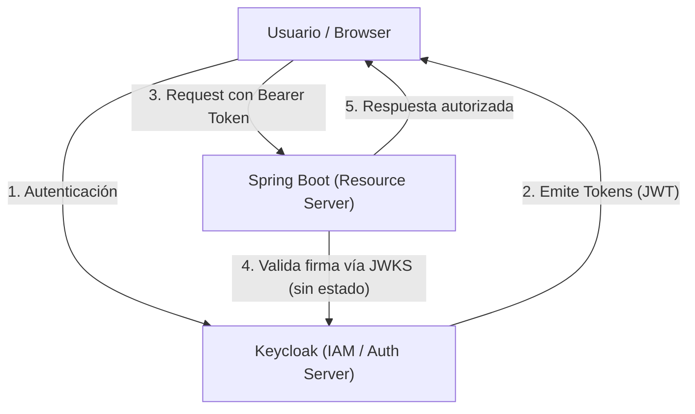

---

## 2. OAuth 2.0 vs. OpenID Connect (OIDC)

Una de las confusiones más frecuentes en la industria es mezclar estos dos conceptos:

| Característica | OAuth 2.0 | OpenID Connect (OIDC) |
| --- | --- | --- |
| **Propósito** | **Autorización** (Delegación de permisos) | **Autenticación** (Identidad del usuario) |
| **Pregunta que responde** | *¿A qué recursos puede acceder esta aplicación?* | *¿Quién es la persona conectada?* |
| **Artefacto principal** | `access_token` (normalmente opaco o JWT) | `id_token` (siempre JWT firmado) |
| **Análogo en la vida real** | La llave magnética de una habitación de hotel | El Documento Nacional de Identidad / Pasaporte |

> **Regla de oro**: OAuth 2.0 le da permiso al cliente para realizar acciones en nombre del usuario. OpenID Connect le informa al cliente quién es el usuario. OIDC es una capa construida **encima** de OAuth 2.0.

### Anatomía de los Tokens

1. **`id_token`**: Consumido exclusivamente por el cliente (ej. SPA React 19) para personalizar la interfaz (nombre, avatar, email). **Nunca debe enviarse como credencial al backend**.
2. **`access_token`**: Credencial enviada en el header `Authorization: Bearer <token>` hacia las APIs del backend.
3. **`refresh_token`**: Token de larga duración para obtener nuevos `access_token` cuando expiran, sin forzar al usuario a ingresar credenciales nuevamente.

### Estructura de un JWT (JSON Web Token)

Un JWT consta de 3 partes codificadas en Base64URL separadas por puntos (`.`):

- **Header**: Algoritmo (`RS256`) y clave pública identificadora (`kid`).
- **Payload (Claims)**: Sujeto (`sub`), emisor (`iss`), expiración (`exp`), roles y grupos.
- **Signature**: Firma criptográfica generada con la clave privada del servidor de identidad.

---

## 3. Clientes en Keycloak: Públicos vs. Confidenciales

En Keycloak configuramos dos clientes con naturalezas y niveles de confianza completamente distintos:

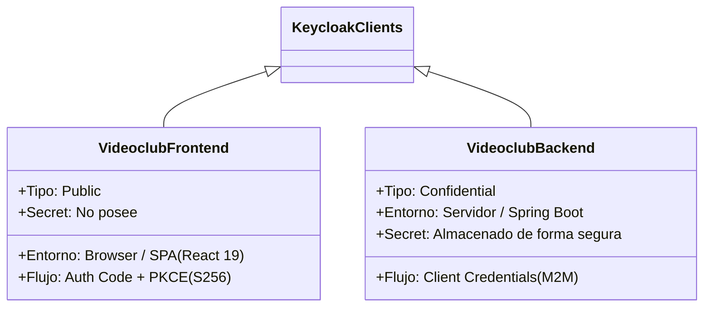

### A. Cliente Público: `videoclub-frontend` (SPA / Mobile)

- **Problema de seguridad**: El código JavaScript corre en el navegador de los usuarios; cualquier usuario puede inspeccionar la memoria o el código fuente. Por ende, **no puede guardar un `client_secret` de forma segura**.
- **Mecanismo de protección**: **PKCE (Proof Key for Code Exchange)**.

### B. Cliente Confidencial: `videoclub-backend` (Servidor a Servidor)

- Corre en un entorno seguro (el proceso Java de Spring Boot).
- Almacena un secreto (`client_secret = dstNSsANvqlaGfZCJa1mcYzP1EBAYP4N`) fuera del alcance del público.

> **Este secreto está versionado en el repositorio, y eso está mal en cualquier contexto que no sea este.** Aparece en texto plano en `realm-export.json`, en el `application.yml` y como valor por defecto en `KeycloakAuthInterceptor`. Es deliberado: permite clonar el proyecto y levantarlo sin configuración previa, que es exactamente lo que necesita una clase. En cualquier entorno real, el secreto va por variable de entorno o gestor de secretos, se rota periódicamente, y **jamás** entra en git. Un secreto commiteado sigue en el historial aunque se borre del archivo.

---

## 4. Flujos de Autorización (Grant Types)

### Flujo 1: Authorization Code Flow con PKCE (S256)

Este es el flujo obligatorio para aplicaciones web y móviles (SPAs).

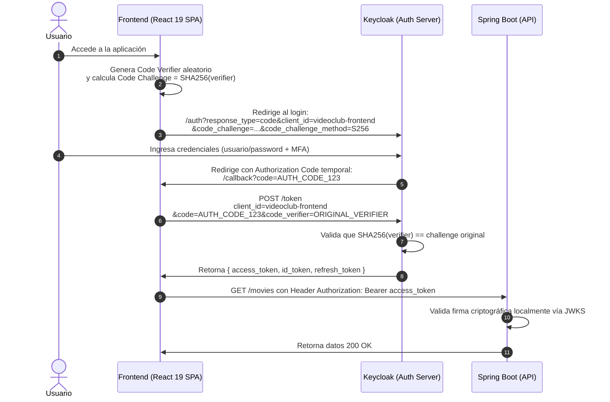

#### ¿Por qué es vital PKCE?

Evita el ataque de interceptación del código de autorización (*Authorization Code Interception Attack*). Aunque un atacante intercepte el `code` en la redirección, no puede canjearlo en `/token` porque no conoce el `code_verifier` original que generó el frontend en memoria.

---

### Flujo 2: Client Credentials Flow (M2M - Machine to Machine)

Este flujo se utiliza cuando un backend o proceso batch necesita comunicarse con otro servicio o con el Admin API de Keycloak sin intervención humana.

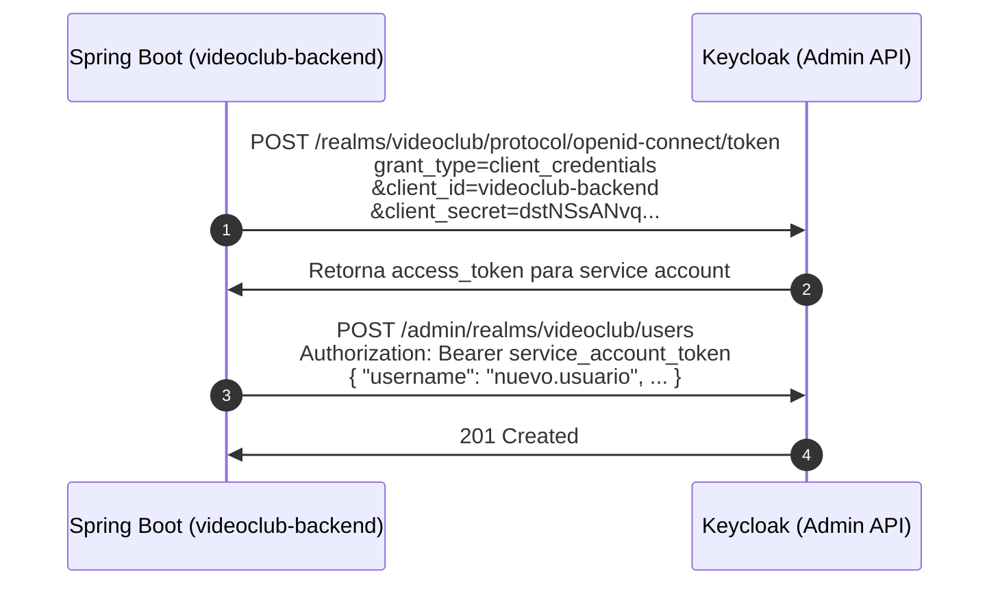

---

## 5. Gestión del Ciclo de Vida de Identidades en Keycloak

### Auto-registro y Asignación Automática de Grupos

Para permitir que nuevos usuarios se registren por sí mismos en la plataforma respetando el **Principio de Menor Privilegio**:

1. **Auto-registro activado (`registrationAllowed: true`)**: Habilita el enlace "Registrarse" en el formulario de login de Keycloak.
2. **Grupo por defecto (`defaultGroups: ["/videoclub-default/cliente"]`)**: Todo usuario que se registre se incorpora automáticamente al grupo de clientes, heredando `ROLE_CLIENT` y `movie-permission-read`. De este modo, no tiene permisos administrativos ni acceso a la gestión de otros usuarios.

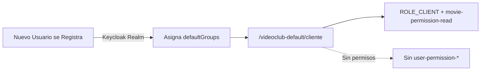

### Autenticación Multifactor (MFA/2FA) Obligatoria

Para proteger las cuentas de usuario contra ataques de fuerza bruta y robo de contraseñas, Keycloak implementa **TOTP (Time-based One-Time Password)**:

- **Subflujo `Browser - Conditional OTP`**: Contiene la condición `conditional-user-configured`.
- **Acción requerida por defecto (`CONFIGURE_TOTP`, `defaultAction: true`)**:
  - Al registrarse o crearse una cuenta nueva, Keycloak le impone al usuario la tarea obligatoria de configurar un autenticador.
  - En el primer inicio de sesión, el flujo redirige automáticamente a la pantalla de enrolamiento de segundo factor con el código QR.
  - Una vez escaneado con Google Authenticator o FreeOTP, la condición se cumple y a partir de ese momento se solicita el código de 6 dígitos en cada login.

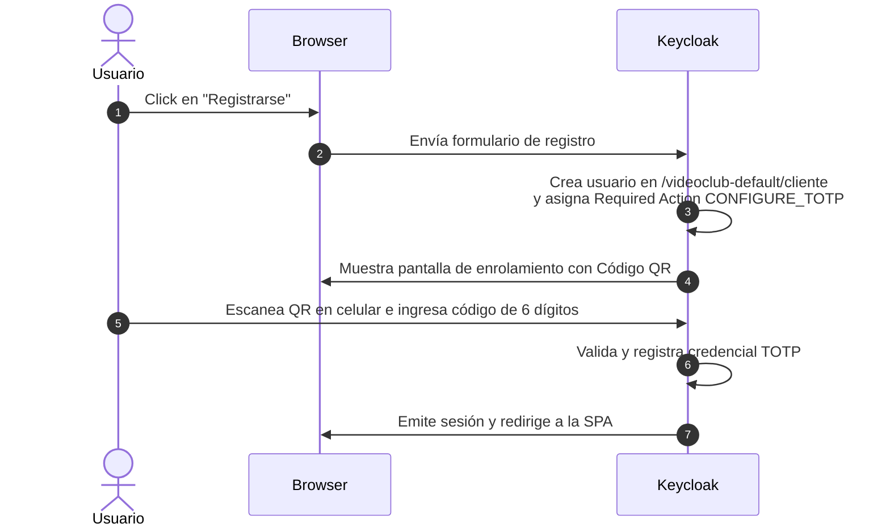

---

## 6. Modelado de Roles, Grupos y Prevención de "Token Bloat"

### Jerarquía de Roles y Separación de Dominios

Para aplicar el principio de menor privilegio, separamos los dominios de datos:

1. **Dominio Películas**: `movie-permission-read`, `movie-permission-create`, `movie-permission-update`, `movie-permission-delete`.
2. **Dominio Usuarios**: `user-permission-read`, `user-permission-create`.

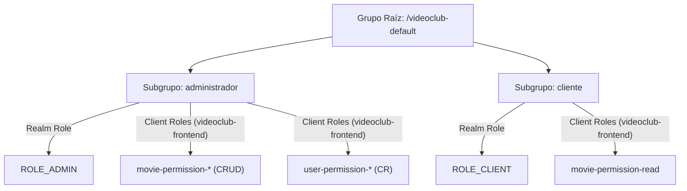

### Prevención de Token Bloat (`fullScopeAllowed: false`)

Por defecto, Keycloak asocia todos los roles del realm a cada token. Esto infla innecesariamente el tamaño de los headers HTTP en cada petición.

- En `realm-export.json`, configuramos `"fullScopeAllowed": false` en `videoclub-frontend`.
- Definimos un Scope explícito (`videoclub`) mapeando únicamente los roles de negocio necesarios.

> **Asimetría intencional**: `videoclub-backend` mantiene `"fullScopeAllowed": true`. Es un cliente confidencial que actúa como service account contra el Admin API y necesita ver los roles de `realm-management` que tiene asignados. El ahorro de bytes importa en el token que viaja en cada request del browser, no en el token M2M que se pide una vez y se cachea.

---

## 7. Anatomía del Client Scope `videoclub`: del rol al `@PreAuthorize`

Esta es la sección que conecta las dos mitades del sistema. Un rol asignado a un grupo en Keycloak **no aparece mágicamente** en el token: alguien tiene que escribirlo como *claim*. Ese "alguien" son los **Protocol Mappers** del client scope.

Sin entender este paso, la configuración de Keycloak (§6) y el converter de Spring Security (§8) parecen dos piezas sueltas que funcionan por casualidad.

### La cadena completa

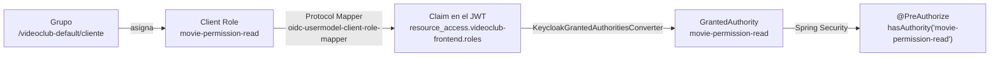

### Los mappers del scope `videoclub`

En `realm-export.json`, el client scope `videoclub` define seis mappers. Los dos críticos para la autorización son:

| Mapper | Tipo (`protocolMapper`) | Claim que escribe |
| --- | --- | --- |
| `realm roles` | `oidc-usermodel-realm-role-mapper` | `realm_access.roles` |
| `client roles` | `oidc-usermodel-client-role-mapper` | `resource_access.${client_id}.roles` |
| `email` | `oidc-usermodel-attribute-mapper` | `email` |
| `username` | `oidc-usermodel-attribute-mapper` | `preferred_username` |
| `full name` | `oidc-full-name-mapper` | `name` |
| `groups` | `oidc-usermodel-realm-role-mapper` | `groups` |

Los dos primeros tienen `"multivalued": "true"` y `"access.token.claim": "true"`: producen arrays dentro del `access_token`, que es exactamente donde el Resource Server los busca.

Notar el detalle de `resource_access.${client_id}.roles`: `${client_id}` es una plantilla que Keycloak resuelve **en tiempo de emisión** al cliente que pidió el token. Por eso el mismo scope sirve para `videoclub-frontend` y para `videoclub-backend` sin duplicar configuración.

### El claim `groups` y el Group Mapper del cliente

Además del scope, el cliente `videoclub-frontend` define su propio mapper:

```json
{
  "name": "Group Mapper",
  "protocolMapper": "oidc-group-membership-mapper",
  "config": {
    "full.path": "false",
    "claim.name": "groups",
    "access.token.claim": "true",
    "id.token.claim": "true"
  }
}
```

Con `"full.path": "false"` el claim contiene `["administrador"]` en lugar de `["/videoclub-default/administrador"]`. El hook `usePermissions` del frontend depende de esta forma corta cuando evalúa `groups.includes('administrador')`.

> **Atención — colisión de claims**: el scope `videoclub` también define un mapper llamado `groups`, pero es de tipo `oidc-usermodel-realm-role-mapper`, es decir, escribe **roles de realm** dentro del claim `groups`. Dos mappers apuntando al mismo claim con semánticas distintas es una fuente de confusión garantizada en clase. Es un buen ejercicio de auditoría: decidir cuál de los dos debe sobrevivir. Si el objetivo es exponer pertenencia a grupos, el correcto es el `oidc-group-membership-mapper` del cliente.

### El filtro: `scopeMappings`

Acá se completa lo que §6 dejó a medias. `fullScopeAllowed: false` **apaga** la inclusión automática de todos los roles del realm, pero por sí solo no dice cuáles sí incluir. Eso lo define `scopeMappings`, a nivel del realm:

```json
"scopeMappings": [
  { "client":      "videoclub-frontend", "roles": ["ROLE_ADMIN", "ROLE_CLIENT"] },
  { "clientScope": "videoclub",          "roles": ["ROLE_CLIENT", "ROLE_ADMIN"] },
  { "clientScope": "offline_access",     "roles": ["offline_access"] }
]
```

Es una lista blanca: de todos los roles de realm que un usuario pueda tener, **solo `ROLE_ADMIN` y `ROLE_CLIENT` llegan al token**. Los roles de infraestructura de Keycloak — `default-roles-videoclub`, `uma_authorization`, `offline_access` — quedan afuera. La aplicación nunca los usa, así que no tienen por qué viajar en cada request HTTP.

### El token resultante

Decodificando el `access_token` de `usuariocliente` (payload, recortado):

```json
{
  "iss": "http://localhost:9091/realms/videoclub",
  "sub": "f7c3...",
  "exp": 1725800300,
  "scope": "openid profile email videoclub",
  "preferred_username": "usuariocliente",
  "email": "usuariocliente@gmail.com",
  "realm_access": {
    "roles": ["ROLE_CLIENT"]
  },
  "resource_access": {
    "videoclub-frontend": {
      "roles": ["movie-permission-read"]
    }
  },
  "groups": ["cliente"]
}
```

Ese `realm_access.roles` con **un solo elemento** es la prueba visible de que el token bloat está controlado. Sin `fullScopeAllowed: false` y sin los `scopeMappings`, ese array traería también `default-roles-videoclub`, `offline_access` y `uma_authorization`: cuatro veces más contenido, cero información útil para la aplicación.

Comparar con el mismo token para `usuarioadmin`: `realm_access.roles` trae `ROLE_ADMIN` y `resource_access.videoclub-frontend.roles` los seis permisos. **Esa diferencia de dos arrays es toda la autorización del sistema.**

### ¿Por qué el scope viaja explícito?

El scope `videoclub` está en `defaultClientScopes` de ambos clientes, así que Keycloak lo aplica siempre. Aun así, la SPA lo pide de forma explícita:

```typescript
scope: 'openid profile email videoclub'
```

Es deliberado y pedagógico: hace visible en la URL de autorización qué información se está solicitando, en lugar de depender de una configuración invisible del servidor.

---

## 8. Implementación en el Backend: Spring Boot Resource Server

### Configuración en `application.yml`

Spring Boot 4 / Spring Security 7 valida los tokens de forma completamente desacoplada mediante el endpoint público de certificados (JWKS) de Keycloak:

```yaml
spring:
  security:
    oauth2:
      resource-server:
        jwt:
          issuer-uri: http://localhost:9091/realms/videoclub
          jwk-set-uri: http://localhost:9091/realms/videoclub/protocol/openid-connect/certs
```

> El `application.yml` real no hardcodea estas URLs: usa placeholders con valor por defecto, del estilo `${KEYCLOAK_ISSUER_URI:${KEYCLOAK_URL:http://localhost:9091}/realms/${KEYCLOAK_REALM:videoclub}}`. El resultado efectivo en desarrollo es el que se muestra arriba, pero el mismo artefacto se despliega en otros entornos sin recompilar.

Con estas dos propiedades, Spring Security descarga las claves públicas del realm una sola vez, las cachea, y a partir de ahí **valida cada token en memoria, sin una sola llamada de red a Keycloak**. Ese es el significado concreto de "stateless".

### La cadena de filtros: `stateless` y sin CSRF

Antes de hablar de roles, hay dos decisiones en `SecurityConfiguration.java` que definen el modelo de seguridad completo:

```java
http
        .cors(withDefaults())
        .csrf(AbstractHttpConfigurer::disable);

http.sessionManagement(sessionManagement ->
        sessionManagement.sessionCreationPolicy(SessionCreationPolicy.STATELESS)
);

http
        .authorizeHttpRequests(registry -> registry
                .requestMatchers("/actuator/**", "/metrics/**", "/swagger-ui/**", "/api-docs/**").permitAll()
                .anyRequest().authenticated()
        )
        .oauth2ResourceServer(oauth2Configurer ->
                oauth2Configurer.jwt(jwtConfigurer ->
                        jwtConfigurer.jwtAuthenticationConverter(jwtAuthenticationConverter())));
```

**`SessionCreationPolicy.STATELESS`**: Spring no crea `HttpSession` ni emite `JSESSIONID`. Cada request se autentica exclusivamente por su header `Authorization`. Dos instancias del backend detrás de un balanceador son intercambiables: no hay *sticky sessions* ni cluster de sesiones que mantener.

**`csrf.disable()` — y por qué acá sí es seguro**: CSRF explota que el navegador adjunta **automáticamente** las cookies a cualquier request hacia el dominio destino, incluso si la disparó un sitio atacante. El header `Authorization: Bearer <token>` no funciona así: ningún navegador lo agrega solo. El código JavaScript de la SPA tiene que leer el token de `sessionStorage` y escribirlo explícitamente, y la Same-Origin Policy impide que un sitio hostil lea ese storage. Sin credencial ambiental automática, no hay vector CSRF.

> **Cuidado con la generalización**: "deshabilitar CSRF" es seguro *porque* la autenticación es por Bearer token y la sesión es stateless. Si mañana este backend volviera a autenticar por cookie, esa línea se convierte en una vulnerabilidad. La regla no es "CSRF off"; es "CSRF off cuando no hay credenciales que el browser envíe solo".

**`permitAll` acotado**: solo se abren los endpoints de observabilidad y documentación (`/actuator/**`, `/metrics/**`, `/swagger-ui/**`, `/api-docs/**`). Todo lo demás cae en `anyRequest().authenticated()`. Es una lista blanca, no una lista negra — el default es cerrado.

### Configuración de CORS para el Frontend SPA

En `SecurityConfiguration.java`, registramos un bean `CorsConfigurationSource` para permitir las peticiones cross-origin desde `http://localhost:5173`:

```java
@Bean
public CorsConfigurationSource corsConfigurationSource() {
    CorsConfiguration configuration = new CorsConfiguration();
    configuration.setAllowedOrigins(List.of("http://localhost:5173", "http://localhost:3000"));
    configuration.setAllowedMethods(List.of("GET", "POST", "PUT", "DELETE", "OPTIONS", "HEAD"));
    configuration.setAllowedHeaders(List.of("Authorization", "Content-Type", "Accept", "X-Requested-With"));
    configuration.setAllowCredentials(true);
    UrlBasedCorsConfigurationSource source = new UrlBasedCorsConfigurationSource();
    source.registerCorsConfiguration("/**", configuration);
    return source;
}
```

### Conversión de Claims: `KeycloakGrantedAuthoritiesConverter`

Por defecto, Spring Security busca roles en el claim `scope` o `scp`. Keycloak guarda los roles en:

- `realm_access.roles` (roles de realm, ej. `ROLE_ADMIN`).
- `resource_access.<client-id>.roles` (roles de cliente, ej. `movie-permission-read`).

Implementamos un `Converter<Jwt, Collection<GrantedAuthority>>` que extrae ambas estructuras para poder evaluarlas con `@PreAuthorize`:

```java
@Component
public class KeycloakGrantedAuthoritiesConverter implements Converter<Jwt, Collection<GrantedAuthority>> {

    @Override
    public Collection<GrantedAuthority> convert(final Jwt jwt) {
        final List<GrantedAuthority> authorities = new ArrayList<>();

        // 1. Roles del Realm
        final Map<String, Object> realmAccess = jwt.getClaim("realm_access");
        if (realmAccess != null && realmAccess.get("roles") instanceof List<?> roles) {
            roles.stream()
                .map(role -> new SimpleGrantedAuthority(role.toString()))
                .forEach(authorities::add);
        }

        // 2. Roles del Cliente (videoclub-frontend)
        final Map<String, Object> resourceAccess = jwt.getClaim("resource_access");
        if (resourceAccess != null) {
            resourceAccess.values().stream()
                .filter(Map.class::isInstance)
                .map(m -> (Map<?, ?>) m)
                .filter(client -> client.get("roles") instanceof List<?>)
                .flatMap(client -> ((List<?>) client.get("roles")).stream())
                .map(role -> new SimpleGrantedAuthority(role.toString()))
                .forEach(authorities::add);
        }

        return authorities;
    }
}
```

El converter se enchufa a la cadena mediante un `JwtAuthenticationConverter`:

```java
@Bean
public JwtAuthenticationConverter jwtAuthenticationConverter() {
    JwtAuthenticationConverter converter = new JwtAuthenticationConverter();
    converter.setJwtGrantedAuthoritiesConverter(new KeycloakGrantedAuthoritiesConverter());
    return converter;
}
```

### El detalle que rompe todo: `GrantedAuthorityDefaults`

Hay un bean de tres líneas en `SecurityConfiguration.java` que explica por qué las anotaciones de este proyecto se escriben como se escriben:

```java
@Bean
GrantedAuthorityDefaults grantedAuthorityDefaults() {
    return new GrantedAuthorityDefaults(""); // Elimina el prefijo ROLE_
}
```

Por convención, Spring Security distingue **roles** de **authorities** con un prefijo: `hasRole('ADMIN')` es azúcar sintáctica que internamente busca la authority `ROLE_ADMIN`. Keycloak, en cambio, entrega el rol con el nombre literal que le pusimos: `ROLE_ADMIN`.

Sin este bean, la combinación produce el clásico error silencioso:

| Anotación | Authority que Spring busca | ¿Coincide con el token? |
| --- | --- | --- |
| `hasRole('ROLE_ADMIN')` | `ROLE_ROLE_ADMIN` | ❌ Doble prefijo |
| `hasRole('ADMIN')` | `ROLE_ADMIN` | ✅ (sin el bean) |
| `hasAuthority('ROLE_ADMIN')` | `ROLE_ADMIN` | ✅ siempre |

Al declarar el prefijo como cadena vacía, `hasRole('X')` y `hasAuthority('X')` pasan a ser equivalentes: ambos comparan contra el nombre literal del token. Por eso en este proyecto **usamos siempre `hasAuthority`** — es explícito, no depende de convenciones ocultas y funciona igual para roles de realm (`ROLE_ADMIN`) que para permisos de cliente (`movie-permission-read`), que en el fondo son la misma cosa: strings dentro de una colección de `GrantedAuthority`.

> Un `403` inexplicable con un token que "tiene el rol" es, nueve de cada diez veces, este prefijo. Es el primer lugar donde hay que mirar.

### Seguridad a Nivel de Método (Method Security)

Activamos `@EnableMethodSecurity` y protegemos los controladores con autorizaciones declarativas:

```java
// Consulta de usuarios: Solo administradores con permiso explícito
@GetMapping("/api/users")
@PreAuthorize("hasAuthority('user-permission-read')")
public ResponseEntity<List<KeycloakUserDTO>> getAllUsers() {
    return ResponseEntity.ok(userService.findAllUsers());
}

// Creación de películas: Solo quien tenga movie-permission-create
// (la ruta base /movies está en el @RequestMapping de la clase MovieResource)
@PostMapping
@PreAuthorize("hasAuthority('movie-permission-create')")
public ResponseEntity<Long> createMovie(@RequestBody @Valid final MovieDTO movieDTO) {
    return new ResponseEntity<>(movieService.create(movieDTO), HttpStatus.CREATED);
}
```

El mapa completo de autorizaciones del proyecto:

| Método y ruta | Autoridad requerida | Grupo que la posee |
| --- | --- | --- |
| `GET /movies`, `GET /movies/{id}` | `movie-permission-read` | administrador, cliente |
| `POST /movies` | `movie-permission-create` | administrador |
| `PUT /movies/{id}` | `movie-permission-update` | administrador |
| `DELETE /movies/{id}` | `movie-permission-delete` | administrador |
| `GET /api/users` | `user-permission-read` | administrador |
| `POST /api/users` | `user-permission-create` | administrador |

Observar el diseño: **el permiso se nombra por la operación de negocio, no por el rol**. `ROLE_ADMIN` nunca aparece en un `@PreAuthorize`. Si mañana aparece un rol `ROLE_BIBLIOTECARIO` que puede crear películas pero no borrarlas, se le asigna `movie-permission-create` en Keycloak y **no se toca ni una línea de Java**. Esa es la diferencia entre autorizar por rol y autorizar por permiso.

### Swagger UI como cliente OAuth2 con PKCE

El backend expone Swagger UI en `http://localhost:8080/swagger-ui/index.html`, configurado para autenticarse **contra Keycloak con el mismo flujo Authorization Code + PKCE** que usa la SPA:

```yaml
springdoc:
  oauth2:
    authorization-url: "${KEYCLOAK_URL:http://localhost:9091}/realms/videoclub/protocol/openid-connect/auth"
    token-url: "${KEYCLOAK_URL:http://localhost:9091}/realms/videoclub/protocol/openid-connect/token"
  swagger-ui:
    oauth:
      client-id: videoclub-frontend
      realm: videoclub
      use-pkce-with-authorization-code-grant: true
```

Por eso `videoclub-frontend` incluye `http://localhost:8080/swagger-ui/*` entre sus `redirectUris`: Swagger UI es, a los ojos de Keycloak, **otro cliente público más**.

Didácticamente vale oro: permite probar los endpoints con distintos usuarios sin escribir una línea de frontend, y muestra en vivo que el mismo flujo de autorización sirve para una SPA de React o para una herramienta de documentación. El botón **Authorize** de Swagger dispara exactamente la secuencia del diagrama de §4.

---

## 9. Cliente Declarativo HTTP Interface (Spring Boot 4)

En Spring Boot 4, el estándar para consumir APIs REST externas son las **Declarative HTTP Interfaces** (anotadas con `@HttpExchange`), reemplazando herramientas pesadas como OpenFeign.

### La Interfaz HTTP

```java
@HttpExchange("/admin/realms/{realm}")
public interface KeycloakAdminClient {

    @GetExchange("/users")
    List<KeycloakUserDTO> getUsers(@PathVariable("realm") String realm);

    @PostExchange("/users")
    ResponseEntity<Void> createUser(
            @PathVariable("realm") String realm,
            @RequestBody KeycloakUserCreateDTO userCreateDTO);
}
```

### El Interceptor M2M con Client Credentials

El interceptor solicita automáticamente el token del cliente confidencial `videoclub-backend` y lo inyecta en cada llamada hacia Keycloak:

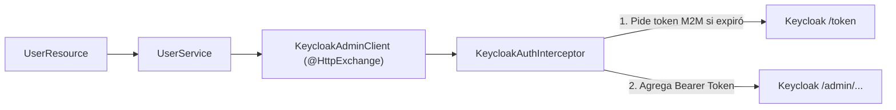

El interceptor cachea el token en memoria y lo renueva con margen de seguridad, evitando una llamada a `/token` por cada operación:

```java
this.expiresAt = Instant.now().plusSeconds(Math.max(10, response.expiresIn() - 15));
```

Los 15 segundos de resta son deliberados: cubren la latencia de red y el desfase de reloj entre contenedores. Un token que expira *mientras viaja* produce un `401` intermitente, de esos que aparecen una vez cada cincuenta requests y cuestan una tarde de debugging.

### El permiso del service account

Un detalle que suele olvidarse: **tener un token M2M válido no alcanza para tocar el Admin API**. La cuenta de servicio necesita roles del cliente interno `realm-management`. En `realm-export.json`:

```json
{
  "username": "service-account-videoclub-backend",
  "clientRoles": {
    "realm-management": ["manage-users", "view-users", "query-users", "query-groups"]
  }
}
```

Estrictamente lo necesario para listar y crear usuarios — nada de `realm-admin`, que sería la vía rápida y también la puerta abierta a que un backend comprometido reconfigure el realm entero. **Principio de menor privilegio, aplicado también a las máquinas.**

---

## 10. Manejo Global de Excepciones Nativo: RFC 7807 (Problem Details)

En lugar de utilizar librerías de terceros o devolver respuestas de error dispares, Spring Boot 3+ y 4 estandarizan los errores bajo la norma **RFC 7807 (`application/problem+json`)**.

Activación en `application.yml`:

```yaml
spring:
  mvc:
    problemdetails:
      enabled: true
```

### Implementación en `GlobalExceptionHandler`

Heredamos de `ResponseEntityExceptionHandler` y formateamos respuestas limpias y tipadas:

```java
@RestControllerAdvice
public class GlobalExceptionHandler extends ResponseEntityExceptionHandler {

    // Errores de validación @Valid (HTTP 400)
    @Override
    protected ResponseEntity<Object> handleMethodArgumentNotValid(
            final MethodArgumentNotValidException ex,
            final HttpHeaders headers,
            final HttpStatusCode status,
            final WebRequest request) {
        final ProblemDetail problemDetail = ex.getBody();
        final Map<String, String> fieldErrors = new HashMap<>();
        for (final FieldError error : ex.getBindingResult().getFieldErrors()) {
            fieldErrors.put(error.getField(), error.getDefaultMessage());
        }
        problemDetail.setProperty("invalidFields", fieldErrors);
        problemDetail.setProperty("timestamp", Instant.now());
        return createResponseEntity(problemDetail, headers, status, request);
    }

    // Recurso inexistente (HTTP 404)
    @ExceptionHandler(NotFoundException.class)
    public ProblemDetail handleNotFoundException(final NotFoundException ex) {
        final ProblemDetail problemDetail = ProblemDetail.forStatusAndDetail(
                HttpStatus.NOT_FOUND,
                ex.getMessage() != null ? ex.getMessage() : "The requested resource was not found"
        );
        problemDetail.setTitle("Resource Not Found");
        problemDetail.setType(URI.create("https://api.videoclub.unrn.edu.ar/errors/not-found"));
        problemDetail.setProperty("timestamp", Instant.now());
        return problemDetail;
    }

    // Errores de autorización @PreAuthorize (HTTP 403)
    @ExceptionHandler(AccessDeniedException.class)
    public ProblemDetail handleAccessDeniedException(final AccessDeniedException ex) {
        final ProblemDetail problemDetail = ProblemDetail.forStatusAndDetail(
                HttpStatus.FORBIDDEN,
                "Access is denied. You do not have the required permissions to perform this operation."
        );
        problemDetail.setTitle("Access Denied");
        problemDetail.setType(URI.create("https://api.videoclub.unrn.edu.ar/errors/forbidden"));
        problemDetail.setProperty("timestamp", Instant.now());
        return problemDetail;
    }

    // Propagación de errores 4xx downstream de Keycloak (409 Conflict, 400, etc.)
    @ExceptionHandler(HttpClientErrorException.class)
    public ProblemDetail handleHttpClientErrorException(final HttpClientErrorException ex) {
        final ProblemDetail problemDetail = ProblemDetail.forStatusAndDetail(
                ex.getStatusCode(),
                ex.getResponseBodyAsString()
        );
        problemDetail.setTitle("Downstream Service Error");
        problemDetail.setType(URI.create("https://api.videoclub.unrn.edu.ar/errors/downstream-error"));
        problemDetail.setProperty("timestamp", Instant.now());
        return problemDetail;
    }

    // Errores 5xx downstream (Keycloak caído o fallando)
    @ExceptionHandler(HttpServerErrorException.class)
    public ProblemDetail handleHttpServerErrorException(final HttpServerErrorException ex) {
        final ProblemDetail problemDetail = ProblemDetail.forStatusAndDetail(
                ex.getStatusCode(),
                ex.getResponseBodyAsString()
        );
        problemDetail.setTitle("Downstream Server Error");
        problemDetail.setType(URI.create("https://api.videoclub.unrn.edu.ar/errors/downstream-server-error"));
        problemDetail.setProperty("timestamp", Instant.now());
        return problemDetail;
    }

    // Red de contención: nunca filtrar stack traces al cliente (HTTP 500)
    @ExceptionHandler(Exception.class)
    public ProblemDetail handleGeneralException(final Exception ex) {
        final ProblemDetail problemDetail = ProblemDetail.forStatusAndDetail(
                HttpStatus.INTERNAL_SERVER_ERROR,
                "An unexpected internal error occurred"
        );
        problemDetail.setTitle("Internal Server Error");
        problemDetail.setType(URI.create("https://api.videoclub.unrn.edu.ar/errors/internal-server-error"));
        problemDetail.setProperty("timestamp", Instant.now());
        return problemDetail;
    }
}
```

### El catálogo completo de errores

| Excepción | HTTP | `type` |
| --- | --- | --- |
| `MethodArgumentNotValidException` | 400 | (default de Spring) + propiedad `invalidFields` |
| `AccessDeniedException` | 403 | `.../errors/forbidden` |
| `NotFoundException` | 404 | `.../errors/not-found` |
| `HttpClientErrorException` | 4xx propagado | `.../errors/downstream-error` |
| `HttpServerErrorException` | 5xx propagado | `.../errors/downstream-server-error` |
| `Exception` | 500 | `.../errors/internal-server-error` |

### El campo `type`: por qué importa

`setType()` es lo que convierte un error en algo **procesable por máquina**. El `detail` es texto para humanos y puede cambiar de redacción o de idioma sin previo aviso; el `type` es un identificador estable que el frontend puede comparar. Un cliente que hace `if (problem.type.endsWith('/forbidden'))` sigue funcionando después de traducir todos los mensajes.

El frontend ya está preparado para consumir este contrato — en `src/api/client.ts`:

```typescript
export interface ProblemDetail {
  type?: string;
  title?: string;
  status: number;
  detail?: string;
  instance?: string;
  invalidFields?: Record<string, string>;
  timestamp?: string;
}
```

Backend y frontend comparten la misma forma de error porque ambos hablan RFC 7807. No hay un "formato de errores de la API" propietario que documentar y mantener sincronizado: **el estándar es la documentación**.

### El handler genérico no es opcional

`@ExceptionHandler(Exception.class)` responde siempre el mismo `500` genérico y **descarta el mensaje real de la excepción**. Es intencional: un stack trace filtrado al cliente le regala a un atacante versiones de librerías, rutas del filesystem, nombres de tablas y estructura interna del código. El detalle va al log del servidor, no a la respuesta HTTP.

---

## 11. Implementación en el Frontend: SPA con React 19

El frontend [`react-sso`](file:///home/horacio/proyectos/unrn/taller/react-sso) actúa como cliente público y demuestra cómo se traslada la seguridad del token a la experiencia de usuario.

### Configuración OIDC con `oidc-client-ts` y `react-oidc-context`

En `src/config.ts`:

```typescript
export const userManager = new UserManager({
  authority: import.meta.env.VITE_AUTHORITY || 'http://localhost:9091/realms/videoclub',
  client_id: import.meta.env.VITE_CLIENT_ID || 'videoclub-frontend',
  redirect_uri: window.location.origin + '/',
  post_logout_redirect_uri: window.location.origin + '/',
  response_type: 'code', // PKCE activado por defecto
  scope: 'openid profile email videoclub',
  userStore: new WebStorageStateStore({ store: window.sessionStorage }),
  monitorSession: true,
  automaticSilentRenew: true
});
```

### Variables de entorno del frontend

El proyecto `react-sso` necesita un archivo `.env` en su raíz:

```bash
VITE_AUTHORITY=http://localhost:9091/realms/videoclub
VITE_CLIENT_ID=videoclub-frontend
VITE_API_BASE_URL=http://localhost:8080
```

> **Nada secreto vive acá.** Vite inyecta las variables `VITE_*` en el bundle en tiempo de compilación, así que cualquiera puede leerlas con las DevTools. Y está bien: un cliente público **no tiene secretos que guardar** (§3). El día que alguien quiera poner un `VITE_CLIENT_SECRET`, la respuesta es no — y el motivo es PKCE.

### Dónde se guarda el token: la decisión de seguridad del frontend

La línea `userStore: new WebStorageStateStore({ store: window.sessionStorage })` es una decisión de seguridad explícita, no un default accidental:

| Almacenamiento | Sobrevive al cierre de pestaña | Expuesto a XSS | Vulnerable a CSRF |
| --- | --- | --- | --- |
| **`sessionStorage`** (elegido) | No | Sí | No |
| `localStorage` | Sí | Sí | No |
| Cookie `httpOnly` + `SameSite` | Sí | No | Sí (mitigable) |

Los tres tienen desventajas. La elección real es **cuál riesgo se prefiere**:

- `sessionStorage` frente a `localStorage`: mismo perfil de exposición a XSS, pero la ventana de ataque se cierra con la pestaña. En una máquina compartida — un laboratorio de facultad, por ejemplo — la diferencia es concreta.
- Cookie `httpOnly` frente a Web Storage: la cookie es inmune a XSS porque JavaScript no puede leerla, pero reintroduce CSRF y obliga al backend a manejar cookies, lo que rompe el modelo stateless de §8.

> **La conclusión honesta**: si hay XSS en la aplicación, el token está comprometido con `sessionStorage` y con `localStorage` por igual. El almacenamiento es mitigación de daño, no la defensa. La defensa contra el robo de tokens es **no tener XSS**: escapar toda salida, `Content-Security-Policy`, y jamás construir HTML por concatenación de strings. Ninguna configuración de storage salva a una aplicación con una inyección de script.

### Extracción de Permisos: Hook `usePermissions`

Un hook de React que decodifica el JWT del token de acceso y expone métodos de verificación:

```typescript
export function usePermissions() {
  const auth = useAuth();
  const tokenData = parseJwt(auth.user?.access_token);
  const clientRoles = tokenData?.resource_access?.['videoclub-frontend']?.roles || [];
  const realmRoles = tokenData?.realm_access?.roles || [];

  return {
    isAuthenticated: auth.isAuthenticated,
    accessToken: auth.user?.access_token,
    hasPermission: (perm: string) => clientRoles.includes(perm),
    hasRole: (role: string) => realmRoles.includes(role),
    clientRoles,
    realmRoles
  };
}
```

> **Decodificar no es validar.** `parseJwt` hace `atob()` sobre el payload: lee el token, **no verifica la firma**. Cualquier usuario puede abrir las DevTools, fabricar un JWT con `"roles": ["user-permission-create"]`, guardarlo en `sessionStorage` y ver aparecer la pestaña de administración. No pasa nada: al primer request el backend valida la firma contra el JWKS y responde `401`. Esto lleva a la regla más importante de toda la guía, y va en negrita porque es la que más se olvida: **la autorización del frontend es cosmética. La seguridad real vive en el backend, siempre.**

### Guardas de Rutas: Componente `PermissionGuard`

Protege las vistas y muestra un mensaje amigable en caso de rechazo:

```tsx
<Route
  path="/users"
  element={
    <PermissionGuard permission="user-permission-read">
      <UsersView />
    </PermissionGuard>
  }
/>
```

El componente evalúa `permission` y/o `role` con el hook anterior y, si falla, renderiza un cartel de "Acceso Restringido (HTTP 403 Forbidden)" indicando exactamente qué autoridad falta. Es intencionalmente didáctico: un producto real no le dice al usuario el nombre interno del permiso que no tiene, pero en clase convierte un rechazo en una lección.

La misma lógica alimenta la navegación en `Layout.tsx` — las pestañas se filtran por `hasPermission`, así que el usuario `cliente` directamente no ve "Gestión Usuarios". **Ocultar y proteger son cosas distintas**: ocultar el link mejora la experiencia, el `PermissionGuard` cubre a quien escribe la URL a mano, y el `@PreAuthorize` del backend es lo único que realmente protege el dato.

### Login forzado: `ProtectedApp`

Esta SPA no tiene pantalla de bienvenida anónima. El componente `ProtectedApp` envuelve toda la aplicación y dispara el redirect apenas detecta que no hay sesión:

```tsx
useEffect(() => {
  if (!(hasAuthParams() || auth.isAuthenticated || auth.activeNavigator || auth.isLoading || hasTriedSignin)) {
    void auth.signinRedirect();
    setHasTriedSignin(true);
  }
}, [auth, hasTriedSignin]);
```

Por eso el Caso 4 del laboratorio dice "en la pantalla de login de Keycloak (`http://localhost:5173`)": el usuario nunca llega a ver la SPA sin autenticarse — el navegador rebota a Keycloak de inmediato. La guarda `hasTriedSignin` evita el bucle infinito de redirects si el login falla.

### Ciclo de vida de la sesión: renovación y cierre

Tres opciones del `UserManager` gobiernan la sesión, y son la contracara práctica del `refresh_token` que §2 describe en teoría:

- **`automaticSilentRenew: true`**: antes de que el `access_token` expire, `oidc-client-ts` usa el `refresh_token` en segundo plano para obtener uno nuevo. El usuario nunca ve un `401` por vencimiento.
- **`monitorSession: true`**: la librería vigila la sesión en Keycloak. Si el usuario cierra sesión en **otra pestaña** o un administrador revoca la sesión desde la consola, esta aplicación se entera. Esto es Single Sign-Out, la contracara del Single Sign-On.
- **`post_logout_redirect_uri`**: a dónde vuelve el navegador después del logout.

El cierre de sesión **no** es borrar el token local:

```tsx
const handleLogout = () => {
  void auth.signoutRedirect();
};
```

`signoutRedirect()` navega al endpoint de logout de Keycloak para terminar la sesión **en el servidor de identidad**. Limpiar solo el `sessionStorage` dejaría viva la cookie de sesión de Keycloak: el siguiente "login" sería instantáneo y sin pedir credenciales, y el usuario creería haber salido cuando no salió. Es un error clásico y con consecuencias reales en equipos compartidos.

### La ruta `/playground`: ver el 401 con los propios ojos

La SPA incluye una ruta `/playground` con dos componentes hermanos, `WithoutToken` y `WithToken`, que hacen exactamente el mismo `fetch` contra el mismo endpoint del backend. La única diferencia es una línea:

```tsx
// WithoutToken.tsx
const response = await fetch(url);

// WithToken.tsx
const response = await fetch(url, {
  headers: {
    accept: 'application/json',
    Authorization: `Bearer ${auth.user?.access_token}`
  }
});
```

Ambos apuntan a `GET /movies`. El resultado es distinto y predecible:

| Panel | Request | Respuesta |
| --- | --- | --- |
| *Without* token | `fetch(url)` | `401 Unauthorized` — el filtro de Spring Security corta antes de llegar al controlador |
| *With* token | `fetch(url, { Authorization: Bearer ... })` | `200 OK` con el listado de películas |

Un panel muestra el error, el otro muestra los datos, **contra el mismo endpoint y en la misma pantalla**. Es la demostración más económica de toda la clase: todo el mecanismo de seguridad se reduce, del lado del cliente, a un header.

> **Variante para profundizar**: iniciar sesión como `usuariocliente` y cambiar la URL de ambos componentes a `/api/users`. Ahora el panel *con* token también falla, pero con `403` en lugar de `401`, y el cuerpo es un `application/problem+json` de §10. La diferencia entre los dos códigos es exactamente la diferencia entre autenticación y autorización de §2: `401` es "no sé quién sos", `403` es "sé quién sos y no te alcanza".

---

## 12. Eventos de Keycloak: SPI Custom y RabbitMQ

Delegar la identidad resuelve la autenticación, pero abre un problema nuevo: **el IAM ahora sabe cosas que la aplicación necesita saber**. Un usuario se registró, otro cambió su email, un tercero acumuló cinco logins fallidos. Si la aplicación no se entera, se desincroniza.

### Las tres soluciones posibles (y por qué elegimos la tercera)

| Estrategia | Problema |
| --- | --- |
| **Polling** al Admin API | Latencia, carga inútil, y hay eventos que no dejan rastro consultable (un login fallido) |
| **Webhooks** salientes | Keycloak no los trae de fábrica; acopla el IAM a una URL concreta |
| **Event Listener SPI** + broker | Requiere compilar un provider, pero desacopla por completo emisor y consumidores |

Keycloak expone un punto de extensión oficial, `EventListenerProvider`, que recibe **todos** los eventos del realm. Publicándolos a un exchange de RabbitMQ, cualquier servicio se suscribe a lo que le interesa sin que Keycloak sepa que existe.

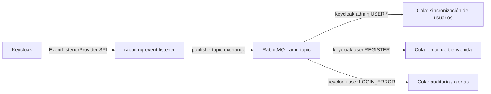

### El provider: dos métodos, dos familias de eventos

El módulo vive en `docker/keycloak/keycloak-spi` y compila contra la API de Keycloak 26.x. La interfaz pide implementar dos métodos, uno por cada tipo de evento:

```java
public class RabbitMQEventListenerProvider implements EventListenerProvider {

    // Eventos de usuario: login, logout, register, verify email...
    @Override
    public void onEvent(Event event) {
        String routingKey = "keycloak.user." + event.getType().name();
        // ... serializa a JSON y publica
    }

    // Eventos administrativos: alta/baja/modificación vía consola o Admin API
    @Override
    public void onAdminEvent(AdminEvent event, boolean includeRepresentation) {
        String routingKey = "keycloak.admin."
                + event.getResourceType().name() + "."
                + event.getOperationType().name();
        // ... serializa a JSON y publica
    }
}
```

La distinción importa: cuando el backend crea un usuario con el `KeycloakAdminClient` de §9, eso genera un **`AdminEvent`** (`keycloak.admin.USER.CREATE`). Cuando un usuario se auto-registra desde el formulario de Keycloak (§5), genera un **`Event`** (`keycloak.user.REGISTER`). Dos caminos distintos hacia el mismo resultado, dos routing keys distintas.

### Convención de routing keys

| Familia | Patrón | Ejemplos |
| --- | --- | --- |
| Eventos de usuario | `keycloak.user.<EVENT_TYPE>` | `keycloak.user.LOGIN`<br>`keycloak.user.REGISTER`<br>`keycloak.user.LOGIN_ERROR` |
| Eventos administrativos | `keycloak.admin.<RESOURCE_TYPE>.<OPERATION_TYPE>` | `keycloak.admin.USER.CREATE`<br>`keycloak.admin.USER.DELETE`<br>`keycloak.admin.CLIENT.UPDATE` |

La jerarquía separada por puntos es lo que hace útil un **topic exchange**: el filtrado ocurre en el broker, mediante bindings, no en el consumidor.

- `*` reemplaza **exactamente una** palabra → `keycloak.admin.USER.*` captura `CREATE`, `UPDATE` y `DELETE`, pero no `keycloak.admin.CLIENT.CREATE`.
- `#` reemplaza **cero o más** palabras → `keycloak.#` captura absolutamente todo.

Un consumidor que solo necesita el alta de usuarios se ata a `keycloak.admin.USER.CREATE` y **nunca recibe el tráfico de logins**, que en producción es de otro orden de magnitud.

### El factory: una conexión para todo el contenedor

`RabbitMQEventListenerProviderFactory` abre **una sola** conexión AMQP en el `init()` y la comparte durante toda la vida del proceso. Abrir una conexión por evento sería catastrófico: el handshake AMQP es caro y los eventos de login llegan en ráfaga.

```java
factory.setAutomaticRecoveryEnabled(true);
connection = factory.newConnection("keycloak-spi");
channel = connection.createChannel();
```

Configuración por variables de entorno, con valores por defecto:

| Variable | Default | Descripción |
| --- | --- | --- |
| `RABBITMQ_HOST` | `localhost` | Host del broker (en Docker: `rabbit`) |
| `RABBITMQ_PORT` | `5672` | Puerto AMQP |
| `RABBITMQ_USER` / `RABBITMQ_PASS` | `guest` / `guest` | Credenciales |
| `RABBITMQ_VHOST` | `/` | Virtual host |
| `RABBITMQ_EXCHANGE` | `amq.topic` | Topic exchange destino |

> **Decisión de resiliencia deliberada**: si RabbitMQ no está disponible, el factory **loguea el error y deja que Keycloak arranque igual**. La alternativa —fallar el arranque— convertiría al broker de mensajería en una dependencia dura del login. Que nadie pueda autenticarse porque una cola de auditoría está caída es un intercambio pésimo. Los eventos son valiosos; la autenticación es crítica.

### Registro del provider

Dos piezas conectan el código con Keycloak. Primero, el descubrimiento por ServiceLoader de Java, en `META-INF/services/org.keycloak.events.EventListenerProviderFactory`:

```text
ar.unrn.keycloak.spi.RabbitMQEventListenerProviderFactory
```

Segundo, la activación en el realm (`realm-export.json`), donde el `PROVIDER_ID` del factory debe aparecer en la lista:

```json
{
  "eventsEnabled": true,
  "adminEventsEnabled": true,
  "adminEventsDetailsEnabled": true,
  "eventsListeners": ["jboss-logging", "rabbitmq-event-listener"]
}
```

`adminEventsDetailsEnabled: true` es lo que agrega el objeto `representation` al payload — sin él llega el hecho de que un usuario cambió, pero no qué cambió.

### Payload

```json
{
  "resourceType": "USER",
  "operationType": "CREATE",
  "realmId": "videoclub",
  "resourcePath": "users/a1b2c3d4-...",
  "time": 1725800000000,
  "auth": {
    "realmId": "master",
    "clientId": "admin-cli",
    "userId": "admin-uuid",
    "ipAddress": "172.25.0.1"
  },
  "representation": {
    "username": "jdoe",
    "email": "jdoe@example.com",
    "enabled": true
  }
}
```

Se publica como JSON UTF-8 con `deliveryMode: 2` (persistente): los mensajes sobreviven a un reinicio del broker.

### Compilación y despliegue

El jar **no está versionado** (`target/` está en `.gitignore`), así que hay que construirlo antes del primer `docker compose up`:

```bash
./mvnw clean package -f docker/keycloak/keycloak-spi/pom.xml
```

Genera `docker/keycloak/keycloak-spi/target/keycloak-spi-1.0.0.jar`, un *shaded jar* que embebe `amqp-client` y excluye lo que Keycloak ya provee. `docker/keycloak.yaml` lo monta como provider:

```yaml
volumes:
  - ./keycloak/realm-export.json:/opt/keycloak/data/import/realm-export.json
  - ./keycloak/keycloak-spi/target/keycloak-spi-1.0.0.jar:/opt/keycloak/providers/keycloak-spi.jar
```

> **Si se saltea este paso, el laboratorio falla.** Docker no encuentra el archivo y monta un **directorio vacío** en su lugar; Keycloak arranca sin el provider y los eventos se pierden en silencio, sin ningún error evidente. Es la falla más confusa posible: todo "funciona", pero no publica nada.

### Estado actual y ejercicio abierto

Hoy el flujo llega hasta el exchange: **Keycloak publica, pero el backend Spring Boot todavía no consume**. No hay dependencia de `spring-boot-starter-amqp` ni ningún `@RabbitListener` en el proyecto.

Queda como extensión natural del taller. Los eventos se pueden inspeccionar en vivo desde la consola de RabbitMQ (`http://localhost:15672`): crear una cola, atarla a `amq.topic` con la routing key `keycloak.#`, y hacer login en la SPA para ver los mensajes caer en tiempo real. Es una demostración excelente de arquitectura orientada a eventos, y no requiere escribir una línea de código.

---

## 13. Laboratorio Práctico: Guía Paso a Paso para la Clase

### Paso 0 (obligatorio la primera vez): Compilar el SPI de eventos

`docker/keycloak.yaml` monta el jar del provider descrito en §12, y ese jar **no está versionado en git**. Si este paso se saltea, Keycloak arranca sin el listener y los eventos se pierden sin ningún mensaje de error:

```bash
./mvnw clean package -f docker/keycloak/keycloak-spi/pom.xml
```

Verificar que el artefacto exista antes de seguir:

```bash
ls -l docker/keycloak/keycloak-spi/target/keycloak-spi-1.0.0.jar
```

### Paso 1: Levantar la infraestructura

**Un solo comando alcanza.** `docker/services.yaml` hace `extends` de todos los servicios del stack — PostgreSQL, Keycloak, RabbitMQ, MailHog y el API Gateway:

```bash
docker compose -f docker/services.yaml --env-file docker/.env up -d
```

> No hace falta invocar `keycloak.yaml` ni `email.yaml` por separado: `services.yaml` ya los incluye. Hacerlo levantaría los mismos contenedores dos veces. Los archivos individuales existen para poder arrancar un servicio suelto durante el desarrollo.

Servicios y puertos resultantes:

| Servicio | URL | Para qué |
| --- | --- | --- |
| Keycloak | `http://localhost:9091` | Consola de administración y endpoints OIDC |
| Backend | `http://localhost:8080` | API REST + Swagger UI |
| Frontend | `http://localhost:5173` | SPA React 19 |
| MailHog | `http://localhost:8025` | Bandeja de correo de desarrollo |
| RabbitMQ | `http://localhost:15672` | Consola del broker (eventos de §12) |
| PostgreSQL | `localhost:5432` | Base de datos de películas |

> **El `--env-file` no es opcional.** `docker/keycloak.yaml` publica `${KEYCLOAK_PORT:-9090}:8080`: el puerto real sale de `docker/.env`, que define `KEYCLOAK_PORT=9091`. Si el archivo de entorno no se carga, Compose usa el fallback **9090** y todo el resto del stack —que apunta a 9091— deja de encontrar a Keycloak. El síntoma es un `401` con *issuer mismatch*, y es la falla número uno del laboratorio.
>
> Compose levanta `docker/.env` de forma automática porque el directorio del proyecto es el del primer archivo `-f`. El `--env-file docker/.env` explícito está en el comando de arriba para que la dependencia sea visible, no porque haga falta.

**MailHog** captura todo el correo que emite Keycloak (verificación de cuenta, recuperación de contraseña) sin enviar nada a internet. El realm ya está apuntado a él (`smtpServer.host: mailhog`, puerto `1025`) y los mensajes se leen en `http://localhost:8025`.

### Paso 2: Iniciar Backend y Frontend

```bash
# Terminal 1: Backend Spring Boot
./mvnw spring-boot:run -Dspring-boot.run.profiles=local

# Terminal 2: Frontend React 19
cd ../react-sso
npm install   # solo la primera vez
npm run dev
```

> **Atajo útil**: `application.yml` tiene activado `spring.docker.compose` apuntando a `./docker/services.yaml` con `lifecycle-management: start_only`. Es decir, **`./mvnw spring-boot:run` levanta los contenedores por su cuenta** si no están corriendo. El Paso 1 sigue siendo recomendable en clase para ver el arranque de la infraestructura por separado, pero conviene saber que existe esta automatización — explica por qué a veces "aparecen" contenedores sin haberlos pedido.

El frontend necesita su propio `.env` (ver §11) antes del primer `npm run dev`.

### Paso 3: Casos de Prueba Didácticos

#### Caso 1: Intentar acceder a un recurso protegido sin token

```bash
curl -i http://localhost:8080/movies
```

- **Resultado esperado**: `401 Unauthorized`.

#### Caso 2: Login como Cliente y verificar restricciones de permisos

1. Iniciar sesión en `http://localhost:5173` con `usuariocliente` / `usuariocliente`.
2. Verificar que ve la pestaña **Películas**, pero la pestaña **Usuarios** no aparece en la navegación.
3. Si intenta forzar la URL `http://localhost:5173/users`, `PermissionGuard` renderiza el mensaje de acceso restringido (403).

#### Caso 3: Login como Administrador y verificar acceso pleno

1. Iniciar sesión con `usuarioadmin` / `usuarioadmin`.
2. Verificar que visualiza ambas pestañas.
3. Crear una película y dar de alta un nuevo usuario en Keycloak desde la UI.

#### Caso 4: Auto-registro de Usuario y Enrolamiento TOTP en Vivo

1. En la pantalla de login de Keycloak (`http://localhost:5173`), hacer click en **"Registrarse"**.
2. Completar el formulario de registro (ej. `nuevoalumno` / `Password123!`).
3. Keycloak presentará la pantalla obligatoria de **Configurar OTP** con el código QR.
4. Escanear el código con la aplicación móvil (Google Authenticator o FreeOTP) e ingresar el token de 6 dígitos.
5. Al ingresar a la aplicación:
   - Verificará que solo tiene acceso a **Películas** (incorporado automáticamente a `/videoclub-default/cliente`).
   - Al cerrar sesión y volver a ingresar, Keycloak exigirá contraseña y el token OTP de 6 dígitos.

#### Caso 5: El mismo flujo, otro cliente — Swagger UI

1. Abrir `http://localhost:8080/swagger-ui/index.html`.
2. Presionar **Authorize**. Swagger redirige a Keycloak con Authorization Code + PKCE, igual que la SPA (§8).
3. Autenticarse como `usuariocliente` e intentar `POST /movies` → `403` con un cuerpo `application/problem+json`.
4. Cerrar sesión, repetir como `usuarioadmin` → `201 Created`.

Es la demostración de que **el mismo flujo de autorización sirve para cualquier cliente público**, y de que la autorización no depende del frontend: cambia el usuario, no la aplicación.

#### Caso 6: Ver el token por dentro

1. Con sesión iniciada en la SPA, abrir DevTools → Application → Session Storage.
2. Copiar el `access_token` y pegarlo en [jwt.io](https://jwt.io).
3. Localizar `realm_access.roles`, `resource_access.videoclub-frontend.roles` y `groups`, y contrastar con los mappers de §7.
4. Comparar el token de `usuariocliente` contra el de `usuarioadmin`: la única diferencia es el contenido de esos arrays.
5. **Ejercicio de cierre**: modificar el payload a mano, volver a codificarlo en Base64URL y reemplazar el token en el storage. La UI puede llegar a mostrar la pestaña de administración; el backend responde `401` igual, porque la firma ya no valida. Es la demostración práctica de la regla de §11.

#### Caso 7: Eventos de Keycloak en vivo (§12)

1. Entrar a la consola de RabbitMQ en `http://localhost:15672`.
2. Crear una cola nueva, por ejemplo `demo-eventos`.
3. Atarla (*binding*) al exchange `amq.topic` con la routing key `keycloak.#`.
4. Iniciar y cerrar sesión en la SPA, y dar de alta un usuario desde la pestaña **Gestión Usuarios**.
5. Observar en la cola los mensajes `keycloak.user.LOGIN`, `keycloak.user.LOGOUT` y `keycloak.admin.USER.CREATE`.
6. Repetir el binding con `keycloak.admin.USER.*` para mostrar cómo el filtrado en el broker descarta el ruido de los logins.

---

## Resumen Arquitectónico para la Pizarra

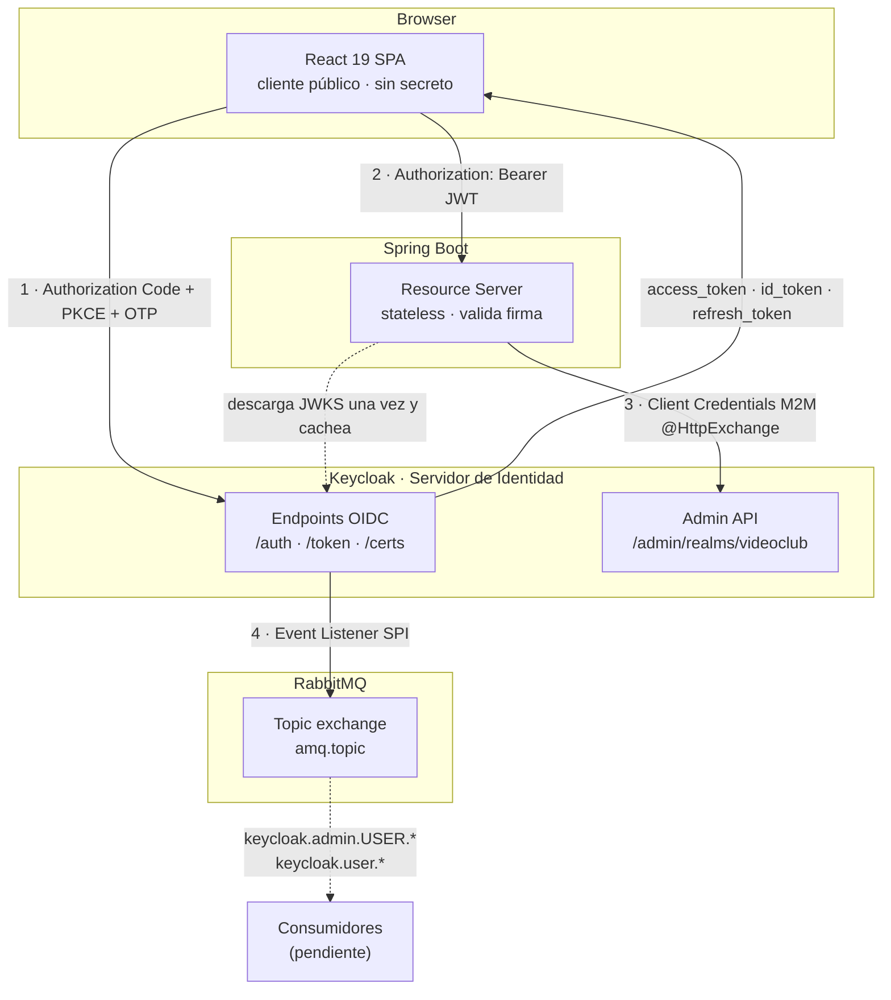

**Los cuatro movimientos:**

1. **El usuario se autentica** contra Keycloak, nunca contra la aplicación. La SPA no ve jamás la contraseña — y con TOTP activo, tampoco alcanzaría con verla.
2. **El token viaja en un header.** El backend valida la firma con la clave pública del realm, en memoria, sin consultar a Keycloak en cada request. Eso es ser *stateless*.
3. **La máquina también se autentica.** Cuando el backend necesita el Admin API, pide su propio token con Client Credentials. Sin usuario de por medio, y con los permisos mínimos.
4. **Los eventos salen del IAM.** Cada login, registro o alta de usuario se publica a un exchange; quien necesite enterarse se suscribe, sin que Keycloak sepa que existe.

> Si hay una sola idea que sobrevive a la clase, es esta: **la aplicación dejó de saber contraseñas.** Sabe verificar firmas. Todo lo demás —MFA, auto-registro, rotación, bloqueo de cuentas, SSO entre aplicaciones— pasó a ser problema del servidor de identidad, y se configura en vez de programarse.
