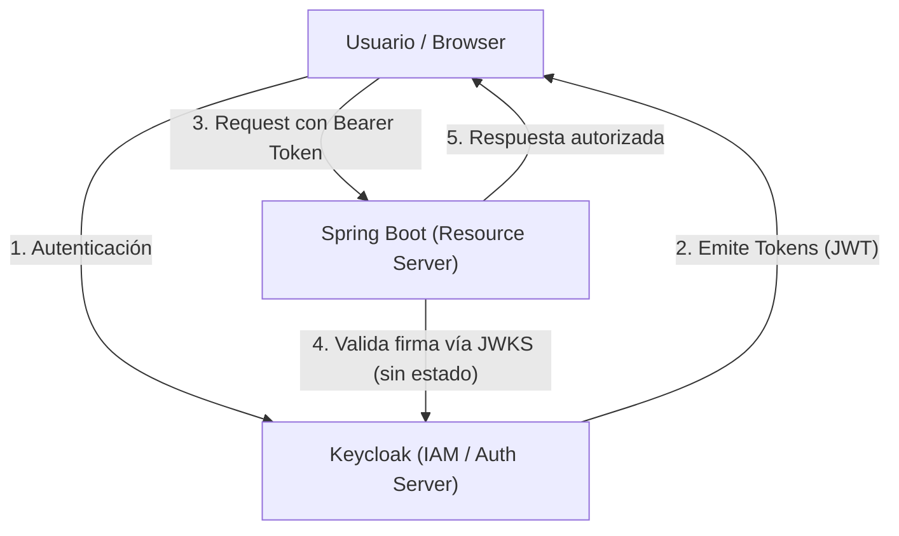
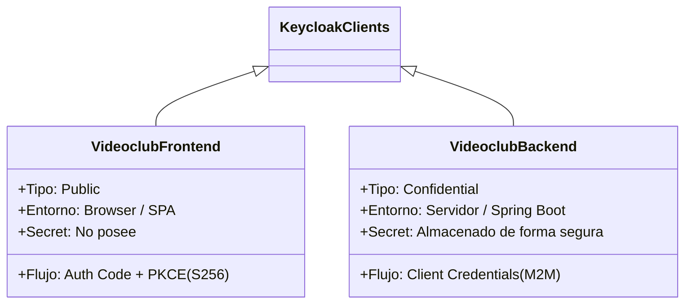
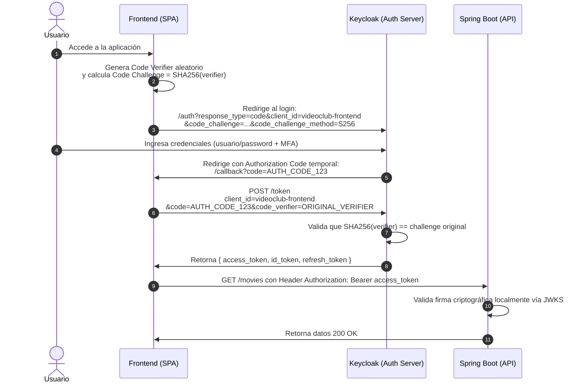
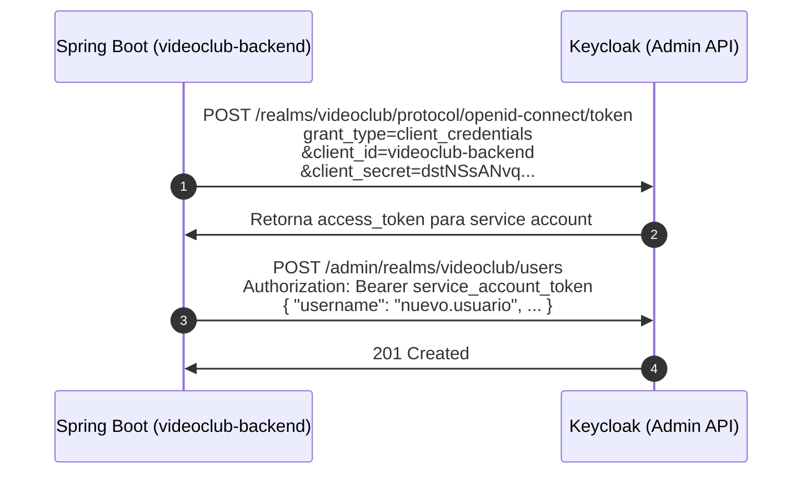
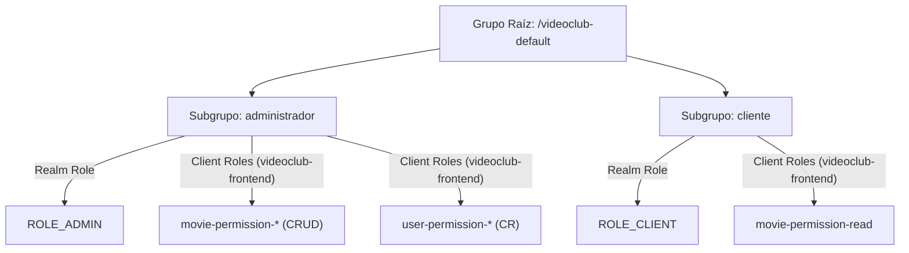
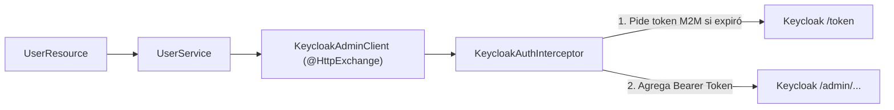

# Guía Integral de Seguridad: OAuth 2.0, OpenID Connect y Keycloak con Spring Boot

Esta guía está diseñada como material pedagógico y de referencia arquitectónica para dictar una clase completa sobre seguridad moderna en aplicaciones web distribuidas. Explica los fundamentos teóricos, los flujos estándar de la industria, las configuraciones en Keycloak y la implementación en el backend con **Spring Boot (Java 25)**.

---

## 1. Fundamentos Conceptuales: ¿Por qué abandonamos la sesión tradicional?

### El problema de la arquitectura monolítica clásica

En aplicaciones web tradicionales, la seguridad se basaba en **sesiones en memoria del servidor** y **cookies de sesión** (`JSESSIONID`):

- **Estado en el servidor (Stateful)**: Dificulta el escalado horizontal (requiere balanceadores con *sticky sessions* o clusters de Redis).
- **Acoplamiento**: El backend debe gestionar directamente la base de datos de usuarios, almacenamiento de contraseñas (hashing, salting), políticas de expiración, bloqueo de cuentas y autenticación multifactor (MFA).
- **Incompatibilidad moderna**: No escala bien para clientes móviles, SPAs (Single Page Applications) o arquitecturas de microservicios.

### La solución moderna: Servidor de Identidad Desacoplado (IAM)

Delegamos la responsabilidad a un Identity & Access Management (IAM) como **Keycloak**. El backend se convierte en un **Resource Server stateless** que solo valida firmas criptográficas de tokens.



---

## 2. OAuth 2.0 vs. OpenID Connect (OIDC)

Una de las confusiones más frecuentes en la industria es mezclar estos dos conceptos:

| Característica | OAuth 2.0 | OpenID Connect (OIDC) |
| --- | --- | --- |
| **Propósito** | **Autorización** (Delegación de permisos) | **Autenticación** (Identidad del usuario) |
| **Pregunta que responde** | *¿A qué recursos puede acceder esta aplicación?* | *¿Quién es la persona conectada?* |
| **Artefacto principal** | `access_token` (normalmente opaco o JWT) | `id_token` (siempre JWT firmado) |
| **Análogo en la vida real** | La llave magnética de una habitación de hotel | El Documento Nacional de Identidad / Pasaporte |

> **Regla de oro**: OAuth 2.0 le da permiso al cliente para realizar acciones en nombre del usuario. OpenID Connect le informa al cliente quién es el usuario. OIDC es una capa construida **encima** de OAuth 2.0.

### Anatomía de los Tokens

1. **`id_token`**: Consumido exclusivamente por el cliente (ej. SPA React/Angular) para personalizar la interfaz (nombre, avatar, email). **Nunca debe enviarse como credencial al backend**.
2. **`access_token`**: Credencial enviada en el header `Authorization: Bearer <token>` hacia las APIs del backend.
3. **`refresh_token`**: Token de larga duración para obtener nuevos `access_token` cuando expiran, sin forzar al usuario a ingresar credenciales nuevamente.

### Estructura de un JWT (JSON Web Token)

Un JWT consta de 3 partes codificadas en Base64URL separadas por puntos (`.`):

- **Header**: Algoritmo (`RS256`) y clave pública identificadora (`kid`).
- **Payload (Claims)**: Sujeto (`sub`), emisor (`iss`), expiración (`exp`), roles y grupos.
- **Signature**: Firma criptográfica generada con la clave privada del servidor de identidad.

---

## 3. Clientes en Keycloak: Públicos vs. Confidenciales

En Keycloak configuramos dos clientes con naturalezas y niveles de confianza completamente distintos:



### A. Cliente Público: `videoclub-frontend` (SPA / Mobile)

- **Problema de seguridad**: El código JavaScript corre en el navegador de los usuarios; cualquier usuario puede inspeccionar la memoria o el código fuente. Por ende, **no puede guardar un `client_secret` de forma segura**.
- **Mecanismo de protección**: **PKCE (Proof Key for Code Exchange)**.

---

## 4. Flujos de Autorización (Grant Types)

### Flujo 1: Authorization Code Flow con PKCE (S256)

Este es el flujo obligatorio para aplicaciones web y móviles (SPAs).



#### ¿Por qué es vital PKCE?

Evita el ataque de interceptación del código de autorización (*Authorization Code Interception Attack*). Aunque un atacante intercepte el `code` en la redirección, no puede canjearlo en `/token` porque no conoce el `code_verifier` original que generó el frontend en memoria.

---

### Flujo 2: Client Credentials Flow (M2M - Machine to Machine)

Este flujo se utiliza cuando un backend o proceso batch necesita comunicarse con otro servicio o con el Admin API de Keycloak sin intervención humana.



---

## 5. Modelado de Roles, Grupos y Prevención de "Token Bloat"

### Jerarquía de Roles y Separación de Dominios

Para aplicar el **Principio de Menor Privilegio**, separamos los dominios de datos:

1. **Dominio Películas**: `movie-permission-read`, `movie-permission-create`, `movie-permission-update`, `movie-permission-delete`.
2. **Dominio Usuarios**: `user-permission-read`, `user-permission-create`.



### Prevención de Token Bloat (`fullScopeAllowed: false`)

Por defecto, Keycloak asocia todos los roles del realm a cada token. Esto infla innecesariamente el tamaño de los headers HTTP en cada petición.

- En `realm-export.json`, configuramos `"fullScopeAllowed": false` en `videoclub-frontend`.
- Definimos un Scope explícito (`videoclub`) mapeando únicamente los roles de negocio necesarios.

---

## 6. Implementación en el Backend: Spring Boot Resource Server

### Configuración en `application.yml`

Spring Boot 4 / Spring Security 7 valida los tokens de forma completamente desacoplada mediante el endpoint público de certificados (JWKS) de Keycloak:

```yaml
spring:
  security:
    oauth2:
      resource-server:
        jwt:
          issuer-uri: http://localhost:9091/realms/videoclub
          jwk-set-uri: http://localhost:9091/realms/videoclub/protocol/openid-connect/certs
```

### Conversión de Claims: `KeycloakGrantedAuthoritiesConverter`

Por defecto, Spring Security busca roles en el claim `scope` o `scp`. Keycloak guarda los roles en:

- `realm_access.roles` (roles de realm, ej. `ROLE_ADMIN`).
- `resource_access.<client-id>.roles` (roles de cliente, ej. `movie-permission-read`).

Implementamos un `Converter<Jwt, Collection<GrantedAuthority>>` que extrae ambas estructuras para poder evaluarlas con `@PreAuthorize`:

```java
@Component
public class KeycloakGrantedAuthoritiesConverter implements Converter<Jwt, Collection<GrantedAuthority>> {

    @Override
    public Collection<GrantedAuthority> convert(final Jwt jwt) {
        final List<GrantedAuthority> authorities = new ArrayList<>();

        // 1. Roles del Realm
        final Map<String, Object> realmAccess = jwt.getClaim("realm_access");
        if (realmAccess != null && realmAccess.get("roles") instanceof List<?> roles) {
            roles.stream()
                .map(role -> new SimpleGrantedAuthority(role.toString()))
                .forEach(authorities::add);
        }

        // 2. Roles del Cliente (videoclub-frontend)
        final Map<String, Object> resourceAccess = jwt.getClaim("resource_access");
        if (resourceAccess != null) {
            resourceAccess.values().stream()
                .filter(Map.class::isInstance)
                .map(m -> (Map<?, ?>) m)
                .filter(client -> client.get("roles") instanceof List<?>)
                .flatMap(client -> ((List<?>) client.get("roles")).stream())
                .map(role -> new SimpleGrantedAuthority(role.toString()))
                .forEach(authorities::add);
        }

        return authorities;
    }
}
```

### Seguridad a Nivel de Método (Method Security)

Activamos `@EnableMethodSecurity` y protegemos los controladores con autorizaciones declarativas:

```java
// Consulta de usuarios: Solo administradores con permiso explícito
@GetMapping("/api/users")
@PreAuthorize("hasAuthority('user-permission-read')")
public ResponseEntity<List<KeycloakUserDTO>> getAllUsers() {
    return ResponseEntity.ok(userService.findAllUsers());
}

// Creación de películas: Solo quien tenga movie-permission-create
@PostMapping("/movies")
@PreAuthorize("hasAuthority('movie-permission-create')")
public ResponseEntity<Long> createMovie(@RequestBody @Valid final MovieDTO movieDTO) {
    return new ResponseEntity<>(movieService.create(movieDTO), HttpStatus.CREATED);
}
```

---

## 7. Cliente Declarativo HTTP Interface (Spring Boot 4)

En Spring Boot 4, el estándar para consumir APIs REST externas son las **Declarative HTTP Interfaces** (anotadas con `@HttpExchange`), reemplazando herramientas pesadas como OpenFeign.

### La Interfaz HTTP

```java
@HttpExchange("/admin/realms/{realm}")
public interface KeycloakAdminClient {

    @GetExchange("/users")
    List<KeycloakUserDTO> getUsers(@PathVariable("realm") String realm);

    @PostExchange("/users")
    ResponseEntity<Void> createUser(
            @PathVariable("realm") String realm,
            @RequestBody KeycloakUserCreateDTO userCreateDTO);
}
```

### El Interceptor M2M con Client Credentials

El interceptor solicita automáticamente el token del cliente confidencial `videoclub-backend` y lo inyecta en cada llamada hacia Keycloak:



---

## 8. Manejo Global de Excepciones Nativo: RFC 7807 (Problem Details)

En lugar de utilizar librerías de terceros o devolver respuestas de error dispares, Spring Boot 3+ y 4 estandarizan los errores bajo la norma **RFC 7807 (`application/problem+json`)**.

Activación en `application.yml`:

```yaml
spring:
  mvc:
    problemdetails:
      enabled: true
```

### Implementación en `GlobalExceptionHandler`

Heredamos de `ResponseEntityExceptionHandler` y formateamos respuestas limpias y tipadas:

```java
@RestControllerAdvice
public class GlobalExceptionHandler extends ResponseEntityExceptionHandler {

    // Errores de validación @Valid (HTTP 400)
    @Override
    protected ResponseEntity<Object> handleMethodArgumentNotValid(
            final MethodArgumentNotValidException ex,
            final HttpHeaders headers,
            final HttpStatusCode status,
            final WebRequest request) {
        final ProblemDetail problemDetail = ex.getBody();
        final Map<String, String> fieldErrors = new HashMap<>();
        for (final FieldError error : ex.getBindingResult().getFieldErrors()) {
            fieldErrors.put(error.getField(), error.getDefaultMessage());
        }
        problemDetail.setProperty("invalidFields", fieldErrors);
        problemDetail.setProperty("timestamp", Instant.now());
        return createResponseEntity(problemDetail, headers, status, request);
    }

    // Errores de autorización @PreAuthorize (HTTP 403)
    @ExceptionHandler(AccessDeniedException.class)
    public ProblemDetail handleAccessDeniedException(final AccessDeniedException ex) {
        final ProblemDetail problemDetail = ProblemDetail.forStatusAndDetail(
                HttpStatus.FORBIDDEN,
                "Acceso denegado. No posee las autoridades requeridas para esta operación."
        );
        problemDetail.setTitle("Access Denied");
        problemDetail.setProperty("timestamp", Instant.now());
        return problemDetail;
    }

    // Propagación de errores downstream de Keycloak (HTTP 409, 400, etc.)
    @ExceptionHandler(HttpClientErrorException.class)
    public ProblemDetail handleHttpClientErrorException(final HttpClientErrorException ex) {
        final ProblemDetail problemDetail = ProblemDetail.forStatusAndDetail(
                ex.getStatusCode(),
                ex.getResponseBodyAsString()
        );
        problemDetail.setTitle("Downstream Service Error");
        problemDetail.setProperty("timestamp", Instant.now());
        return problemDetail;
    }
}
```

Ejemplo de respuesta devuelta ante un error de validación:

```json
{
  "type": "about:blank",
  "title": "Bad Request",
  "status": 400,
  "detail": "Invalid request content.",
  "instance": "/movies",
  "invalidFields": {
    "title": "no debe ser nulo"
  },
  "timestamp": "2026-09-09T13:51:05Z"
}
```

---

## 9. Servicio de Correo y Flujos Asincrónicos (SMTP con MailHog)

Keycloak permite verificar emails, recuperar contraseñas y ejecutar acciones obligatorias (*Required Actions*).

- Para desarrollo y testing local, levantamos **MailHog** (`docker/email.yaml`) con:
  - Servidor SMTP: puerto `1025`.
  - Interfaz Web de inspección: `http://localhost:8025`.
- Keycloak envía los correos en texto plano/HTML hacia MailHog sin salir a internet.
- Los alumnos pueden ver en tiempo real los enlaces de activación con tokens temporales de un solo uso generados por Keycloak.

---

## 10. Laboratorio Práctico: Guía Paso a Paso para la Clase

### Paso 1: Levantar los contenedores de infraestructura

```bash
# Red común, base de datos y RabbitMQ
docker compose -f docker/services.yaml up -d

# Servidor de correo de desarrollo
docker compose -f docker/email.yaml up -d

# Keycloak con importación automática del realm
docker compose -f docker/keycloak.yaml --env-file docker/.env up -d
```

### Paso 2: Iniciar la aplicación Spring Boot

```bash
./mvnw spring-boot:run -Dspring-boot.run.profiles=local
```

### Paso 3: Casos de Prueba Didácticos (con el archivo `.http` o `curl`)

#### Caso 1: Intentar acceder a un recurso protegido sin token

```bash
curl -i http://localhost:8080/movies
```

- **Resultado esperado**: `401 Unauthorized` (Spring Security rechaza la petición en el filtro de Resource Server).

#### Caso 2: Login como Cliente y verificar restricciones de permisos

1. Obtener token para `usuariocliente`:

   ```bash
   TOKEN_CLIENTE=$(curl -s -X POST http://localhost:9091/realms/videoclub/protocol/openid-connect/token \
     -d client_id=videoclub-frontend -d username=usuariocliente -d password=usuariocliente -d grant_type=password | jq -r .access_token)
   ```

2. Consultar películas:

   ```bash
   curl -i -H "Authorization: Bearer $TOKEN_CLIENTE" http://localhost:8080/movies
   ```

   - **Resultado esperado**: `200 OK` (Posee `movie-permission-read`).

3. Intentar crear una película:

   ```bash
   curl -i -X POST http://localhost:8080/movies \
     -H "Authorization: Bearer $TOKEN_CLIENTE" \
     -H "Content-Type: application/json" \
     -d '{"title": "Inception"}'
   ```

   - **Resultado esperado**: `403 Forbidden` en formato RFC 7807 (Carece de `movie-permission-create`).

4. Intentar listar usuarios del sistema:

   ```bash
   curl -i -H "Authorization: Bearer $TOKEN_CLIENTE" http://localhost:8080/api/users
   ```

   - **Resultado esperado**: `403 Forbidden` (Carece de `user-permission-read`).

#### Caso 3: Login como Administrador y verificar acceso pleno

1. Obtener token para `usuarioadmin`:

   ```bash
   TOKEN_ADMIN=$(curl -s -X POST http://localhost:9091/realms/videoclub/protocol/openid-connect/token \
     -d client_id=videoclub-frontend -d username=usuarioadmin -d password=usuarioadmin -d grant_type=password | jq -r .access_token)
   ```

2. Crear película:

   - **Resultado esperado**: `201 Created`.

3. Crear un usuario a través del backend:

   ```bash
   curl -i -X POST http://localhost:8080/api/users \
     -H "Authorization: Bearer $TOKEN_ADMIN" \
     -H "Content-Type: application/json" \
     -d '{"username":"alumno1","email":"alumno1@unrn.edu.ar","firstName":"Juan","lastName":"Perez","password":"Password123!"}'
   ```

   - **Resultado esperado**: `201 Created` (Spring Boot llama a Keycloak vía HTTP Interface usando M2M y aprovisiona el usuario).

---

## Resumen Arquitectónico para la Pizarra

```
+-------------------------------------------------------------------------------+
|                                  BROWSER                                      |
|                                                                               |
|  [ React / Angular SPA ]  ====== (1. Auth Code + PKCE) ======> [ KEYCLOAK ]   |
|            ||                                                        ||       |
|   (2. Bearer JWT)                                          (Valida firma vía  |
|            ||                                                    JWKS)        |
|            \/                                                        \/       |
|  [ Spring Boot Resource Server ] <===================================+        |
|            ||                                                                 |
|    (@HttpExchange)                                                            |
|    (3. Client Credentials M2M)                                                |
|            ||                                                                 |
|            \/                                                                 |
|  [ Keycloak Admin API ] ===== (Crea usuarios, asigna grupos)                  |
+-------------------------------------------------------------------------------+
```
