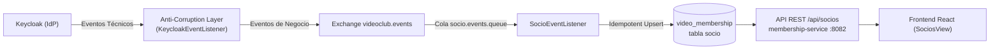

# Bounded Context: Gestión y Sincronización de Socios

Este documento describe el modelo de dominio, la persistencia, el procesamiento asíncrono de eventos y la API REST del dominio de **Socios** en la plataforma VideoClub.

> [!NOTE]
> **Desde la separación en microservicios, este bounded context es un servicio propio: `membership-service` (`:8082`).** Es dueño exclusivo de la base `video_membership` — ver [ADR-013](adr.md#adr-013-un-esquema-por-microservicio-database-per-service) — y no comparte tablas con `catalog-service`. Ya no es un "módulo" dentro de un backend: el aislamiento dejó de ser una convención y pasó a ser estructural.

---

## 1. Visión General del Dominio

El Bounded Context de Socios gestiona los miembros registrados en el videoclub. Dado que la identidad y autenticación se originan en **Keycloak**, este módulo opera bajo un patrón de **Event-Carried State Transfer** con **consistencia eventual**:



---

## 2. Modelo de Dominio y Persistencia

### Entidad JPA (`ar.unrn.video.membership.domain.Socio`)
* Mapeada a la tabla `socio` en PostgreSQL con secuencia `primary_sequence` (`allocationSize = 1`, `initialValue = 10000`).
* **Campos:**
  * `id` (`Long`): Clave primaria local.
  * `keycloakId` (`String`): Identificador único global UUID emitido por Keycloak (`unique = true`, `nullable = false`).
  * `email` (`String`, `nullable = true`): Correo electrónico del usuario. Es nullable debido a que Keycloak permite la existencia de usuarios sin email; forzar un `NOT NULL` en base de datos causaría violaciones de integridad irrecuperables en el consumidor AMQP.
  * `username` (`String`): Nombre de usuario en Keycloak.
  * `nombre` (`String`): Nombre de pila (`firstName`).
  * `apellido` (`String`): Apellido (`lastName`).
  * `activo` (`Boolean`): Indicador de membresía activa.
  * `fechaAlta` (`LocalDateTime`): Marca temporal de creación en el videoclub.
  * `fechaBaja` (`LocalDateTime`, `nullable = true`): Marca temporal de baja lógica.

### Estrategia de Baja Lógica (Soft Delete)
Cuando un usuario es eliminado de Keycloak, el sistema no destruye la fila (`Hard Delete`). En su lugar, ejecuta una **baja lógica**:
```java
socio.setActivo(false);
socio.setFechaBaja(LocalDateTime.now());
```
Esto preserva la integridad referencial histórica para futuros módulos de préstamos, facturación o devoluciones.

---

## 3. Procesamiento Asíncrono de Eventos

### Contrato Canónico de Negocio
Los eventos de dominio viajan desacoplados del IdP utilizando el sobre genérico `Event<K, T>`:
* **Envelope:** `Event<String, SocioPayload>` con tipo de evento `Event.Type { CREATE, UPDATE, DELETE }`.
* **Routing Keys:** `Socio.CREATE`, `Socio.UPDATE`, `Socio.DELETE`.
* **Payload:**
  ```json
  {
    "keycloakId": "ce51c71a-319e-483c-cc64-cbf11899efb1",
    "email": "usuarioadmin@gmail.com",
    "username": "usuarioadmin",
    "nombre": "Roberto",
    "apellido": "Perez"
  }
  ```

### Consumidor Idempotente (`SocioEventListener`)
Escucha en la cola `socio.events.queue` bindeada al topic exchange `videoclub.events` con patrón `Socio.#`.
* **Idempotencia:** Si un mensaje llega duplicado debido a la semántica *at-least-once* del broker, `SocioService` realiza un *upsert* basado en `keycloakId`.
* **Ciclo de Vida del ACK:** El listener no envía el ACK a RabbitMQ hasta que la transacción de PostgreSQL confirma el `COMMIT`. Si ocurre una excepción transitoria, el mensaje se reintenta según la política de reintentos con backoff configurada en `application.yml`.
* **Dead Letter Queue (DLQ):** Tras agotar los reintentos (`max-attempts: 3`), el mensaje se rutea a `socio.events.dlq` mediante `videoclub.events.dlx`, evitando bloqueos en la cola principal.

---

## 4. Reconciliación y Backfill (`POST /api/socios/sync`)

Dado que Keycloak emite eventos después del commit de base de datos y podría descartar eventos si RabbitMQ sufre una caída transitoria, el sistema provee un mecanismo de **reconciliación**:
* **Endpoint:** `POST /api/socios/sync`
* **Seguridad:** Requiere autoridad `user-permission-create`.
* **Funcionamiento:** Consulta a Keycloak a través de `KeycloakUserService`, itera los usuarios existentes en el Realm y realiza un *upsert* en la tabla local `socio`, sincronizando estados y evitando usuarios huérfanos.

---

## 5. API REST y Seguridad

### Endpoints (`ar.unrn.video.membership.rest.SocioResource`)

| Método | Path | Permiso Requerido | Descripción |
| :--- | :--- | :--- | :--- |
| `GET` | `/api/socios` | `socio-permission-read` | Lista todos los socios ordenados por fecha de alta descendente. |
| `GET` | `/api/socios/{id}` | `socio-permission-read` | Retorna el detalle de un socio por su ID local. |
| `POST` | `/api/socios/sync` | `user-permission-create` | Dispara el proceso de reconciliación contra Keycloak. |

---

## 6. Frontend React (`react-sso`)

* **Vista:** `SociosView.tsx` accesible en `/socios`.
* **Protección de Ruta:** `PermissionGuard` con permiso `socio-permission-read`.
* **Actualización en Tiempo Real:** El componente escucha eventos por Server-Sent Events (SSE) desde `/api/notifications/stream`. Al recibir un evento administrativo de usuario (`USER.CREATE`, `USER.UPDATE`, `USER.DELETE`), invalida la cache de `@tanstack/react-query`, refrescando la tabla automáticamente sin recargar la página.
