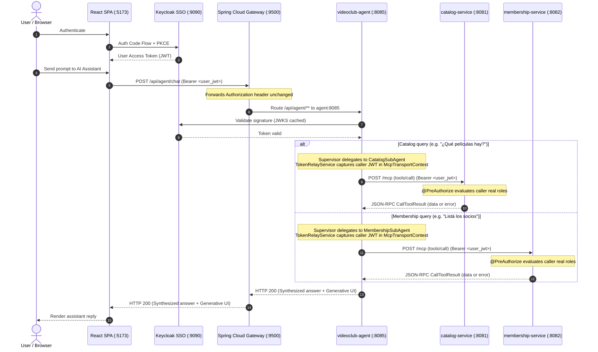

# SSO Token Propagation (Token Relay) — Implemented Architecture

**Status:** implemented and verified end-to-end across two MCP services.
**Scope:** `videoclub-agent` (`:8085`), `catalog-service` (`:8081`), `membership-service` (`:8082`), Keycloak realm `videoclub` (`:9090`).

This document describes how the agent authenticates its callers and how it authorizes its
outbound MCP calls across the **two independent domain microservices** (`catalog-service` and `membership-service`).
It is a description of the running system, not a proposal.

---

## 1. What this replaced

The initial prototype authenticated against Keycloak with the **Resource Owner Password Credentials**
grant, using a human's credentials stored in `.env`:

```properties
KEYCLOAK_USERNAME=usuarioadmin
KEYCLOAK_PASSWORD=usuarioadmin
```

Three problems made that untenable beyond an offline spike:

1. **ROPC is deprecated.** The grant is removed in OAuth 2.1 because it requires the client to handle
   the user's password directly.
2. **Identity was lost.** Every MCP tool execution was attributed to `usuarioadmin`, so audit logs
   and event sourcing recorded the agent, never the person.
3. **Authorization was bypassed.** Any user of the React app could ask the agent for member records
   and get them, because the agent always ran with admin privileges.

All three are gone. `KEYCLOAK_USERNAME` and `KEYCLOAK_PASSWORD` no longer exist in `.env`,
`.env.example`, or `application.yml`.

Furthermore, **the backend is no longer a single process at `:8080`**. It was split into two independent
Spring Boot microservices — `catalog-service` (`:8081`) and `membership-service` (`:8082`) — each with its own
database, its own security rules, and its own MCP server endpoint (`/mcp`). The agent maintains dedicated
MCP clients to each service, propagating the caller's identity to both.

---

## 2. Architecture



The gateway needs no `TokenRelay=` filter. That filter relays the token of an
`OAuth2AuthorizedClient` held by the gateway, which would require the gateway to be an OAuth2
*client* with a user session — it is not configured as one. React sends the `Authorization` header
itself and Spring Cloud Gateway forwards request headers by default.

---

## 3. The two identities & Dual MCP Client Architecture

Two independent MCP transports carry requests under two different identities. Keeping them apart across
both backend clients is the core of this design.

| | Identity | Used for | Where it comes from |
|---|---|---|---|
| **Relay path** | the human who made the HTTP request | every `tools/call` to either backend | `SecurityContextHolder` → `McpTransportContext` → `JwtAuthenticationToken` |
| **Bootstrap path** | `service-account-videoclub-backend` | `initialize()` handshake for each service at startup | `client_credentials` grant |

### 3.1. Why a bootstrap identity is needed at all

`/mcp` in both `catalog-service` and `membership-service` ends its security filter chain with `anyRequest().authenticated()`, so each MCP handshake
needs *some* token. At startup there is no HTTP request, therefore no `SecurityContext`, therefore
no user. Without a bootstrap credential the startup handshake returns 401.

### 3.2. Why the bootstrap identity has no permissions

The service account only has to satisfy `anyRequest().authenticated()`. `initialize()` and
`tools/list` are MCP protocol operations; the `@PreAuthorize` checks live on the **tool methods**,
which are reached only by `tools/call`. Startup discovery therefore works with zero business roles —
confirmed in practice: the agent discovers all 6 tools at boot while
`service-account-videoclub-backend` holds no `movie-permission-read` and no `socio-permission-read`.

**This is a requirement, not a coincidence. Do not grant that service account business roles.** In
the realm those permissions are client roles of `videoclub-frontend`, assigned through the
`administrador` and `cliente` groups; `videoclub-backend` declares `"roles": []`. Granting them
would recreate the shared privileged identity this whole design removed.

Note also that `KeycloakGrantedAuthoritiesConverter` in both services flattens **every** client
entry in `resource_access` into authorities, so roles added to a service account for one purpose
become authorities everywhere. Another reason to leave that client empty.

### 3.3. The discovery window (per-client `AtomicBoolean`)

`McpClientConfiguration` creates one `McpSyncClient` per service via `buildClient(serviceName, mcpUrl, tokenRelayService)`. Each client opens the bootstrap path for exactly one moment:

```java
private static McpSyncClient buildClient(final String serviceName,
                                         final String mcpUrl,
                                         final TokenRelayService tokenRelayService) {
    final AtomicBoolean discoveryWindow = new AtomicBoolean(true);

    final HttpClientStreamableHttpTransport transport = HttpClientStreamableHttpTransport
            .builder(mcpUrl)
            .httpRequestCustomizer((builder, method, uri, body, ctx) -> builder.header(
                    "Authorization",
                    "Bearer " + resolveToken(ctx, discoveryWindow.get(), tokenRelayService)))
            .build();

    final McpSyncClient client = McpClient.sync(transport)
            .transportContextProvider(() -> captureCallerToken(tokenRelayService))
            .build();

    try {
        client.initialize();
    } catch (Exception e) {
        log.warn("Could not initialize MCP session with {} at startup: {}", serviceName, e.getMessage());
    } finally {
        discoveryWindow.set(false);
    }
    return client;
}
```

**The flag is local to `buildClient` on purpose, so each client owns its own window.**
A single shared flag would be closed by whichever client initialized first, and the second
client's own `initialize()` would then fall through to `tokenRelayService.getUserBearerToken()` — which
throws `IllegalStateException`, because there is no caller at startup. Two clients, two windows.

### 3.4. Carrying caller identity across thread hops (`McpTransportContext`)

`SecurityContextHolder` is backed by a `ThreadLocal`. In Spring AI / MCP, outbound HTTP requests are not written on the servlet thread that asked for them: an MCP tool call executes through a reactive pipeline that hops onto the MCP client's own worker threads. Reading the caller's JWT inside the request customizer directly from `SecurityContextHolder` would find it empty.

Instead, identity is **captured on the thread that starts the operation**:
`transportContextProvider(() -> captureCallerToken(tokenRelayService))` runs where the servlet's `SecurityContext` is still visible, wrapping the JWT into an `McpTransportContext` (key `videoclub.caller-token`). This transport context travels with the request through the Reactor pipeline, surviving thread hops. The `httpRequestCustomizer` then reads the token out of that context reliably.

`getUserBearerToken()` **throws** when no JWT is present and the discovery window is closed. It never falls back to the service account: failing closed guarantees that MCP calls cannot execute under the machine identity.

### 3.5. Multi-agent delegation and dedicated callback providers

`McpClientConfiguration` publishes **three** `SyncMcpToolCallbackProvider` beans:

1. **`catalogTools`** (`@Qualifier("catalogMcpToolCallbackProvider")`): bound strictly to `catalogMcpClient` (`:8081`).
2. **`membershipTools`** (`@Qualifier("membershipMcpToolCallbackProvider")`): bound strictly to `membershipMcpClient` (`:8082`).
3. **Aggregated Provider** (`@Primary`): aggregates both clients. Injected into `AgentService` by type to answer `GET /api/agent/tools`.

Sub-agents inject only their domain-dedicated provider:

* `CatalogSubAgent` can only see and execute catalog tools (`list_movies`, `get_movie`, `search_movies`, `create_movie`) and resources (`catalog://...`). It has no visibility into membership tools.
* `MembershipSubAgent` can only see and execute membership tools (`list_socios`, `get_socio`). It has no visibility into movie tools.

This enforces the boundary of the domain at the bean level, preventing prompt injection from jumping across service scopes.

### 3.6. Tool discovery is lazy, and that is the recovery path

`SyncMcpToolCallbackProvider` caches its callbacks and re-issues `tools/list` on first use.
A failed startup handshake is logged and tolerated per client: if `membership-service` is temporarily down at boot, `catalog-service` still works, and the first authenticated request establishes the membership session under the user's token.

---

## 4. How a permission denial travels

It is **not** an HTTP 403.

`AccessDeniedException` is a `RuntimeException`, and Spring AI's `SyncStatelessMcpToolMethodCallback`
catches `RuntimeException` and converts it into `createSyncErrorResult(e)` — a `CallToolResult`
flagged `isError`, carried inside a normal **HTTP 200** JSON-RPC response. The MCP endpoint itself
already authenticated the request; only the *tool* failed.

This is what makes a graceful answer possible: the denial reaches the LLM as tool output it can read
and paraphrase. A real 403 would abort the call before the model ever saw it.

**Do not write client code that switches on a 403 here — there is none.**

### 4.1. Visual transparency in the frontend (`toolsDenied`)

When an MCP tool invocation produces an `AccessDeniedException`, `TrackingToolCallback` intercepts the exception,
records the tool into `ExecutionTracker.toolsDenied`, and allows the exception to propagate to Spring AI's
tool execution manager so the LLM can generate its explanatory prose.

The `/api/agent/chat` response carries `toolsDenied: List<String>` alongside `toolsExecuted`:

```json
{
  "agentsInvoked": ["MembershipSubAgent"],
  "toolsExecuted": ["list_socios"],
  "toolsDenied": ["list_socios"]
}
```

The frontend UI (`AgentChatView.tsx`) leverages this contract to distinguish tools that executed successfully
from those blocked by Keycloak `@PreAuthorize`, rendering a distinct alert badge (`🚫 list_socios (sin permiso)`)
with descriptive tooltips, preventing the false perception that the action succeeded.

---

## 5. Configuration reference

`application.yml`:

```yaml
spring:
  security:
    oauth2:
      resourceserver:
        jwt:
          issuer-uri: ${KEYCLOAK_ISSUER_URI:http://localhost:9090/realms/videoclub}
          jwk-set-uri: ${KEYCLOAK_JWK_SET_URI:http://localhost:9090/realms/videoclub/protocol/openid-connect/certs}

videoclub:
  mcp:
    catalog-url: ${CATALOG_MCP_URL:http://localhost:8081/mcp}
    membership-url: ${MEMBERSHIP_MCP_URL:http://localhost:8082/mcp}
  keycloak:
    token-url: ${KEYCLOAK_TOKEN_URL:http://localhost:9090/realms/videoclub/protocol/openid-connect/token}
    client-id: ${KEYCLOAK_CLIENT_ID:videoclub-backend}
    client-secret: ${KEYCLOAK_CLIENT_SECRET:dstNSsANvqlaGfZCJa1mcYzP1EBAYP4N}
```

Both properties are set on purpose. With `issuer-uri` alone, startup performs OIDC discovery and
fails when Keycloak is not already running; the explicit `jwk-set-uri` removes that coupling.

The `iss` claim of an incoming token must match `issuer-uri` exactly. A token minted through a
different hostname — `host.docker.internal`, for instance — is rejected.

`SecurityConfiguration` permits `/api/agent/health` anonymously, requires authentication on
`/api/agent/chat`, `/api/agent/chat/stream`, and `/api/agent/tools`, and ends with `anyRequest().authenticated()` so endpoints
added later fail closed.

---

## 6. Verification

Run against a live stack (Keycloak, `catalog-service`, `membership-service`, the gateway and the agent all up). Every call
goes through the gateway on `:9500`, which is what proves the route forwards the header.

| Check | Expected | Observed |
|---|---|---|
| `GET /api/agent/health` without token | 200 | 200 |
| `POST /api/agent/chat` without token | 401 | 401 |
| `GET /api/agent/tools` without token | 401 | 401 |
| `GET /api/agent/tools` with any valid token | 6 tools | `get_movie`, `list_movies`, `search_movies`, `create_movie`, `get_socio`, `list_socios` |
| Chat as `usuarioadmin`: *"Listá los socios registrados"* | member list returned | full member registry returned (`agentsInvoked: ["MembershipSubAgent"]`) |
| Chat as `usuariocliente`: *"Listá los socios registrados"* | denial explained in prose, HTTP 200 | *"no tengo acceso a la información sobre los socios registrados"* (`agentsInvoked: ["MembershipSubAgent"]`) |
| Chat as `usuariocliente`: *"¿Qué películas hay?"* | catalog returned | catalog returned (`agentsInvoked: ["CatalogSubAgent"]`) |

The last two rows together are the real proof: the same agent, two identities, two outcomes across two independent backend microservices.

A response of **0 tools** would mean neither MCP session was established — check the startup log
for the handshake warning and each service's URL and client secret.

---

## 7. Known open issue

The Keycloak client secret for `videoclub-backend` is still committed to the repository, as a
default value in `application.yml` and as a literal in the tracked `.env.example`:

```yaml
client-secret: ${KEYCLOAK_CLIENT_SECRET:dstNSsANvqlaGfZCJa1mcYzP1EBAYP4N}
```

This is the same defect that made the ROPC credentials unacceptable — a working secret surviving in
the image even with an empty `.env` — with a machine credential instead of a human one. Swapping a
user password for a client secret is the acceptable half of that trade; committing it is not.

The fix is to drop the default so startup fails without the variable, put a placeholder in
`.env.example`, and rotate the secret in Keycloak, since it is present from the first commit onward.

> **Update (Clase 6 / Hardening):**
> Compose files (`docker-compose.yml` and `docker-compose.prod.yml`) have been cleansed of hardcoded secret fallbacks (`:-fallback`), establishing `.env` and `.env.prod` as the single sources of truth. Git tracking strictly ignores `.env.*` (while preserving `.env.template` and `.env.prod.template`). Rotating the secret in Keycloak remains recommended for production readiness.
